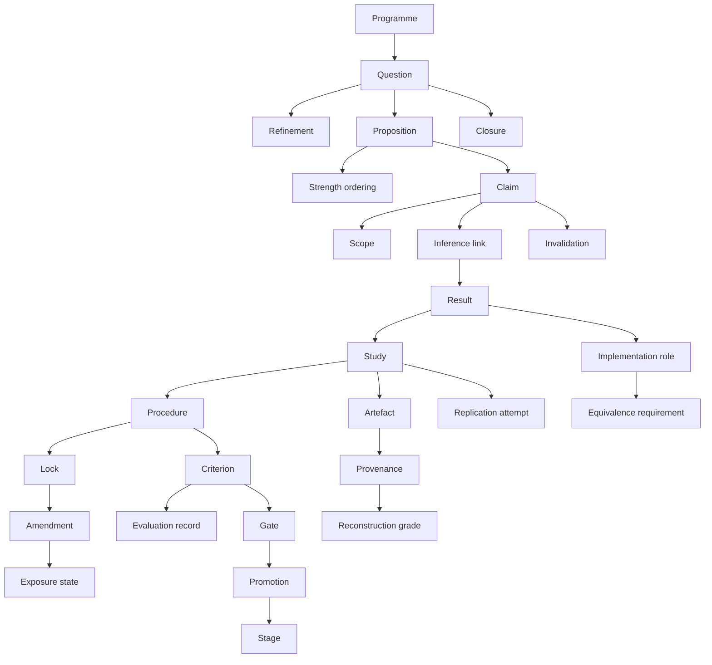

# Stage A output — designer `claude` (`anthropic/claude-opus-5`)

**Verbatim, unedited.** Everything below the horizontal rule is this
designer's complete stdout, committed before any output was read and before
any cross-reading. Run 2026-08-20:

```
omp -p --no-session --no-title --auto-approve --no-tools \
  --model anthropic/claude-opus-5 --thinking high \
  --cwd <empty scratch dir> --max-time 20m --mode text \
  -- @<stage A packet, 73 lines>
```

Input was `002_stage_a_packet.md` **below its horizontal rule only** — the
preamble is repo commentary and names terms the packet exists to withhold.
No repository access, no tools, no knowledge that other designers exist.

---

# LabKit — Read Surface

A design for the operations that answer *"where does the research stand?"* Read-only throughout: nothing here records, changes, or approves.

---

## 0. Conventions that apply to every operation

Stating these once keeps the operation list from repeating itself.

**Every call accepts:**

- `as_of` — a point in time, interpreted as *record time*: "answer using what had been written down by then." Defaults to now. A second optional `believed_at` asks the different question: "what did the research hold to be true at that moment, regardless of when it was written down." The two differ, and the difference is answerable only because record time and event time are both kept (see glossary §36).
- `include_scratch` — defaults to **false**. Ephemeral work is never in an answer unless asked for by name.
- `scope_filter` — restrict to a regime, population, or condition set, expressed in the same vocabulary claims use to state their own scope.

**Every call returns:**

- The answer.
- `outstanding` — what evidence, evaluation, or judgement is *absent* that would change this answer. This is a field, not an operation, because "what would it take to trust this?" is the same question asked at a gate, at a candidate implementation, and at a claim. It should have one shape everywhere.
- `basis` — which records were read and the as-of used. An answer that cannot say what it read is not an answer.

**Naming.** Operations are named as the question the researcher asked. None of them is named after a table, a traversal, or a graph.

---

## 1. The read operations

### Orientation

---

**`where_the_programme_stands`**

> *"Forget the details. What is this programme's current position?"*

**Pass:** a programme; optionally `as_of`, `scope_filter`.

**Get back:** every live question grouped by disposition — *open and worked*, *open and deliberately accepted as unresolved*, *answered affirmatively*, *answered negatively*, *superseded*, *abandoned*. Standing claims with their support strength and scope. Gates with no evaluation against them. Candidate conflicts flagged for adjudication. Work waiting on promotion evidence.

It returns **no score, index, or health rating.** A programme with fourteen open questions is not worse than one with three, and the read surface must not imply otherwise.

**Serves:** 1, 4, 14.

---

**`how_this_question_developed`**

> *"How did we get from the thing I noticed to the question I'm now asking?"*

**Pass:** a question.

**Get back:** the chain backwards to the originating observation, and forwards to descendants. Each refinement step carries: the question before, the question after, the reason for sharpening, what was known at the moment it happened, and whether that moment was before or after any confirmatory evidence existed. Sibling branches that were sharpened differently and then dropped are included, with why they were dropped.

The point of this operation is that it makes the *lack* of foresight legible. A question that was vague in March and precise in July shows as exactly that, not as a question that was always precise.

**Serves:** 1, 6, 13.

---

**`where_this_question_stands`**

> *"What do we actually know about this question now?"*

**Pass:** a question.

**Get back:** each proposition posed under the question, its position in the strength ordering, and its individual standing. A weaker proposition may read *supported* while the stronger proposition it is entailed by reads *open* — these are reported as two facts, never collapsed into a single verdict on the question. Also: the mode of the work currently attached (exploratory / locked-confirmatory), and, if the question is closed, the closure record.

**Serves:** 2, 4, 14.

---

**`what_closed_this_line`**

> *"This is marked closed. On what, and does it mean we failed?"*

**Pass:** a closed question.

**Get back:** the closure kind — *answered no*, *answered yes*, *shown infeasible*, *superseded by a better question*, *abandoned* — the evidence cited for it, who closed it, and the closure's stated relationship to the parent programme. A well-supported negative answer returns `programme_impact: none` with the reasoning; that is a different record from *abandoned*, which returns the reason work stopped and explicitly does **not** assert the answer.

**Serves:** 4.

---

**`what_we_are_content_not_to_know`**

> *"What has been consciously parked, versus what is merely neglected?"*

**Pass:** a programme; optionally a question.

**Get back:** questions carrying an explicit acceptance-of-unresolved: who accepted, when, the stated rationale, and any revisit trigger (a condition under which it should come back). Separately, questions that are open with no acceptance and no active work — the genuine backlog. The two lists must not be merged; the entire value of the operation is the boundary between them.

**Serves:** 14.

---

### Belief

---

**`what_we_believe_about`**

> *"What does this research currently hold to be true about X?"*

**Pass:** a subject binding — a question, a claim, or a scope expression. Free text is accepted but see §2 (refusals).

**Get back:** current claims, each with its statement, its scope of application, its status (*standing*, *contested*, *suspended*, *withdrawn*), the strength of its support, and whether that support is confirmatory or exploratory. Withdrawn claims appear, marked, rather than vanishing.

**Serves:** 2, 5, 12.

---

**`what_this_claim_rests_on`**

> *"Why do we believe this, and is that belief still sound?"*

**Pass:** a claim.

**Get back:** the support structure downward — the inferences, the results those inferences read, the studies that produced them, the procedures those studies followed. Each support path is annotated with: mode at the time (exploratory / confirmatory), the criteria that were prespecified for it, whether those criteria were *evaluated*, and whether any part of the path has since been invalidated. A path whose statistical criterion passed but whose prespecified robustness condition failed reports as **insufficient**, not as support with a footnote.

**Serves:** 3, 11, 12, 17.

---

**`how_this_claim_has_changed`**

> *"Has what we believe changed, as opposed to what we computed?"*

**Pass:** a claim.

**Get back:** the claim's own history — restatements, scope narrowings and widenings, status transitions — each with its reason, its author, and whether any underlying computation changed at the same time. Reinterpretation of unchanged results and revision forced by changed results are distinguishable in the output, because they are different events.

**Serves:** 12.

---

**`what_depends_on_this`**

> *"If this turned out to be wrong, what else is in trouble?"*

**Pass:** a claim, result, artefact, or implementation.

**Get back:** everything recorded as depending on it — claims, promotions, gate passages, closures — with the *nature* of each dependence (this claim was inferred from it; this promotion cited it as evidence; this gate was passed on it). Depth is bounded by request, and the answer states the bound.

It reports **recorded** dependence only, and says so explicitly with a count, because a human who formed a belief by looking at a figure leaves no edge. See §2.

**Serves:** 11, 12.

---

**`what_needs_reconsideration`**

> *"This analysis was just invalidated. What now has to be looked at again — and what doesn't?"*

**Pass:** an invalidation event, or the thing invalidated.

**Get back:** three disjoint sets. **Still standing** — claims that depended on it but retain independent sufficient support, with that remaining support named. **Now unsupported** — claims whose only support ran through the invalidated thing. **Untouched** — things adjacent in the record but not dependent, listed so the reader can confirm the blast radius stopped where they expected.

Critically, the invalidation's *scope* is honoured: invalidating an analysis leaves the observations it consumed intact and available, and the operation says so in as many words. Invalidating observations propagates further, and that difference is visible in the output rather than assumed by the reader.

**Serves:** 11.

---

### Tension

---

**`do_these_conflict`**

> *"These two findings look contradictory. Are they?"*

**Pass:** two claims, or a claim and a result.

**Get back:** a structured adjudication, in this order: (a) are these answering the same question, or different questions that sound alike; (b) do their scopes overlap, and if so, over what region; (c) do they rest on shared or disjoint evidence; (d) within the overlap, do they actually disagree; (e) is either one exploratory, making the tension a difference in evidential standing rather than in finding.

The verdict is one of: **genuine conflict** (with the overlap region stated), **apparent only — different questions**, **apparent only — disjoint scopes**, **apparent only — different evidential standing**, or **undeterminable**, with the specific missing information named.

It does not say which one is right. See §2.

**Serves:** 5.

---

**`where_the_record_disagrees`**

> *"Is anything in here quietly inconsistent?"*

**Pass:** a programme; optionally `scope_filter`.

**Get back:** candidate tensions, each with the reason for suspicion (overlapping scope with opposing direction; the same proposition supported and contradicted; a claim standing on invalidated support; a gate passed on evidence later withdrawn). Each candidate is a pointer into `do_these_conflict`, not a verdict.

**Serves:** 5.

---

### Evidence and gates

---

**`did_this_meet_its_conditions`**

> *"The number came out significant. Does that count?"*

**Pass:** a result or study.

**Get back:** every criterion prespecified for it, each with one of three states — **satisfied**, **failed**, **never evaluated** — plus the evaluation record behind that state (what was run, by whom, when, producing what). Then the composite evidential standing: *sufficient*, *insufficient — condition failed* (naming which), or *insufficient — condition unevaluated* (naming which).

A formally significant computation whose own prespecified robustness condition failed returns **insufficient**. The significance is still shown; it is simply not permitted to be the headline.

**Serves:** 3, 17.

---

**`what_this_gate_is_waiting_on`**

> *"Is this gate passed?"*

**Pass:** a gate.

**Get back:** the criterion in the words it was written in, what kind of evidence would satisfy it, every evaluation attempted against it, and the verdict — **passed**, **failed**, or **unevaluated**. `unevaluated` is a first-class answer and is never rendered as pending-with-optimism or inferred from the gate's existence. The presence of an object named "gate" tells you nothing; the presence of an evaluation record tells you everything.

**Serves:** 8, 17.

---

**`can_this_advance`**

> *"This is sitting at a feasibility stage. What stands between it and the real experiment?"*

**Pass:** an experiment, line of work, or implementation.

**Get back:** current stage, the stage above, the gates between them with their verdicts from `what_this_gate_is_waiting_on`, and `outstanding` — the specific evidence that does not yet exist. For stages already passed, the evidence that was *cited at the time*, and by whom, so that a promotion justified by enthusiasm rather than evidence is visible as such: the citation list is empty, and the approver has a name.

**Serves:** 8, 15.

---

### Procedure

---

**`what_procedure_was_actually_followed`**

> *"Not what was planned — what was done?"*

**Pass:** a study.

**Get back:** the procedure version in force when execution began, every amendment applied during or after, and for each amendment: what changed, why, who authorised it, its classification (**mechanical repair** — the procedure was unexecutable as written; **scientific change** — the substance of the test moved), and the exposure state at the moment it was made (had anyone seen outcome data yet?).

The original locked text is always returned alongside. History is shown as amended, never as rewritten.

**Serves:** 7, 10.

---

**`how_this_design_changed_and_when`**

> *"Did we iterate honestly, or did we move the goalposts?"*

**Pass:** a procedure, question, or study.

**Get back:** one timeline with the **lock** marked on it. Everything left of the lock — changes to the question, the criteria, the analysis plan, the interpretation — is returned as ordinary design work with its reasons, and carries no suspicion; before confirmatory evidence exists, revision is the job. Everything right of the lock is returned as amendments with classification and exposure state.

The lock is a recorded event with a time and an author, not an inference from file timestamps.

**Serves:** 6, 7.

---

### Reproduction and recovery

---

**`what_was_reproduced_here`**

> *"They say they reproduced it. Reproduced what?"*

**Pass:** a replication attempt.

**Get back:** the **kind** claimed — *same conclusion, independent execution* or *same execution, same result* — the criteria that kind requires, and what matched and what did not against those criteria. A bit-identical re-run is reported as execution-level and is explicitly noted as carrying **no** independent weight for the conclusion. An independent team reaching the same conclusion with different machinery is reported as conclusion-level and explicitly noted as carrying **no** claim about execution fidelity.

If a caller asks whether a claim was confirmed and the only replication is execution-level, the answer says the category is wrong rather than answering the adjacent question.

**Serves:** 10, 16.

---

**`can_this_be_re_run`**

> *"Could I execute this again as it was executed?"*

**Pass:** a study or execution.

**Get back:** each ingredient needed — inputs, code version, parameters, seeds, environment, external services — graded independently as **recovered exactly** (identity pinned and verified), **recovered approximately** (a compatible substitute, with the substitution and its risk described), or **unresolved** (not recorded, not inferable). `outstanding` names precisely what is missing.

The operation never fills an unresolved slot with a plausible value. "The container was probably the 2024-03 image" is not an answer this surface is allowed to produce.

**Serves:** 9, 10.

---

**`where_did_this_come_from`**

> *"What produced this file, and how sure are we?"*

**Pass:** an artefact.

**Get back:** the producing execution if known, the chain of inputs behind it, and the same three-way grading per link — exact, approximate, unresolved. An artefact recovered from an archive with no producing record returns a chain of length zero and `provenance: unresolved`, with the evidence that was tried.

**Serves:** 9.

---

**`is_this_implementation_trusted_yet`**

> *"Can I use the fast version?"*

**Pass:** an implementation, or the computation it implements.

**Get back:** which implementation holds the **reference** role and since when; every candidate alongside it; for each candidate the equivalence requirement that was specified (over which inputs, to what tolerance, on which properties), which of that evidence exists, and the promotion verdict. Results produced by an unpromoted candidate are listed, marked provisional.

The distinction from `what_was_reproduced_here` is deliberate: swapping machinery under a fixed science is judged by equivalence to the reference; running the science again is judged by reaching the same conclusion. They have different criteria and this operation applies only the first.

**Serves:** 15, 16.

---

### Boundaries of the record

---

**`what_this_study_spawned`**

> *"That result was surprising. Where did the surprise go?"*

**Pass:** a completed study or result.

**Get back:** questions raised by it that were adopted as new work, with their own status; observations raised and *not* adopted, still sitting as unadopted; and — the reason the operation exists — any case where the study's own scope was widened after completion to cover something it did not prespecify, flagged as scope drift rather than presented as an additional finding.

**Serves:** 13.

---

**`what_is_not_in_the_record`**

> *"What scratch work is lying around next to this?"*

**Pass:** a question, study, or workspace.

**Get back:** ephemeral work associated with it — notebooks, one-off runs, throwaway plots — each marked **not citable**, with its retention state (kept / expiring / expired). The operation exists so exploration is cheap and findable, while making the boundary explicit: nothing returned here may be cited as support, and any attempt to trace a claim's support into this set is a refusal (§2), not a warning.

**Serves:** 18.

---

## 2. Questions I expect to be refused

Each of these is a question a researcher will genuinely ask. A blank, or a confident-sounding near-answer, is worse than the refusal.

---

**"Is this claim true?"**
LabKit records what the research holds and why. It has no access to the world.
*Instead:* the claim's status, its support and that support's evidential standing, the strongest recorded challenge to it, and `outstanding`. Phrased as: *"The record cannot say whether this is true. It says the research currently holds it, on confirmatory support from two studies, with one unresolved tension in the overlap with claim C-88."*

---

**"How confident should I be? Give me a number."**
The record holds discrete evidential standings and named criteria, not a calibrated posterior. Synthesising a percentage from them would be manufacture.
*Instead:* the standings that exist, and an explicit statement that no probability was ever asserted by anyone. If someone *did* record a subjective probability, it is returned as their attributed judgement, with their name on it, not as the system's.

---

**"Why did that job get slower / how much memory did run 4102 use?"**
Out of scope by design. LabKit is not the metrics system and holding a partial shadow of one would be worse than holding none.
*Instead:* an explicit out-of-scope response naming what LabKit *does* hold on the subject — for instance, "no run telemetry; there is a claim (C-140) asserting the optimised implementation is 6× faster, supported by an equivalence study" — plus a pointer to the metrics system of record.

---

**"Which of these two conflicting claims is right?"**
The system can establish that two claims genuinely conflict, over which region, on what evidence. Deciding which is correct is the research, not the record of it.
*Instead:* the full adjudication from `do_these_conflict`, and, if someone has recorded an adjudication judgement, that judgement attributed to them.

---

**"Reconstruct the environment for this 2024 run."** *(when provenance is unresolved)*
Refused rather than approximated. The failure mode here is not an unhelpful answer, it is a plausible fabrication that someone then re-runs against.
*Instead:* the graded inventory — what is exact, what is approximate and why the substitution is defensible, what is unresolved — with the unresolved items named individually. Never a filled-in guess, even a well-reasoned one.

---

**"Was that amendment p-hacking?"**
The record can show that the primary endpoint changed after outcome data had been seen, and who classified the change as scientific rather than mechanical. It cannot certify intent.
*Instead:* the exposure state, the classification and its author, the original locked text, and the observation that these facts are what the reader must judge. Phrased as: *"The record shows the change was made after outcome exposure and was classified as a scientific change by A. Okonjo. It does not hold a judgement about intent."*

---

**"Is the programme going well? Give me a status."**
There is no aggregate. A programme with many open questions and several well-supported negative answers may be in excellent health. Any single figure would be read as a target and would then be gamed.
*Instead:* `where_the_programme_stands`, with an explicit note that no health metric exists and none is derivable from these counts.

---

**"Show me everything about 'batch effects'."** *(free text not bound to a question or scope)*
Answering would silently pick an interpretation and hide the rest.
*Instead:* the bindings the record does recognise for that phrase — three questions, one scope dimension, eleven claims mentioning it — and a request to choose. A list of candidate bindings is a real answer; a confident topic summary is not.

---

**"What did we believe on 3 March?"** *(when the March record was backfilled in September)*
Answerable, but not as asked — and the difference matters.
*Instead:* both readings, separated. *"Recorded by 3 March: claims A and B. Asserted as held on 3 March but written down later: claim C, backfilled 14 September by R. Lindqvist."* If the backfill's own provenance is unresolved, that is stated rather than smoothed over.

---

**"Does this replication confirm the claim?"** *(replication was execution-level, claim is conclusion-level)*
A category error, refused as one rather than answered approximately.
*Instead:* *"That replication re-executed the original pipeline and matched it bit-for-bit. It establishes execution fidelity and contributes nothing to the conclusion's independent support. Conclusion-level replication for C-52: none recorded."*

---

**"List everything that depends on this observation."**
Only recorded dependence is visible. A researcher who read a figure and updated their thinking left no edge.
*Instead:* the recorded dependents with a count, and an explicit statement of the limit: *"12 recorded dependents. The record cannot see influence that was never recorded; treat this as a lower bound."* This qualification appears every time, not only when it seems relevant.

---

**"Cite that result from my scratch notebook."**
Refused by construction. Scratch is findable and non-citable, and the whole point of statement 18 is that the boundary cannot be crossed by accident or by insistence.
*Instead:* *"That work is scratch and cannot support a claim. To make it citable it must be re-executed under a recorded procedure."* Followed by what such a procedure would need.

---

**"Has this gate passed?"** *(gate exists, no evaluation)*
Not a refusal so much as a refusal to guess, but it belongs on this list because the tempting answer is "not yet" and that is wrong.
*Instead:* **unevaluated** — distinct from failed, distinct from pending. *"Gate G-9 exists with criterion X. No evaluation has ever been recorded against it. Its status is unknown, not unmet."*

---

**"What should I run next?"**
A recommendation, and this is a read surface over a record, not an advisor. Ranking open work would encode a research strategy the record has no standing to hold.
*Instead:* unmet gates, unresolved questions, and unadopted spawned observations — unranked, with a note that the ordering is the researcher's to impose.

---

**"Who is responsible for this being wrong?"**
The record attributes actions — who locked, who amended, who promoted, who closed. It does not attribute fault, and answering as if it did would make people stop recording.
*Instead:* the attributed action history, without characterisation.

---

## 3. Glossary

Every concept the operations above depend on. The last bullet of each entry is the load-bearing one: if a concept's absence costs no distinction, it is decoration and should be cut — and where that is true below, it is said.



---

### Inquiry

**1. Programme**
The bounded body of work within which questions relate to one another and claims are expected to be mutually consistent.
*Required by:* `where_the_programme_stands`, `where_the_record_disagrees`, `what_we_are_content_not_to_know`, `what_closed_this_line`.
*Identity:* a stable programme identifier, independent of its name, its funding, its team, and its questions. Renaming, re-staffing, or replacing every question in it leaves it the same programme; splitting it into two creates two new identities with a recorded derivation from the first.
*Must be remembered:* its identity, its boundary (which questions are in it), and boundary changes over time.
*Derivable:* its current question set, its claim set, its open/closed profile.
*Absence loses:* "Claim A (from the immunology programme) and Claim B (from the materials programme) both concern 'stability at 40 °C' and are unrelated" becomes indistinguishable from "Claim A and Claim B are two answers to the same question and one of them is wrong." Without a boundary, consistency scanning has no domain and generates permanent false conflict.

**2. Question**
An articulated thing the research wants to know. The unit that can be open, answered, parked, or closed.
*Required by:* nearly all operations.
*Identity:* a stable identifier that survives restatement. A question is "the same one" a year later if its subject matter is continuous, even if its wording sharpened three times — sharpening produces a *refinement edge*, not a new identity, unless the refinement narrows it enough that the original is no longer being asked, which is a recorded decision.
*Must be remembered:* identity, every wording it has held with the time and reason, its disposition, its origin.
*Derivable:* current wording, ancestry depth, whether any work is currently attached.
*Absence loses:* "We are investigating whether the effect holds under thermal cycling" becomes indistinguishable from "someone ran an experiment involving thermal cycling." Results with no question they answer cannot be judged sufficient or insufficient, because sufficiency is always sufficiency *for something*.

**3. Refinement**
A recorded step from a broader question to a sharper one, carrying the reason and the state of knowledge at the time.
*Required by:* `how_this_question_developed`, `how_this_design_changed_and_when`.
*Identity:* the ordered pair (question before, question after) plus its timestamp; two sharpenings of the same question at different times are different refinements even if the resulting wording is identical.
*Must be remembered:* the before and after, the time, the author, the stated reason, and what evidence existed at that moment.
*Derivable:* the full lineage chain, sibling branches, the number of sharpening steps.
*Absence loses:* "We started with 'does temperature matter?' and after two pilots narrowed to 'does the effect vanish above 38 °C in the B-strain?'" becomes indistinguishable from "we set out to test whether the effect vanishes above 38 °C in the B-strain." The first is honest inquiry; the second, told about the same work, is retrofitted foresight. This is HARKing at the level of the question, and only the refinement record catches it.

**4. Question origin**
Where a question came from: a standing observation, a refinement of another question, or a *spawn* from a completed study that produced a surprise.
*Required by:* `what_this_study_spawned`, `how_this_question_developed`.
*Identity:* carried by the question it originated; the origin is a property, not an independent entity.
*Must be remembered:* the kind of origin, the source (study, question, observation), and the date.
*Derivable:* whether a study has unadopted spawn observations outstanding.
*Absence loses:* "Study S-31 answered its prespecified question and, incidentally, raised a new one now tracked as Q-77" becomes indistinguishable from "Study S-31 investigated both questions." The second silently widens a completed study's scope to cover something it never prespecified — which converts an incidental observation into an apparent finding.

**5. Closure**
The recorded end of a question, carrying its kind and its grounds.
*Required by:* `what_closed_this_line`, `where_the_programme_stands`, `where_this_question_stands`.
*Identity:* one closure per question at a time; reopening is a new event that supersedes rather than deletes.
*Must be remembered:* kind (answered yes / answered no / infeasible / superseded / abandoned), evidence cited, author, date, stated programme impact.
*Derivable:* the programme's disposition profile; how many closures were negative.
*Absence loses:* "We established convincingly that the mechanism does not operate here, and moved on" becomes indistinguishable from "we ran out of money and stopped." Both present as a dead question. The first is a result the programme should be credited with and future work should not repeat; the second is a gap someone should return to.

**6. Acceptance of unresolved**
An explicit decision that a question will remain open and that this is acceptable, with a rationale and optionally a revisit trigger.
*Required by:* `what_we_are_content_not_to_know`, `where_the_programme_stands`.
*Identity:* the pair (question, acceptance event); a later re-acceptance is a distinct event.
*Must be remembered:* who accepted, when, why, and the revisit condition.
*Derivable:* the genuine backlog (open, unaccepted, unworked).
*Absence loses:* "We have decided this is not worth resolving and it is fine as it is" becomes indistinguishable from "this is on the list and nobody has got to it." Without the distinction, every unresolved question looks like a debt, which produces exactly the eternal queue of fake work statement 14 warns about — someone eventually invents a token experiment to close it and make the board green.

---

### Belief

**7. Proposition**
A specific, testable statement posed under a question. A question may carry several, at different strengths.
*Required by:* `where_this_question_stands`, `what_we_believe_about`, `do_these_conflict`.
*Identity:* stable identifier tied to its logical content; rewording for clarity preserves identity, changing what would count as evidence for it does not.
*Must be remembered:* its statement, its question, its scope, its introduction date.
*Derivable:* its current standing (from its support), its position in the strength ordering if that ordering is recorded.
*Absence loses:* "We tested whether the effect exceeds zero, and separately whether it exceeds the clinical threshold" becomes indistinguishable from "we tested the effect." Sufficiency judgements then have no target: significant *for what*?

**8. Strength ordering**
A recorded entailment relation between propositions under the same question: proving the stronger would prove the weaker; the converse does not hold.
*Required by:* `where_this_question_stands`, `do_these_conflict`.
*Identity:* the ordered pair of propositions plus the justification of the entailment.
*Must be remembered:* the pairs and why the entailment holds. It is a research judgement, not an inference the system may make from wording.
*Derivable:* the fact that a question is partially answered; that a positive result does not settle the stronger form.
*Absence loses:* "We have shown the effect is non-zero; whether it reaches the threshold that would matter is still open" becomes indistinguishable from "we have one positive result and one unfinished experiment." The first is a coherent intermediate position that should be reported as progress. The second invites either overclaiming ("we showed it works") or a false appearance of contradiction between the two propositions. This is the whole of statement 2.

**9. Claim**
What the research currently holds to be true, as an entity in its own right — distinct from the results it was inferred from.
*Required by:* `what_we_believe_about`, `what_this_claim_rests_on`, `how_this_claim_has_changed`, `what_depends_on_this`, `do_these_conflict`.
*Identity:* stable identifier. It is "the same claim" a year later if it concerns the same proposition over the same scope; a narrowed scope is a revision of the same claim, a different proposition is a different claim.
*Must be remembered:* statement, scope, status, author, and every revision.
*Derivable:* support strength, contested-ness, whether any support is invalidated.
*Absence loses:* "We now interpret the 2024 data as showing saturation rather than decline" becomes indistinguishable from "the 2024 data changed." If belief is not separable from computation, reinterpretation is unrecordable except by falsifying the results — which is statement 12 exactly.

**10. Scope**
The conditions, population, or regime over which a claim is asserted to apply.
*Required by:* `do_these_conflict`, `what_we_believe_about`, `where_the_record_disagrees`, `how_this_claim_has_changed`.
*Identity:* part of the claim; a scope expression is identified by its content in a shared vocabulary, not by prose.
*Must be remembered:* the scope as asserted, and every change with its reason.
*Derivable:* overlap between two scopes, whether a new result falls inside a claim's scope.
*Absence loses:* "The effect is present below 30 °C and absent above 45 °C — two claims, no conflict" becomes indistinguishable from "the effect is present and the effect is absent — a contradiction." Every conflict adjudication in the system collapses without scope, and the record starts generating alarms about findings that agree perfectly.

**11. Claim status**
The claim's current epistemic position: standing, contested, suspended, withdrawn.
*Required by:* `what_we_believe_about`, `what_needs_reconsideration`, `where_the_programme_stands`.
*Identity:* a property of the claim; each transition is an event.
*Must be remembered:* transitions with author, time, reason. *Contested* and *withdrawn* are human judgements and cannot be inferred.
*Derivable:* partially — "has invalidated support" is computable, but that is a different fact from "the research no longer believes this." A claim can survive the invalidation of one support path; a claim can be withdrawn while its support remains formally intact.
*Absence loses:* "We no longer believe this, though the computation still runs" becomes indistinguishable from "we still believe this." Withdrawal-on-reflection has no expression, so the only way to retract a belief is to attack its evidence — which is both dishonest and destructive.

**12. Inference link**
The recorded step from results to a claim: this evidence, read this way, supports this statement over this scope.
*Required by:* `what_this_claim_rests_on`, `what_depends_on_this`, `what_needs_reconsideration`.
*Identity:* the triple (claim, evidence, inference) plus its author and time; re-inferring the same claim from the same evidence with different reasoning is a distinct link.
*Must be remembered:* which evidence, what the reasoning was, who made it, when, and under what mode.
*Derivable:* support strength, whether any path is confirmatory, blast radius on invalidation.
*Absence loses:* "This claim rests on studies 12 and 19; study 12's analysis is now void but 19 still carries it" becomes indistinguishable from "this claim is associated with some studies, one of which is void." Statement 11's precise question — which downstream claims need reconsideration and which do not — is unanswerable without per-path links, and the safe default becomes invalidating everything nearby.

**13. Claim revision**
A change to a claim's own statement, scope, or status, independent of any change to its supporting computation.
*Required by:* `how_this_claim_has_changed`.
*Identity:* an event on a claim, ordered in time.
*Must be remembered:* before, after, reason, author, time, and whether supporting evidence changed concurrently.
*Derivable:* the claim's current form; how many times it has narrowed.
*Absence loses:* "We narrowed this claim to the B-strain after the A-strain replication failed" becomes indistinguishable from "this claim always applied only to the B-strain." The record of retreat is exactly what a reader needs in order to weigh the claim.

---

### Doing

**14. Procedure**
The specification of how a study is to be carried out, including its analysis plan and its criteria. Versioned.
*Required by:* `what_procedure_was_actually_followed`, `how_this_design_changed_and_when`, `did_this_meet_its_conditions`.
*Identity:* stable identifier across versions. It is "the same procedure" while it addresses the same proposition by the same mechanism; a change of mechanism is a new procedure with a recorded derivation.
*Must be remembered:* every version's full text, ordered, with authorship.
*Derivable:* the diff between versions, which version was in force at any moment.
*Absence loses:* "The study followed the plan as written" becomes indistinguishable from "the study did something, and this document describes it." With no versioned specification there is nothing for an amendment to be an amendment *to*, and nothing prespecification could mean.

**15. Lock**
The recorded moment a procedure ceases to be freely revisable and becomes prespecified. The boundary between design and commitment.
*Required by:* `how_this_design_changed_and_when`, `what_procedure_was_actually_followed`, `did_this_meet_its_conditions`.
*Identity:* an event: (procedure version, time, author). One lock per version; re-locking after amendment is a new event.
*Must be remembered:* which version, when, by whom, and against which propositions.
*Derivable:* whether a given change was pre- or post-lock; whether a study's evidence can count as confirmatory.
*Absence loses:* "We rewrote the analysis plan three times while still exploring, then locked it and ran" becomes indistinguishable from "we rewrote the analysis plan three times, one of them mid-study." The first is good practice; the second is p-hacking. They are the *same edits* and only the lock separates them. This is the hinge of statements 6 and 7 together: without it you must either forbid all revision (killing exploration) or permit all of it (killing confirmation).

**16. Mode**
The standing of a piece of work: **exploratory** (revisable, may support claims but only as exploratory support), **confirmatory** (post-lock, criteria prespecified), **scratch** (ephemeral, never citable).
*Required by:* `where_this_question_stands`, `what_this_claim_rests_on`, `what_is_not_in_the_record`, `do_these_conflict`.
*Identity:* a property of the work item, with recorded transitions.
*Must be remembered:* current mode and each transition with time and author. Scratch must be declared at creation, not assigned afterwards — retroactive scratch-marking is how inconvenient results disappear.
*Derivable:* citability; whether support is confirmatory; what a given amendment is permitted to be.
*Absence loses:* "This finding comes from a locked confirmatory test" becomes indistinguishable from "this finding comes from a quick look someone took on a Friday." Both are results with numbers attached. Mode is what stops the second from being cited like the first — and, in the other direction, what stops the Friday look from being suppressed as illegitimate.

**17. Amendment**
A change to a locked procedure, carrying a classification: **mechanical repair** (the procedure was unexecutable as written) or **scientific change** (what is being tested moved).
*Required by:* `what_procedure_was_actually_followed`, `how_this_design_changed_and_when`.
*Identity:* an event on a procedure version, ordered in time.
*Must be remembered:* what changed, why, who authorised it, the classification, who classified it, and the exposure state at the time. The original text must survive intact alongside.
*Derivable:* the effective procedure at any moment; the count of scientific amendments (a reader's signal).
*Absence loses:* "We corrected a transposed reagent volume that made the protocol physically impossible, before any samples were run" becomes indistinguishable from "we changed the primary endpoint after seeing the interim analysis." Both are "the procedure was edited after locking." Without classification, statement 7 forces an impossible choice: either every repair is treated as misconduct, or every goalpost move is waved through as a repair.

**18. Exposure state**
Whether, at a given moment, anyone had seen outcome data — and which data.
*Required by:* `what_procedure_was_actually_followed`, `how_this_design_changed_and_when`.
*Identity:* a property attached to events, not a standalone entity.
*Must be remembered:* explicitly, per amendment. It is an assertion made by the person amending.
*Derivable:* only weakly. Timestamps establish that data was *available*, which is not the same as seen. Deriving exposure from ordering alone produces false accusations and false exonerations in equal measure.
*Absence loses:* "The analyst amended the plan on 12 May; the outcome data landed on 4 May but was under embargo and unopened" becomes indistinguishable from "the analyst amended the plan on 12 May after reviewing the outcomes." Timestamps report identically in both cases. This is the one place where the record must carry an assertion it cannot verify, and saying so is better than inferring.

**19. Study**
A single execution of a procedure, producing results.
*Required by:* `what_procedure_was_actually_followed`, `did_this_meet_its_conditions`, `can_this_be_re_run`, `what_was_reproduced_here`, `what_this_study_spawned`.
*Identity:* stable identifier per execution. Re-running the same procedure produces a *different* study, always — this is what makes replication countable.
*Must be remembered:* which procedure version, when, by whom, on what inputs, in what environment, producing what.
*Derivable:* its evidential standing, its reconstructability, whether it has been replicated.
*Absence loses:* "This conclusion rests on three independent executions" becomes indistinguishable from "this conclusion rests on one execution that was written up three times." Independent support is a count of executions; if executions have no identity, the count is meaningless.

**20. Stage**
A position on an explicit feasibility ladder — for instance *paper design → dry run → pilot → full study* — where each step costs more or spends more information.
*Required by:* `can_this_advance`, `where_the_programme_stands`.
*Identity:* the ladder is defined per programme or per line of work; a stage is identified by ladder plus position.
*Must be remembered:* the ladder definition, and each work item's current position with its history.
*Derivable:* what remains between here and the top; how long something has sat at a stage.
*Absence loses:* "This n=6 run was a pilot, always intended only to establish that the assay works" becomes indistinguishable from "this n=6 run was the study, and it was badly underpowered." Same data, same procedure, opposite readings — and without stages, the generous reading is always available after the fact.

**21. Promotion**
The recorded advance of a work item from one stage to the next, citing the evidence that justified it.
*Required by:* `can_this_advance`, `is_this_implementation_trusted_yet`.
*Identity:* an event: (work item, from-stage, to-stage, time).
*Must be remembered:* the evidence cited, the gates whose evaluations were relied on, the approver, the time.
*Derivable:* whether a promotion was evidence-backed (its citation list is non-empty and the cited evaluations exist).
*Absence loses:* "This advanced to full study because gate G-4 was evaluated and passed" becomes indistinguishable from "an agent decided it was ready and moved it." Statement 8 asks precisely for that separation, and it cannot be recovered from the fact of the item's current stage — the item is at the top either way.

---

### Judging

**22. Criterion**
A prespecified condition that some result must satisfy: a statistical threshold, a robustness condition, an equivalence tolerance, a feasibility bar.
*Required by:* `did_this_meet_its_conditions`, `what_this_gate_is_waiting_on`, `is_this_implementation_trusted_yet`.
*Identity:* stable identifier, bound to the procedure version that prespecified it. Changing a criterion after lock is an amendment, and the original criterion retains its identity.
*Must be remembered:* the condition as written, when it was specified, and relative to which lock.
*Derivable:* whether a criterion is currently satisfied, given evaluations.
*Absence loses:* "The analysis was required in advance to survive leave-one-site-out" becomes indistinguishable from "the analysis happens also to have been checked leave-one-site-out." The first makes failure fatal; the second makes it a curiosity. Statement 3 depends entirely on the condition having been named *before*.

**23. Gate**
A decision point that consumes one or more criteria and controls a consequence — a promotion, a claim's admissibility, an implementation's trust.
*Required by:* `what_this_gate_is_waiting_on`, `can_this_advance`, `is_this_implementation_trusted_yet`.
*Identity:* stable identifier, bound to the decision it controls.
*Must be remembered:* which criteria it consumes, what it controls, when it was created.
*Derivable:* its verdict — but only from evaluation records, never from its own existence.
*Absence loses (as distinct from criterion):* "This robustness condition is informational" becomes indistinguishable from "this robustness condition blocks promotion." A criterion with no consequence attached and a criterion that stops the work are different objects, and reading the first as the second stalls research while reading the second as the first ships unsupported work.

**24. Evaluation record**
Evidence that a criterion was actually assessed: what was run, against what, by whom, when, and with what verdict.
*Required by:* `did_this_meet_its_conditions`, `what_this_gate_is_waiting_on`, `can_this_advance`.
*Identity:* an event: (criterion, evaluation attempt, time). Multiple evaluations of one criterion are ordered and all retained; a later pass does not erase an earlier failure.
*Must be remembered:* all of it. This is the concept that cannot be inferred from anything.
*Derivable:* the criterion's state; the gate's verdict; the three-way *satisfied / failed / unevaluated*.
*Absence loses:* "Gate G-9's criterion was evaluated on the held-out cohort and passed" becomes indistinguishable from "an object named G-9 exists in the record with a criterion nobody ever ran." This is statement 17 verbatim, and it is the most commonly lost distinction in systems of this kind — because a gate with no evaluation renders as an empty field, and empty fields get read as *fine*.

**25. Evidential standing** *(derived view — stores nothing)*
The composite verdict on a result: sufficient, insufficient because a condition failed, insufficient because a condition was never evaluated.
*Required by:* `did_this_meet_its_conditions`, `what_this_claim_rests_on`.
*Identity / memory:* none. Computed from criteria plus evaluation records plus mode.
*Absence loses:* nothing, provided criteria, evaluations and mode are all present. It is a name for a computation and a place to put the composition rule; it is not part of the record. Worth naming because the composition rule (a failed robustness condition dominates a passed significance test) is a design decision that must live somewhere explicit rather than being re-derived differently by each caller.

---

### Materials and recovery

**26. Artefact**
A durable output — dataset, model, figure, table, derived file — that later work may consume.
*Required by:* `where_did_this_come_from`, `can_this_be_re_run`, `what_depends_on_this`.
*Identity:* content identity (a digest) plus a logical identity. Two files with identical content are the same artefact; the same logical artefact regenerated with different content is a new version, and both facts are needed — content identity answers "is this the file the study used", logical identity answers "is this the current version of the calibration table".
*Must be remembered:* both identities, and the producing execution if known.
*Derivable:* dependents, whether it is reachable from any standing claim.
*Absence loses:* "The claim rests on the calibration table as it stood in March" becomes indistinguishable from "the claim rests on the calibration table," which now has different contents. Silent input drift is invisible without artefact identity, and it invalidates conclusions without anyone noticing.

**27. Environment fingerprint**
The recorded description of the execution context: code version, dependency set, container or image identity, hardware class, seeds, external service versions.
*Required by:* `can_this_be_re_run`, `what_was_reproduced_here`.
*Identity:* content identity over the description.
*Must be remembered:* whatever was captured, at capture fidelity — and, crucially, what was *not* captured.
*Derivable:* whether two executions ran in equivalent environments; what would need substituting to re-run.
*Absence loses:* "The result differs from 2024 because the BLAS library changed" becomes indistinguishable from "the result differs from 2024 for unknown reasons." The second sends someone on a multi-week hunt that the first answers in a minute.

**28. Provenance record**
The recorded derivation of an artefact: which execution produced it, from which inputs.
*Required by:* `where_did_this_come_from`, `what_depends_on_this`, `what_needs_reconsideration`.
*Identity:* edges from artefact to producing execution to input artefacts.
*Must be remembered:* the edges as asserted, with who asserted them and whether they were recorded at production time or reconstructed later.
*Derivable:* full ancestry chains, blast radius.
*Absence loses:* "This figure was produced by study S-31 from the cleaned cohort" becomes indistinguishable from "this figure exists and mentions the cohort in its filename." When an analysis is invalidated, the first tells you the figure must go; the second leaves it in a slide deck forever.

**29. Reconstruction grade**
The per-ingredient verdict on recovery: **exact** (identity pinned and verified), **approximate** (a substitute, described, with its risk), **unresolved** (not recorded, not inferable).
*Required by:* `can_this_be_re_run`, `where_did_this_come_from`.
*Identity:* an assessment attached to a recovery attempt, not a standing property — it can improve when an archive is found.
*Must be remembered:* the grade, the evidence for it, and for `approximate` the substitution made; for `unresolved`, what was tried.
*Derivable:* the overall reconstructability of an execution (worst grade dominates).
*Absence loses:* "We recovered the exact container digest and the exact seed" becomes indistinguishable from "we found a container from around that month and picked a seed." Both render as "environment: recovered." A re-run built on the second and disagreeing with the original proves nothing, but will be read as a failed replication. This is statement 9, and it is the distinction the system is most tempted to lose, because a plausible value is always available and looks better than a gap.

**30. Replication attempt, and replication kind**
A study undertaken to check an earlier one, carrying its **kind**: *conclusion-level* (independent execution, does the finding hold) or *execution-level* (same execution, does it reproduce).
*Required by:* `what_was_reproduced_here`, `what_this_claim_rests_on`.
*Identity:* a study, plus a link to its target and its declared kind. Kind is declared before running — declaring afterwards lets a failed conclusion-level attempt be re-badged as an execution check.
*Must be remembered:* target, kind, criteria for that kind, outcome per criterion.
*Derivable:* how much independent support a claim actually has (execution-level attempts contribute zero).
*Absence loses:* "An independent lab, different instruments, different analysts, reached the same conclusion" becomes indistinguishable from "we re-ran our own pipeline and got the same numbers." Both are "reproduced: yes." The first is strong independent support; the second establishes only that the code is deterministic. Statements 10 and 16 both live here.

**31. Implementation role**
The designation of one implementation of a computation as **reference** (trusted, results are citable) and others as **candidate** (results provisional until equivalence is shown).
*Required by:* `is_this_implementation_trusted_yet`, `what_this_claim_rests_on`.
*Identity:* a role held by an implementation over a time interval; the reference role can transfer, and the transfer is a recorded promotion.
*Must be remembered:* who holds which role, since when, and role transfers with their justification.
*Derivable:* which existing results are provisional; what a candidate still needs.
*Absence loses:* "The optimised kernel disagrees with the reference in the tails, so the optimised kernel is wrong" becomes indistinguishable from "two implementations disagree, and we do not know which to believe." Without a designated reference there is no direction to the disagreement, and — worse — results already produced by the unvalidated candidate cannot be distinguished from trusted ones.

**32. Equivalence requirement and equivalence evidence**
The specification of what would have to be shown for a candidate implementation to be trusted — over which inputs, on which properties, to what tolerance — and the results of attempting it.
*Required by:* `is_this_implementation_trusted_yet`, `can_this_advance`.
*Identity:* the requirement is bound to (computation, candidate); evidence items are evaluation records against it.
*Must be remembered:* the requirement as specified *before* the comparison was run, and every comparison result.
*Derivable:* promotion readiness; `outstanding`.
*Absence loses:* "The candidate matched the reference to 1e-9 across the full input distribution, as required in advance" becomes indistinguishable from "the candidate matched the reference on the three cases someone happened to try, and 1e-9 was declared adequate afterwards." Statement 15's "required equivalence evidence" only means something if the requirement predates the evidence.

---

### Record hygiene

**33. Invalidation**
A recorded judgement that something in the record should no longer be relied upon, carrying its **scope** — which layer is void.
*Required by:* `what_needs_reconsideration`, `what_this_claim_rests_on`, `what_depends_on_this`.
*Identity:* an event: (target, scope, time, author, reason). Superseded by reinstatement, never deleted.
*Must be remembered:* target, scope, reason, author, time.
*Derivable:* the reconsideration sets; which claims lose their last support.
*Absence loses:* "The regression model was misspecified; the measurements it consumed are fine" becomes indistinguishable from "the measurements were contaminated." Under the first, the observations remain a reusable asset and only the inferences fall; under the second, months of collection are worthless. Statement 11 asks for exactly this, and a scopeless invalidation forces the record to choose between discarding good data and retaining bad conclusions.

**34. Reconsideration set** *(derived view — stores nothing)*
The partition of affected work into *still standing on other support*, *now unsupported*, and *untouched*.
*Required by:* `what_needs_reconsideration`.
*Identity / memory:* none. Computed from an invalidation, its scope, and the inference links.
*Absence loses:* nothing, given invalidation scope and per-path inference links. It is a view, named because the three-way partition — particularly the explicit *untouched* list — is what makes the answer trustworthy to read, and callers should not each invent their own partition.

**35. Actor**
The person or software agent that authored an action: a lock, an amendment, a classification, a promotion, a closure, an acceptance, a claim revision.
*Required by:* `what_procedure_was_actually_followed`, `can_this_advance`, `what_closed_this_line`, `what_we_are_content_not_to_know`.
*Identity:* stable identifier for the individual or agent; for agents, the identity must pin the agent *version*, since an agent's judgement at version 3 is not evidence about version 7.
*Must be remembered:* who, and for agents which version, on every judgement-bearing action.
*Derivable:* which promotions were self-approved by the executing agent.
*Absence loses:* "The promotion was approved by the principal investigator after reviewing the pilot" becomes indistinguishable from "the agent that ran the pilot promoted its own work." Statement 8's concern is not that agents promote things — it is that self-promotion on no evidence is invisible unless the approver is recorded and comparable to the executor.

**36. Record time and event time**
Two clocks kept on every fact: when it happened, and when the record learned of it.
*Required by:* the `as_of` / `believed_at` parameters, so: all operations.
*Identity:* a property of every recorded fact.
*Must be remembered:* both, always. Record time cannot be reconstructed later — that is the point of it.
*Derivable:* the state of the record at any past moment; which facts were backfilled and by how long.
*Absence loses:* "On 3 March we believed X" becomes indistinguishable from "on 14 September we wrote down that on 3 March we had believed X." A reader auditing a decision made on 4 March needs to know what was on the desk *then*, not what was later reconstructed as having been true. Without both clocks, backfilled hindsight is indistinguishable from contemporaneous knowledge — and every retrospective looks better than it was.

**37. Tension** *(derived view — stores nothing, except when adjudicated)*
The structured relationship between two claims that appear to disagree.
*Required by:* `do_these_conflict`, `where_the_record_disagrees`.
*Identity / memory:* the *suspicion* is derived from scope overlap, shared propositions, and opposing direction, and stores nothing. An *adjudication* — a researcher's recorded judgement that a conflict is genuine, or explained by a scope artefact — is a stored fact with an author, because it is a research conclusion.
*Absence loses:* the derived part loses nothing. The adjudication part loses this: "we examined these two results and concluded the disagreement is explained by the difference in assay temperature" becomes indistinguishable from "nobody has looked at these two results yet." Without recorded adjudications, the same conflict is re-litigated forever, and `where_the_record_disagrees` becomes a list of permanently unread alarms that people learn to ignore.

**38. Citability** — **decoration; cut it.**
Proposed as a stored flag meaning "this may be cited as support for a claim."
*Would be required by:* `what_is_not_in_the_record`, `what_this_claim_rests_on`.
*Honest assessment:* it stores no distinction of its own. Citability is exactly *mode is not scratch, and status is not withdrawn* — both of which are already recorded, both of which already carry the author and reason that a citability flag would not. Adding it creates a second place where the same fact lives and a second place for the two to disagree; the failure mode is a record that is scratch but flagged citable, and no way to know which field is lying.
*Absence loses:* nothing. Derive it at read time from mode and status. It is listed here because it was on the way to being designed in, and the honest answer is that it earns nothing.
