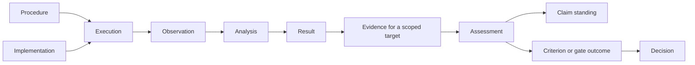

# Stage A output — designer `gpt` (`openai-codex/gpt-5.6-sol`)

**Verbatim, unedited.** Everything below the horizontal rule is this
designer's complete stdout, committed before any output was read and before
any cross-reading. Run 2026-08-20:

```
omp -p --no-session --no-title --auto-approve --no-tools \
  --model openai-codex/gpt-5.6-sol --thinking high \
  --cwd <empty scratch dir> --max-time 20m --mode text \
  -- @<stage A packet, 73 lines>
```

Input was `002_stage_a_packet.md` **below its horizontal rule only** — the
preamble is repo commentary and names terms the packet exists to withhold.
No repository access, no tools, no knowledge that other designers exist.

---

# Read-surface design

The surface should answer research questions, not expose a graph, event store, or collection of records. Every operation should:

- accept an optional **as-of time**, defaulting to now;
- distinguish **recorded fact**, **recorded judgment**, and **derived conclusion**;
- return `determined`, `partly determined`, or `cannot determine`, rather than forcing a Boolean;
- include the evidence and reasoning behind its answer;
- identify missing or disputed information;
- preserve exact scope: a weaker answered question must not make a stronger question appear answered;
- never treat “not found” as “did not happen,” especially for scratch work.

The names below are illustrative researcher-facing operations rather than transport-level API names.

---

## 1. Read operations

### R1. `where_does_the_programme_stand`

**Caller passes**

- The programme.
- Optionally, an as-of time.

**Returns**

- Active, answered, closed, superseded, and deliberately accepted-unresolved lines of enquiry.
- The current questions in each line.
- Current claims, with their exact scopes and present assessments.
- The evidence chiefly responsible for those assessments.
- Studies in progress and the stage each has reached.
- Material disagreements, missing evaluations, and unresolved dependencies.
- A record of negative answers without converting them into a programme-level “failure” score.

This is a map of the research state, not a dashboard or aggregate success metric.

**Serves statements:** 1, 2, 4, 14.

---

### R2. `where_does_this_line_of_enquiry_stand`

**Caller passes**

- A line of enquiry.
- Optionally, an as-of time.

**Returns**

- Why the line was opened.
- Its originating and current questions.
- Branches, refinements, and follow-up questions.
- Answers reached, including well-supported negative answers.
- Questions still open or deliberately accepted as unresolved.
- Whether the line is active, closed by an answer, closed without an answer, or superseded.
- The decision and rationale for any closure.
- Other lines or programme questions that remain unaffected by its closure.

**Serves statements:** 1, 4, 13, 14.

---

### R3. `explain_this_question`

**Caller passes**

- A question.
- Optionally, an as-of time.

**Returns**

- Its exact current formulation and scope.
- Earlier formulations and why they changed.
- Related questions: weaker, stronger, refined, alternative, or spawned-by.
- The claims that purport to answer it.
- Whether each claim answers all or only part of the question.
- Its current disposition: active, answered, accepted-unresolved, superseded, or otherwise closed.
- Any disagreement about its formulation, scope, or disposition.

A positive answer to a weaker related question is shown alongside, not substituted for, the answer to this question.

**Serves statements:** 1, 2, 6, 13, 14.

---

### R4. `compare_these_questions`

**Caller passes**

- Two questions.
- Optionally, an as-of time.

**Returns**

- Whether one is recorded or demonstrably stronger, weaker, narrower, broader, a refinement, or an independent question.
- Their overlapping and non-overlapping scopes.
- Which evidence and claims answer each.
- Whether an answer transfers from one to the other, and under what recorded assumptions.
- `Cannot determine relationship` when the formulations are too informal or no defensible relation is recorded.

The operation must not infer implication merely because the questions use similar words.

**Serves statements:** 2, 5.

---

### R5. `explain_this_claim`

**Caller passes**

- A claim.
- Optionally, an as-of time.

**Returns**

- The exact proposition and scope.
- Which question or questions it addresses.
- Its current assessment, such as supported, challenged, insufficiently supported, or unresolved.
- Supporting, challenging, and scope-limiting evidence.
- The criteria under which its support was assessed.
- Earlier assessments and why they changed.
- Related but distinct claims, including weaker, stronger, or replacement claims.
- Dependencies whose failure would require reconsideration.

The claim remains distinct from the computations, observations, and artefacts used to assess it.

**Serves statements:** 2, 4, 12.

---

### R6. `why_is_this_claim_currently_held`

**Caller passes**

- A claim.
- Optionally, the criterion or decision context whose standard of support matters.
- Optionally, an as-of time.

**Returns**

- A trace from observations through analyses and results to evidence and claim assessments.
- For each evidential step:
  - whether its inputs and provenance are usable;
  - whether it applies to the claim’s scope;
  - whether it satisfies the relevant evidential criterion;
  - recorded challenges or failed robustness conditions.
- A separation between formal results and their scientific interpretation.
- The decisive support, decisive objections, and unresolved gaps.
- An explanation of why the current assessment follows—or why no defensible assessment follows.

A significant primary computation may therefore be shown as validly computed but insufficient for the claim because a prespecified robustness criterion failed.

**Serves statements:** 3, 11, 12, 17.

---

### R7. `do_these_claims_genuinely_conflict`

**Caller passes**

- Two claims.
- Optionally, an as-of time.

**Returns**

One of:

- `Genuine conflict`
- `Compatible`
- `Apparently conflicting but differently scoped`
- `Relationship cannot be determined`

Along with:

- the exact propositions and scopes;
- the questions each answers;
- relevant times, populations, conditions, methods, and definitions;
- whether one claim is stronger or more general;
- whether they rely on independent or shared evidence;
- the logical or recorded reason for the conclusion;
- any missing relation or scope information preventing determination.

Two differently scoped findings must not be labelled contradictory merely because their summaries sound opposed.

**Serves statement:** 5.

---

### R8. `explain_this_study`

**Caller passes**

- A study.
- Optionally, an as-of time.

**Returns**

- The questions and claim scopes the study was designed to address.
- Its current stage and stage history.
- The committed procedure and criteria, including their versions.
- Executions performed under the study.
- Implementations and machinery used by each execution.
- Gates, evaluations, and promotion or closure decisions.
- Observations, analyses, results, evidence, and resulting claim assessments.
- Procedure changes and their classifications.
- Follow-up questions that were kept outside the completed study’s scope.

**Serves statements:** 6, 7, 8, 13, 15, 16.

---

### R9. `explain_this_evidence`

**Caller passes**

- An evidence item.
- Optionally, an as-of time.

**Returns**

- What observation, analysis, result, or artefact supplies it.
- Its provenance and dependencies.
- Its assigned purpose, such as exploratory, feasibility, confirmatory, robustness, or equivalence evidence.
- The claims, criteria, gates, or decisions for which it has been cited.
- Assessments of:
  - integrity;
  - applicability;
  - sufficiency;
  - independence from other evidence.
- Failed checks, objections, and superseding assessments.
- Which underlying observations survive if an associated analysis is invalidated.

**Serves statements:** 3, 9, 10, 11, 12, 17.

---

### R10. `explain_this_gate`

**Caller passes**

- A gate.
- Optionally, an as-of time.

**Returns**

- The transition controlled by the gate.
- The exact criterion versions composing it.
- Whether and when those criteria were committed.
- Every actual evaluation, including the evidence evaluated and its outcome.
- Separate outcomes for each criterion.
- A derived gate state:
  - `passed`;
  - `failed`;
  - `not evaluated`;
  - `partly evaluated`;
  - `indeterminate`.
- Any decision made at the gate, kept separate from the derived criterion outcome.

The presence of an artefact, field, or object called “gate” is never treated as evidence that the gate was evaluated.

**Serves statements:** 3, 8, 17.

---

### R11. `what_changed_and_why`

**Caller passes**

- A question, claim, study, procedure, criterion, gate, or line of enquiry.
- Optionally, a time interval.
- Optionally, an as-of time.

**Returns**

A chronological explanation of changes, including:

- before and after formulations or versions;
- what changed semantically and what changed only mechanically;
- the review, evidence, or feasibility problem that prompted the change;
- the recorded rationale and decision;
- timing relative to procedure commitment and confirmatory evidence;
- whether old evidence was reinterpreted, made inapplicable, or left untouched;
- disagreements or absent rationales.

**Serves statements:** 1, 6, 7, 12.

---

### R12. `is_this_study_ready_for_the_next_stage`

**Caller passes**

- A study.
- The proposed target stage.
- Optionally, an as-of time.

**Returns**

- `Eligible`, `not eligible`, or `indeterminate`; this is not an approval.
- The gates controlling the transition.
- Each criterion and its actual evaluations.
- The evidence supporting each evaluation.
- Missing, failed, or disputed conditions.
- Any recorded promotion decision, separate from calculated eligibility.
- The exact reason enthusiasm, expense already incurred, or an object named “gate” does not satisfy the transition.

**Serves statements:** 8, 17.

---

### R13. `what_kind_of_procedure_change_was_this`

**Caller passes**

Either:

- A recorded procedure change; or
- Two procedure versions to compare.

Optionally:

- An as-of time.

**Returns**

- The recorded classification, or `unclassified`.
- Any competing assessments.
- Whether the change was:
  - editorial;
  - a repair of a mechanical defect;
  - machinery-only while preserving the scientific procedure;
  - a substantive scientific-design change;
  - or evidence of a new execution or study.
- Timing relative to commitment and evidence.
- Which scientific criteria and prior results remain applicable.
- The rationale and evidence supporting the classification.

The operation reports whether a repair was justified; it does not infer innocence or misconduct from the label “repair.”

**Serves statements:** 7, 16.

---

### R14. `explain_this_reconstruction_attempt`

**Caller passes**

- A reconstruction attempt.
- Optionally, an as-of time.

**Returns**

- The historical execution, procedure, analysis, or artefact being reconstructed.
- Sources used.
- Components recovered exactly.
- Components recovered approximately, including the accepted tolerance or comparison criterion.
- Components whose provenance remains unresolved.
- Contradictions among sources.
- A component-by-component fidelity assessment rather than one optimistic overall label.

**Serves statement:** 9.

---

### R15. `explain_this_reproduction_attempt`

**Caller passes**

- A reproduction attempt.
- Optionally, an as-of time.

**Returns**

- What was intended to be reproduced:
  - a conclusion;
  - a claim assessment;
  - an analysis result;
  - a procedure;
  - or an exact execution.
- The new execution and its procedure and implementation.
- Comparison criteria and their evaluations.
- Whether the conclusion was reproduced.
- Separately, how closely the execution was reproduced.
- Differences that matter scientifically and differences that are merely mechanical.
- Any aspect for which comparison is impossible.

A reproduced conclusion is not reported as an exact reproduction of execution.

**Serves statements:** 10, 16.

---

### R16. `is_this_candidate_implementation_equivalent_to_the_reference`

**Caller passes**

- A candidate implementation.
- A reference implementation.
- The intended scientific use.
- Optionally, an as-of time.

**Returns**

- Whether the reference and candidate roles were actually assigned for that use.
- The exact equivalence criteria.
- Evaluations performed and the evidence used.
- Differences within and outside accepted tolerances.
- `Equivalent`, `not equivalent`, `not fully evaluated`, or `indeterminate`.
- Any recorded promotion decision.
- Whether the evidence covers the proposed use rather than only a narrower test case.

Performance measurements alone cannot establish scientific equivalence.

**Serves statements:** 15, 17.

---

### R17. `what_would_need_reconsideration_if_this_were_unusable`

**Caller passes**

- An observation, analysis, result, artefact, evidence item, implementation, or claim.
- Optionally, the precise hypothetical failure, such as “analysis is invalid” rather than “everything is wrong.”
- Optionally, an as-of time.

**Returns**

- Direct and transitive dependencies.
- Items partitioned into:
  - directly unusable;
  - assessment must be reconsidered;
  - weakened but still independently supported;
  - unaffected.
- For an invalid analysis, the underlying observations that remain intact.
- Claims supported by independent evidence.
- Gates or decisions that relied on the affected item.
- Places where the record is insufficient to determine impact.

This is a hypothetical read. It does not itself invalidate or change anything.

**Serves statements:** 11, 12.

---

### R18. `what_new_work_came_from_this_study`

**Caller passes**

- A study, execution, result, or claim.
- Optionally, an as-of time.

**Returns**

- Follow-up questions explicitly spawned from it.
- The surprising observation, result, or interpretation that motivated each.
- How each new question differs from the completed study’s committed scope.
- The line of enquiry and study, if any, now responsible for it.
- Its current disposition.
- Any purported follow-up that was instead treated as an in-scope analysis, with the reason.

**Serves statement:** 13.

---

### R19. `what_is_still_unresolved`

**Caller passes**

- A programme or line of enquiry.
- Optionally, whether to include deliberately accepted-unresolved questions.
- Optionally, an as-of time.

**Returns**

- Active unresolved questions.
- Stronger questions left unresolved despite answers to weaker ones.
- Questions deliberately accepted as unresolved.
- The recorded reason and decision for accepting that disposition.
- Conditions that could make reconsideration appropriate, if any were recorded.
- A clear distinction between:
  - unresolved work expected to continue;
  - unresolved work deliberately not queued;
  - missing information that prevents classification.

It does not fabricate tasks merely to eliminate unresolved states.

**Serves statements:** 2, 14.

---

### R20. `is_this_part_of_the_scientific_record`

**Caller passes**

- An artefact, note, execution, result, or other identified item.
- Optionally, an as-of time.

**Returns**

- Whether the item is admitted to the scientific record, deliberately ephemeral, excluded, or of unknown status.
- When and why that status was assigned.
- Its provenance, if known.
- Whether it may be used as evidence.
- Any admitted record derived from it.
- A warning that this operation cannot enumerate or make claims about scratch work that was never admitted or identified.

**Serves statement:** 18.

---

## 2. Questions the surface should refuse

A refusal should not be a blank or generic error. It should return:

1. the exact question it could not answer;
2. `out of scope` or `cannot determine`;
3. what is known;
4. what distinction or information is missing;
5. why that missing information matters;
6. the narrower questions the surface can answer.

### “Which run performed best?”

**Refuse as:** `Out of scope`.

**Say instead:** LabKit records the scientific purpose, evidence, and interpretation of executions, not operational metrics. It can identify the executions and their associated studies and artefacts, but runtime, throughput, utilization, and sweep comparisons must come from the accompanying run-tracking system.

---

### “Is this claim actually true?”

**Refuse as:** `Cannot certify truth`.

**Say instead:** State the claim’s current assessment, exact scope, support, objections, criteria, and unresolved dependencies. LabKit can explain what the research currently holds and why; it cannot convert finite recorded evidence into an unconditional guarantee of truth.

---

### “These summaries sound opposite. Are the findings contradictory?”

**Refuse when:** The exact claims, scopes, or relation between their questions cannot be established.

**Say instead:** Show the known differences and identify whether population, time, intervention, endpoint, model, or proposition strength is missing. Do not force a conflict classification from prose similarity.

---

### “The gate object exists, so did the study pass?”

**Refuse when:** No criterion evaluation is recorded.

**Say instead:** The gate and its criteria exist, but there is no evidence that the criteria were evaluated. Report `not evaluated`, not `passed` and not `failed`.

---

### “Was this amendment legitimate, or was it p-hacking?”

**Refuse when:** Timing, rationale, semantic effect, or access to confirmatory evidence is not known.

**Say instead:** Report what changed, when it changed, what evidence was available, and any recorded classifications or disagreements. State which facts needed to distinguish a mechanical repair from a scientific redesign are absent. Do not infer intent.

---

### “Can we promote this candidate?”

**Refuse as phrased:** A read surface cannot approve promotion.

**Say instead:** Report whether the candidate is eligible under the recorded criteria, which evaluations passed or failed, what remains unevaluated, and whether an authorized promotion decision already exists.

---

### “Was this an exact reconstruction?”

**Refuse when:** The historical target, source provenance, or exactness criterion is missing.

**Say instead:** Identify which components were recovered exactly, which only approximately, and which cannot be compared. Never turn missing provenance into presumed equality.

---

### “Did this reproduce the old experiment?”

**Refuse when:** “Reproduce” has no declared target.

**Say instead:** Ask the recorded comparison separately for conclusion, claim assessment, analysis result, procedure, and execution. It may have reproduced one and not the others.

---

### “Nothing is recorded, so this was never tried, correct?”

**Refuse as:** `Cannot infer non-occurrence from absence`.

**Say instead:** No admitted scientific record of the attempt is known. Scratch work may be intentionally unrecorded or no longer available.

---

### “Why did the team make this change?”

**Refuse when:** No rationale or attributable review survives.

**Say instead:** Report the before and after states, timing, and nearby evidence, but label any causal explanation as unavailable. Temporal adjacency is not a remembered reason.

---

### “What was the programme’s state before the earliest retained history?”

**Refuse when:** The necessary identities, versions, or effective decisions are absent.

**Say instead:** Give the earliest defensible as-of view, identify what predates it, and avoid projecting the present state backward.

---

### “What should we do next?”

**Refuse as:** Normative decision outside a read-only surface.

**Say instead:** Return unresolved questions, eligible stage transitions, failed or unevaluated criteria, threatened claims, and recorded candidate next steps. Choosing or approving work is a separate operation.

---

### “This analysis is invalid, so all its observations and conclusions are invalid too, right?”

**Refuse the bundled premise.**

**Say instead:** Trace the consequences separately. The analysis result and evidence derived through it may be unusable; underlying observations may remain valid; some claims may retain independent support; others may require reassessment.

---

### “The primary result is significant, so the claim is supported, correct?”

**Refuse when:** The relevant evidential criterion includes unevaluated or failed robustness conditions.

**Say instead:** The primary result met its significance condition, but the overall support criterion did not pass—or cannot yet be determined. Report each condition separately.

---

## 3. Glossary

Operation references use the identifiers above.

---

## Research framing

### 1. Research programme

- **Definition:** The enduring body of related research whose state LabKit is describing. It may contain many lines of enquiry and may continue despite individual negative or unresolved answers.
- **Required by:** R1, R19.
- **Identity:** A programme keeps its identity through changes of personnel, questions, and methods when its declared continuity remains. A split, merger, or replacement must create distinct identities and explicit relations.
- **Remember:** Its identity, remit, creation, declared changes of remit, constituent lines, and split or merger decisions.
- **Derive:** Its current map of questions, claims, studies, and unresolved matters can be assembled as an as-of view.
- **Without it:** “This line produced a strong negative answer” and “the entire research effort failed” would become indistinguishable.

### 2. Line of enquiry

- **Definition:** A coherent thread of questioning pursued within a programme, including its branches and closure. It is narrower than the programme and broader than one question or study.
- **Required by:** R1, R2, R18, R19.
- **Identity:** A line persists while it represents the same declared investigative thread. A surprising branch with a materially different target becomes a new linked line rather than silently changing the old one.
- **Remember:** Why it was opened, its questions, branch relations, closure or continuation decisions, and rationale.
- **Derive:** Current standing, unresolved questions, and aggregate supporting work.
- **Without it:** “A negative answer closed the specific calibration enquiry” and “the negative answer terminated the whole programme” would look the same.

### 3. Question

- **Definition:** A proposition or uncertainty the research intends to resolve, stated with enough scope to tell what would count as answering it.
- **Required by:** R1–R5, R7, R8, R18, R19.
- **Identity:** Editorial clarification may remain a new version of the same question. A materially stronger, weaker, differently scoped, or newly motivated proposition is a distinct linked question.
- **Remember:** Formulations, scope, origin, formulation changes, relations to other questions, and disposition decisions.
- **Derive:** Current formulation, candidate answers, and whether available claims cover all of its scope.
- **Without it:** “The method helps on average” and “the method helps every important subgroup” would collapse into one question, making a weak positive result falsely settle the stronger proposition.

### 4. Scope

- **Definition:** The boundaries and quantifiers of a question or claim: for example population, conditions, time, endpoint, model, intervention, and degree of generality.
- **Required by:** R1–R9, R13, R15, R16, R18.
- **Identity:** An exact scope version remains the same only while those boundaries remain unchanged. Broadening the population or changing “some” to “all” creates a new scope version.
- **Remember:** The exact boundaries attached to each question, claim, study, criterion, and evidence use.
- **Derive:** Overlap, containment, and sometimes implication where the scope is sufficiently formal.
- **Without it:** “No effect in adults under protocol A” and “no effect in children under protocol B” could be reported as contradictory, or as one universal negative claim.

### 5. Question relation

- **Definition:** An attributable relationship between questions, such as stronger-than, weaker-than, refinement-of, alternative-to, duplicate-of, or spawned-by.
- **Required by:** R2–R4, R7, R18.
- **Identity:** A relation is distinguished by its two endpoints, relation type, asserted direction, effective time, and source. A later correction is a new assessment of that relation.
- **Remember:** Relations that were explicitly asserted or scientifically justified, including rationale and disputes.
- **Derive:** Some relations may be checked from formal propositions and scopes; transitive chains may be calculated when valid.
- **Without it:** “The follow-up asks a stronger version of the original question” and “the follow-up is an unrelated question merely using similar vocabulary” would be indistinguishable.

### 6. Disposition

- **Definition:** The research treatment of a question or line: active, answered, closed, deliberately accepted as unresolved, or superseded. It is not a truth value and not a programme success score.
- **Required by:** R1–R3, R18, R19.
- **Identity:** Each disposition decision has its own effective time and basis. The current disposition is the latest applicable, non-superseded decision.
- **Remember:** The decision, effective time, rationale, authority, and any conditions for reopening.
- **Derive:** Current disposition and counts or summaries by disposition.
- **Without it:** “Nobody has yet worked on this question” and “the programme deliberately accepts that this question will remain unresolved” would both appear merely open.

### 7. Claim

- **Definition:** A scoped proposition the research may assess as supported, challenged, or unresolved. It is an interpretation that can be revised independently of its source observations or computations.
- **Required by:** R1, R3–R7, R9, R15, R17.
- **Identity:** A claim retains identity while its exact proposition and scope remain fixed and only its assessment changes. A materially revised proposition is a new linked claim.
- **Remember:** Exact proposition, scope, origin, target questions, related claims, and assessment history.
- **Derive:** Current assessment, supporting and challenging evidence, and affected claims under dependency tracing.
- **Without it:** “The computation produced \(p<0.05\)” and “the intervention is effective in the target population” would collapse into one statement, preventing the latter from being revised independently.

### 8. Assessment

- **Definition:** A time-bounded, attributable judgment about a subject, such as evidence integrity, applicability, claim support, conflict, equivalence, fidelity, or change classification.
- **Required by:** R5–R7, R9, R11–R17.
- **Identity:** An assessment is distinguished by its subject, question being judged, criteria, evidence considered, assessor or authority, and effective time. Reassessment creates another assessment rather than overwriting the first.
- **Remember:** Outcome, dimensions assessed, criteria, evidence basis, rationale, attribution, time, and supersession or disagreement.
- **Derive:** The presently effective assessment and summaries of consensus or disagreement.
- **Without it:** “The analysis artefact has not changed, but reviewers no longer consider it sufficient” and “the analysis itself was rerun and produced a different result” would be indistinguishable.

---

## Work, procedure, and governance

### 9. Study

- **Definition:** A bounded scientific undertaking intended to address specified questions under a design, criteria, and procedure. A study may have several stages and executions.
- **Required by:** R1–R3, R8, R12, R15, R18.
- **Identity:** It remains the same study through explicitly governed design development. A post-commitment change that alters the scientific target or correctness conditions may require a new linked study; that identity decision must be explicit.
- **Remember:** Purpose, questions, scope, stages, procedure commitments, criteria, executions, and closure.
- **Derive:** Current stage, evidence produced, answered questions, and outstanding gates.
- **Without it:** “A surprising result led to a separate follow-up study” and “the original study silently expanded its confirmatory scope after seeing the result” would look the same.

### 10. Stage

- **Definition:** A purposeful phase of a study, such as exploration, feasibility, pilot, confirmation, or equivalence validation, with explicit conditions for entering or leaving it.
- **Required by:** R1, R8, R10, R12.
- **Identity:** A stage is distinguished by its study, purpose, place in the planned progression, and applicable gate versions.
- **Remember:** Purpose, ordering, entry and exit conditions, and any transition decisions.
- **Derive:** Current stage and eligibility for a target stage from gate evaluations.
- **Without it:** “A cheap feasibility execution justified considering an expensive experiment” and “the feasibility execution itself supplied the confirmatory answer” would become indistinguishable.

### 11. Procedure

- **Definition:** The prescribed way a study or execution is to be carried out, including scientifically material steps and relevant machinery.
- **Required by:** R8, R11, R13, R15.
- **Identity:** A procedure has a continuing identity across declared versions, while each exact version is immutable. If scientific purpose or correctness conditions change materially, the relation to the old procedure must be explicit rather than assumed.
- **Remember:** Exact versions, applicability, components, commitments, amendments, and use by executions.
- **Derive:** Differences between versions and which executions followed which version.
- **Without it:** “The same committed analysis was run on new hardware” and “a different estimator was substituted after results were seen” could both appear as generic implementation changes.

### 12. Version

- **Definition:** An immutable historical state of a question formulation, scope, procedure, criterion, gate, or other revisable subject.
- **Required by:** R3, R8–R11, R13, R15, R16.
- **Identity:** A version is distinguished by its subject, exact content, and effective interval. The continuing subject and the exact version have separate identities.
- **Remember:** Exact content, predecessor, successor, effective time, and change event.
- **Derive:** Current version and differences between versions.
- **Without it:** “Execution A used the original prespecified criterion” and “Execution B used the criterion after review changed its threshold” would both appear to use “the criterion.”

### 13. Commitment or lock

- **Definition:** The event at which a procedure, question, scope, or criterion becomes prospectively fixed for a stated purpose, especially before confirmatory evidence.
- **Required by:** R8, R10, R11, R13.
- **Identity:** Each commitment is tied to exact versions, purpose, authority, and effective time. A recommitment after an amendment is distinct.
- **Remember:** What was committed, when, by whom or under what authority, for which study stage, and what evidence was available.
- **Derive:** Whether a later change was pre- or post-commitment and whether evidence preceded it.
- **Without it:** “The robustness criterion was specified before confirmatory data” and “the same criterion was added after the primary result was inspected” would be indistinguishable.

### 14. Change event

- **Definition:** An attributable transition from one version, assessment, role, or disposition to another, with a reason and effective time.
- **Required by:** R3, R5, R11, R13, R16, R20.
- **Identity:** A change event is distinguished by subject, before and after states, time, decision context, and source. Corrections to its description remain separate changes.
- **Remember:** Before and after states, rationale, timing, attribution, triggering evidence or review, and any classification.
- **Derive:** Timelines, current state, and cumulative differences.
- **Without it:** “The question was sharpened through documented review” and “the historical question was silently overwritten to match the eventual experiment” would look identical.

### 15. Amendment

- **Definition:** A change to something already committed, especially a locked procedure or criterion. It may be mechanical, scientific, or disputed.
- **Required by:** R8, R11, R13.
- **Identity:** An amendment is tied to one committed version and one replacement version, with a specific effective time and justification.
- **Remember:** The defect or need, exact change, rationale, evidence available, authorization, classification, and recommitment.
- **Derive:** A textual or structural diff and which executions are governed by each side.
- **Without it:** “A broken file path was repaired while preserving the estimator” and “the estimator was changed after seeing an unfavourable result” would both appear as ordinary procedure edits.

### 16. Review

- **Definition:** A deliberative episode in which questions, criteria, procedures, or interpretations are examined and recommendations or decisions may be made.
- **Required by:** R3, R5, R11, R13.
- **Identity:** A review is distinguished by its remit, participants or authority, inputs, time, and resulting recommendations or decisions.
- **Remember:** Materials considered, issues raised, rationale, disagreements, recommendations, and resulting changes.
- **Derive:** Which changes arose from a review and whether it occurred before confirmatory evidence.
- **Without it:** “The criterion changed because preregistration review exposed ambiguity” and “the criterion changed for an unknown reason after data arrived” would be indistinguishable.

### 17. Criterion

- **Definition:** An exact condition used to judge evidence, robustness, equivalence, eligibility, fidelity, or another research property.
- **Required by:** R5, R6, R8–R10, R12, R14–R16.
- **Identity:** A criterion is distinguished by its predicate, scope, tolerance, inputs, purpose, and version. Changing a threshold or required check creates a new version.
- **Remember:** Exact condition, intended use, scope, version history, commitment state, and relation to gates.
- **Derive:** Whether a supplied and usable evidence set satisfies it, where the evaluation is deterministic.
- **Without it:** “The candidate matched the reference within the declared scientific tolerance” and “the outputs merely looked close to a reviewer” would be indistinguishable.

### 18. Gate

- **Definition:** A named decision point controlling a specific transition through one or more criteria. A gate’s outcome is determined by criterion evaluations, not by the gate’s existence.
- **Required by:** R8, R10, R12, R17.
- **Identity:** A gate is distinguished by its source stage, target stage or action, exact criterion set, scope, and version.
- **Remember:** Controlled transition, criterion versions, decision authority, and any decisions made.
- **Derive:** Passed, failed, partly evaluated, not evaluated, or indeterminate from applicable evaluations.
- **Without it:** “A robustness report was attached to the study” and “the required robustness criterion was evaluated and passed for promotion” would look the same.

### 19. Evaluation

- **Definition:** An actual application of a criterion to identified evidence, yielding an outcome and diagnostics. It is distinct from defining the criterion and from making a decision.
- **Required by:** R6, R9, R10, R12, R14–R16.
- **Identity:** An evaluation is distinguished by criterion version, evidence set, execution or context, evaluator, and time. Re-evaluation with changed evidence is new.
- **Remember:** Inputs, criterion, outcome, diagnostics, errors, attribution, time, and applicability.
- **Derive:** Gate outcome, stage eligibility, and portions of an equivalence or fidelity assessment.
- **Without it:** “A gate had a criterion named `robustness_passed`” and “the robustness analysis was actually run and failed” would be indistinguishable.

### 20. Decision

- **Definition:** An attributable act that adopts, rejects, closes, promotes, commits, assigns a role, or otherwise governs research work. A calculated eligibility result is not itself a decision.
- **Required by:** R2, R8, R10–R13, R16, R19, R20.
- **Identity:** A decision is distinguished by its subject, action, authority, effective time, and governing context. Reversal is a later decision.
- **Remember:** Action, authority, rationale, evidence considered, time, conditions, and later reversal or supersession.
- **Derive:** Presently effective decisions and whether they were consistent with recorded gate outcomes.
- **Without it:** “The candidate satisfied all promotion criteria” and “the candidate was actually designated as the new reference” would become indistinguishable.

### 21. Rationale

- **Definition:** The recorded reason offered for an assessment, change, or decision, including the considerations judged material at the time.
- **Required by:** R2, R3, R5–R7, R11–R14, R18–R20.
- **Identity:** A rationale belongs to a particular assessment, change, or decision and its authoring context. A later reinterpretation is a separate rationale.
- **Remember:** The reason as stated, attribution, time, evidence cited, and acknowledged uncertainty or dissent.
- **Derive:** Concise explanations and recurring reason categories; the historical reason itself cannot be reconstructed safely from outcomes.
- **Without it:** “The stronger question was left unresolved because available evidence could not address it” and “it was forgotten without any deliberate choice” would look the same.

### 22. Execution

- **Definition:** One actual carrying out of a study procedure, as distinct from the study’s scientific design and from the implementation used.
- **Required by:** R8, R9, R13, R15, R17.
- **Identity:** Every carrying-out has a distinct identity even if inputs and procedure are nominally identical. It is tied to procedure version, implementation, inputs, time, and produced artefacts.
- **Remember:** Study, procedure version, implementation, inputs, environment where scientifically relevant, outputs, and provenance.
- **Derive:** Similarity to another execution and which evidence arose from it.
- **Without it:** “The same stored output was reinterpreted” and “the procedure was executed again and independently reached the same conclusion” would be indistinguishable.

### 23. Implementation

- **Definition:** Concrete machinery that realizes a procedure, such as code, solver, instrument configuration, or optimized algorithm.
- **Required by:** R8, R13, R15–R17.
- **Identity:** An implementation is distinguished by exact code or configuration and its version. Rebuilds may count as the same implementation version only when their scientifically relevant identity is established.
- **Remember:** Exact version, provenance, intended procedure, relevant environment, known limitations, and role history.
- **Derive:** Which executions used it and evidence bearing on equivalence.
- **Without it:** “The trusted algorithm was rerun with a faster but unvalidated implementation” and “the trusted implementation itself was rerun on new data” would look the same.

### 24. Role assignment

- **Definition:** A time-bounded designation of an item’s purpose, such as reference implementation, candidate implementation, exploratory evidence, feasibility evidence, or confirmatory evidence.
- **Required by:** R8, R9, R12, R16.
- **Identity:** A role assignment is distinguished by item, role, intended use, scope, decision, and effective interval.
- **Remember:** The assigned role, scope, authority, rationale, and effective time.
- **Derive:** Current reference or candidate for a use and whether cited evidence was intended as confirmatory.
- **Without it:** “This implementation is trusted as the reference” and “this implementation is merely a candidate that happened to run first” would be indistinguishable.

---

## Empirical and inferential record

### 25. Observation

- **Definition:** A recorded empirical occurrence or measurement before the particular analysis and interpretation used to make a claim.
- **Required by:** R6, R9, R17.
- **Identity:** An observation is distinguished by what was observed, source, acquisition event, conditions, and provenance. Correcting its recorded value creates a correction history, not silent replacement.
- **Remember:** Value or content, units and conditions, acquisition provenance, quality issues, and corrections.
- **Derive:** Inclusion in analyses, summaries, and which claims indirectly depend on it.
- **Without it:** “The raw observations remain usable but their regression analysis was invalid” and “the underlying measurements themselves were corrupted” would be indistinguishable.

### 26. Analysis or computation

- **Definition:** A defined transformation of inputs into results, including statistical, symbolic, qualitative, or algorithmic analysis.
- **Required by:** R6, R9, R15, R17.
- **Identity:** An analysis execution is distinguished by method version, implementation, inputs, parameters that affect scientific meaning, and execution identity.
- **Remember:** Method, implementation, inputs, relevant configuration, outputs, diagnostics, and provenance.
- **Derive:** Re-executable results only when all necessary inputs and machinery remain available; dependencies and comparisons can also be derived.
- **Without it:** “The observations support a claim only through a flawed model” and “the same observations directly satisfy a simple count criterion” would look the same.

### 27. Result

- **Definition:** The scientific or formal output produced by an analysis, execution, or evaluation before it is interpreted as a broader claim.
- **Required by:** R5, R6, R8, R9, R14, R15, R18.
- **Identity:** A result is tied to the producing activity and exact inputs. Numerically equal results from different executions remain distinct results.
- **Remember:** Value or structured outcome, units, uncertainty, diagnostics, producer, and relation to source artefacts.
- **Derive:** Some results can be recomputed when complete provenance survives; summaries and comparisons may be derived.
- **Without it:** “The test returned a formally significant statistic” and “reviewers judged the overall evidence sufficient for the scientific claim” would collapse into one conclusion.

### 28. Artefact

- **Definition:** A persistent digital or physical carrier, such as a dataset, notebook, report, model, image, code package, or instrument export.
- **Required by:** R6, R8, R9, R14–R17, R20.
- **Identity:** An exact artefact version is distinguished by its content and provenance; a mutable filename is not sufficient identity.
- **Remember:** Content identity, version, creator, creation process, custody, format, and record status.
- **Derive:** Equality, differences, referenced results, and dependencies where content remains readable.
- **Without it:** “Two reports point to the same immutable dataset” and “one report points to a later file silently written under the same name” would be indistinguishable.

### 29. Evidence

- **Definition:** An identified use of observations, analyses, results, or artefacts as bearing on a claim, criterion, question, or decision. Evidence is relational: the same result may be useful for one proposition and insufficient for another.
- **Required by:** R1, R3, R5–R10, R12, R14–R17.
- **Identity:** An evidence item is distinguished by its sources, target, asserted bearing, intended role, and scope. Reusing the same result for another claim creates a distinct evidential use.
- **Remember:** Sources, target, role, asserted direction, scope, provenance, and assessment history.
- **Derive:** Current usability, support chains, overlap with other evidence, and gate coverage.
- **Without it:** “The significant result is evidence for a narrow average-effect claim” and “the same result is sufficient evidence for the stronger all-subgroups claim” would be indistinguishable.

### 30. Provenance

- **Definition:** The attributable history of where an item came from, how it was produced, and what earlier items or actors it depends on.
- **Required by:** All operations, especially R6, R9, R14–R17, R20.
- **Identity:** Each provenance assertion is tied to a subject, source relation, attribution, and time. Conflicting provenance assertions coexist until assessed.
- **Remember:** Origins, creators or responsible agents, transformations, source identities, times, custody where relevant, and unresolved gaps.
- **Derive:** Lineage paths, common ancestors, independence warnings, and recoverability.
- **Without it:** “Two analyses independently corroborate a claim” and “both analyses are copies of the same undocumented spreadsheet calculation” would look the same.

### 31. Dependency

- **Definition:** A typed statement that one item relies on another, such as analysis-uses-observation, result-produced-by-analysis, evidence-supports-claim, or decision-relies-on-evaluation.
- **Required by:** R5–R7, R9, R14–R17.
- **Identity:** A direct dependency is distinguished by source, target, dependency type, scope, attribution, and effective time.
- **Remember:** Direct scientifically meaningful dependencies, qualifications, and disputed or removed dependencies.
- **Derive:** Transitive impact, common dependencies, independent support paths, and candidate reconsideration sets.
- **Without it:** “The claim must be reconsidered because its only analysis failed” and “the claim remains supported by an independent experiment” would be indistinguishable.

---

## Recovery, repeatability, and boundaries

### 32. Reconstruction attempt

- **Definition:** An effort to recover a historical procedure, execution, result, or artefact from incomplete surviving material. Its target is the past record, not a new repetition of the science.
- **Required by:** R14.
- **Identity:** An attempt is distinguished by its historical target, source set, reconstruction method, and time.
- **Remember:** Target, sources, method, recovered components, conflicts, gaps, and assessments.
- **Derive:** Component coverage and comparisons against newly discovered source material.
- **Without it:** “Investigators approximately rebuilt a lost 2019 environment from reports” and “investigators reran the 2019 procedure as a new experiment” would be indistinguishable.

### 33. Reproduction attempt

- **Definition:** A new effort to reproduce a declared target, such as a conclusion, result, procedure, or execution.
- **Required by:** R15.
- **Identity:** An attempt is distinguished by target, new execution, comparison criteria, and time. Repeating it again creates another attempt.
- **Remember:** Target, intended fidelity, procedure, execution, comparison criteria, results, and assessment.
- **Derive:** Whether declared comparison criteria were met and which differences may explain divergence.
- **Without it:** “A new independent execution reached the same conclusion” and “the old output file was opened again and gave the same displayed number” would look the same.

### 34. Fidelity level

- **Definition:** A criterion-backed description of similarity to a target, reported component by component. Relevant levels include exact, approximate within declared tolerance, conclusion-equivalent, and unresolved.
- **Required by:** R14, R15.
- **Identity:** A fidelity assessment is tied to a target, candidate, dimensions, criterion versions, evidence, and time.
- **Remember:** Dimensions compared, criteria and tolerances, outcomes, evidence, and unresolved components.
- **Derive:** Overall summaries only when the rules for combining component outcomes are declared.
- **Without it:** “The original executable was recovered byte-for-byte” and “a modern reimplementation produces roughly similar plots” could both be called “recovered.”

### 35. Change classification

- **Definition:** An assessment of what a change means: editorial, mechanical repair, machinery-only, scientific-design change, or new execution or study.
- **Required by:** R11, R13, R15.
- **Identity:** A classification is tied to one change, an intended scientific use, criteria, evidence, assessor, and time. Competing classifications remain distinct.
- **Remember:** Classification, criteria, rationale, evidence, attribution, and disputes.
- **Derive:** Consequences for which prior criteria, evidence, and claims remain applicable.
- **Without it:** “The code was optimized without changing defined outputs” and “the method’s decision rule was altered to improve the observed answer” would both appear as code revisions.

### 36. Record status

- **Definition:** Whether an identified item is admitted to the scientific record, deliberately ephemeral, excluded, or of unknown standing.
- **Required by:** R9, R20, and implicitly every operation that cites recorded material.
- **Identity:** Each status assignment is tied to an item, purpose, decision, and effective time. Admission of a later curated artefact does not retroactively admit every scratch precursor.
- **Remember:** Status, effective time, rationale, decision, provenance, and any restrictions on evidential use.
- **Derive:** Whether an identified item may be cited by ordinary read operations and which admitted items descend from it.
- **Without it:** “A disposable exploratory notebook happened to mention an idea” and “the notebook was deliberately admitted as evidence for a claim” would be indistinguishable.

### 37. As-of view

- **Definition:** The research state defensible from versions, assessments, and decisions effective at a specified time, without importing later knowledge.
- **Required by:** Every operation.
- **Identity:** An as-of view is identified by programme or subject, time, and applicable interpretation policy. It is derived, not a new scientific event.
- **Remember:** The underlying effective times, versions, changes, assessments, and decisions—not a separately editable snapshot.
- **Derive:** Historical and current views, provided the necessary history survives.
- **Without it:** “What researchers reasonably believed before the robustness failure was discovered” and “what they believe now after reassessment” would be reported as the same state.

---

The central separation is:



No arrow implies identity. An observation is not its analysis; a result is not automatically evidence for every claim; evidence is not automatically sufficient; eligibility is not approval; and a decision does not rewrite the history that preceded it.
