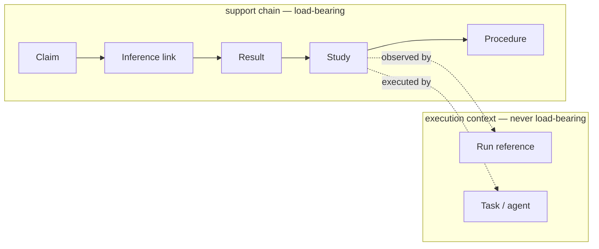

# Stage B revision — designer `claude` (`anthropic/claude-opus-5`)

**Verbatim, unedited.** Everything below the horizontal rule is this
designer's complete stdout. Run 2026-08-20, after `010` was frozen
and committed; `--no-tools`, empty `--cwd`, `--no-session`, stdin detached.

Each designer was given three things and **only its own** Stage A output:
the original Stage A material, its own design reproduced verbatim, and
PJ-001's constraints (`003_stage_b_packet.md`) which it did not have when
designing. Necessary because `--no-session` leaves these processes with no
memory of the earlier run.

Protocol vocabulary was stripped from the prompt: the packet's own heading
read *"The Stage B question"*, which would tell a designer it is inside a
staged experiment and invite a performed revision. It reads "Your task",
and the instruction states that no change is a legitimate answer and more
useful than a manufactured one.

---

# LabKit Read Surface — Revision

**Verdict: the contract changes in nine places, seven of them substantive.** The constraints do not overturn the design, but they expose three genuine defects in it: a refusal that was too broad (metrics), an answer shape that collapses two opposite kinds of absence into one empty field, and a concept (`computation`) that two glossary entries lean on without it ever being defined. They also add one requirement the original surface has no operation for at all — the narrow, derived brief for an implementation agent.

Below: what changes, which constraint forced it, and the glossary effect. Then what I checked and deliberately did *not* change, including where I concede that a concept of mine reads as ceremony.

---

## R1 — The metrics refusal was wrong. Narrow it.

**What changed.** The original surface refuses telemetry questions outright and offers a pointer to the metrics system. The acceptance criteria ask for *"the evidence supporting Claim C7, the computations that generated it, and the relevant run metrics"* in one breath. That is answerable without LabKit becoming a metrics store, and my blanket refusal made it unanswerable.

The replacement rule: **LabKit holds no metric values and resolves no queries over them. It holds addressable references to the executions that produced results, and returns them attached to the support chain.** Relevance is not LabKit's judgement — "relevant" means exactly *produced by an execution appearing in this claim's support chain*. Anything narrower (which metric matters) belongs to the researcher; anything wider would be a dashboard.

`what_this_claim_rests_on` now returns **two separated layers**, and the separation is structural, not cosmetic:

Anything in the lower box is diagnostic. It can explain a result and it can discredit one in a researcher's eyes, but it cannot appear in the answer to "why does this count as supported."

**Constraint that caused it.** MVP question 1; *"allowing computations and external run systems to be linked into the research record"*; *"should not require duplicated bookkeeping across LabKit and external execution systems"*; *"should not make operational entities such as tasks, agents, or runs part of the logical support for a scientific claim."*

**Glossary effect.** **Adds one concept** (Run reference, §39). **Removes one refusal** and replaces it with a narrower one (§2 below). The retained half of the refusal is now sharper: a question about a metric is still refused *as a question LabKit can answer*, but never with a blank — it returns the handle and says who can answer it.

**New entry — §39. Run reference**
*Definition:* An addressable pointer from a study or result to its execution in an external run system, pinning which execution, not what it measured.
*Required by:* `what_this_claim_rests_on`, `can_this_be_re_run`, `where_did_this_come_from`, `what_this_task_must_respect`.
*Identity:* the external system's own execution identity, plus the system's identity. Two references are the same reference if they resolve to the same execution in the same system; a re-run is a different execution and therefore a different reference.
*Must be remembered:* the reference, when it was asserted, and by whom. Never the metric values behind it.
*Derivable:* whether a support chain is fully traceable to executions; which results have no execution behind them.
*Absence loses:* "Result R-9 was produced by `wandb://calib/4102`, which a reviewer can open and check for divergence" becomes indistinguishable from "Result R-9 was produced by a study that ran sometime in March." The first lets someone verify the job did what it claims; the second leaves exactly two options, both forbidden by the constraints — trust the number blind, or copy telemetry into LabKit and maintain it in two places.

---

## R2 — Split absence in two. This is the most load-bearing change.

**What changed.** The original `outstanding` field carries every kind of "what is missing" in one shape. Two of the constraints pull that field in opposite directions:

- *"A missing structure should be tolerated when the science is genuinely unresolved."*
- *"A missing dependency, criterion evaluation, or provenance link should not be silently interpreted as satisfied."*

One `outstanding` cannot serve both. If it treats every gap as a deficit, then an early, deliberately vague question generates a nag list, and the system starts *"prevent[ing] work simply because the eventual scientific structure is not yet fully known."* If it treats gaps softly, an unevaluated gate renders as an empty field, which is the exact failure I attacked in §24.

`outstanding` becomes **three-valued and mandatory** everywhere it appears:

| Value | Meaning | How it must read |
|---|---|---|
| `nothing_outstanding` | The structure exists and the evidence exists. | A positive statement, asserted. |
| `unevaluated` | The structure exists; the evidence does not. Names each item. | **Never** as satisfied, pending, or fine. |
| `unarticulated` | The structure does not exist yet. Names what has not been articulated. | **Not a defect.** Legitimate open research. |

An empty rendering of `outstanding` is now a bug, not a state.

**Constraint that caused it.** The two design principles above, together with *"should not confuse absence of evidence with failure, or a missing evaluation with a pass"* and *"should not prevent work simply because the eventual scientific structure is not yet fully known."*

**Glossary effect.** **Splits** the absence handling that was buried inside §25 (Evidential standing) into a named derived view used by every operation.

**New entry — §40. Absence kind** *(derived view — stores nothing)*
*Definition:* The three-way classification of a gap in an answer: articulated-and-evaluated, articulated-but-unevaluated, or not-yet-articulated.
*Required by:* every operation, via `outstanding`.
*Identity / memory:* none. Computed from whether the structure (proposition, criterion, gate, provenance edge) exists and whether an evaluation record exists against it.
*Absence loses:* "Gate G-9 has a criterion that nobody has ever run" becomes indistinguishable from "this question has not yet been sharpened into anything a criterion could be written against." Both render as an empty `outstanding` list. Collapsing them forces a single global policy, and both available policies are wrong: nag about unarticulated exploration, which is the ceremony the authors explicitly reject, or render unevaluated gates as fine, which is statement 17 failing in the most common way.

---

## R3 — New operation: `why_this_is_still_open`

**What changed.** MVP question 4 has no home in the original surface. `where_this_question_stands` says what is known; `what_we_are_content_not_to_know` says whether it was parked. Neither answers *why it has not closed*.

**`why_this_is_still_open`** — pass a question. Get back, in this order: whether it is parked with an acceptance (and by whom, on what rationale); the propositions posed under it with their individual standings; what has been attempted and where each attempt fell short — failed criterion, unevaluated criterion, unpromoted stage, blocked information boundary; and — the reason the operation is separate — whether the question is **unarticulated**: no propositions yet, therefore nothing that could close it has been stated. That last state returns as a legitimate position with a name, not as an empty attempt list.

**Constraint that caused it.** MVP question 4; *"make it cheap to ask 'why?', 'what depends on this?', 'what remains unresolved?'"*

**Glossary effect.** **None.** It is R2 applied at question level. I considered a separate *articulation state* concept and cut it by my own rule in §38 — it adds no distinction beyond absence kind, so it would be decoration.

---

## R4 — Reopening conditions become first-class

**What changed.** The original records a *revisit trigger* only on an acceptance-of-unresolved (§6). The constraints ask the record to preserve, for a claim, decision, criterion **or** line of enquiry, *"what would invalidate or reopen it."* That generalisation is not free — it is a different kind of fact from anything else in the design.

It must be distinguished sharply from `outstanding`, which it superficially resembles:

- `outstanding` is **derived**, and says what evidence is missing that would *complete* the current answer.
- A reopening condition is **stored, authored, and dated**, and says what future evidence would *overturn* it.

New operation **`what_would_overturn_this`** — pass a claim, closure, decision, or question. Get back the recorded conditions, each with its author, date, and the state of the world it presumes; plus, separately, anything already in the record that appears to meet one, flagged as a candidate for re-examination rather than as an automatic reopening.

**Constraint that caused it.** *"preserve why a claim, decision, criterion, or line of enquiry exists, what evidence it depends on, and what would invalidate or reopen it."*

**Glossary effect.** **Generalises §6's revisit trigger into a standalone concept** attached to four host kinds.

**New entry — §41. Reopening condition**
*Definition:* A recorded, authored statement of what future evidence or circumstance would overturn a claim, void a decision, or reopen a closed question.
*Required by:* `what_would_overturn_this`, `what_closed_this_line`, `what_we_are_content_not_to_know`, `where_the_programme_stands`.
*Identity:* the pair (host, condition statement) plus its author and time; restating the condition more precisely is a revision of the same condition, replacing it with a different circumstance is a new one.
*Must be remembered:* the condition as written, its author, its date, and the host it attaches to. It cannot be inferred — it is a research judgement about the future.
*Derivable:* which conditions currently appear met by evidence already in the record.
*Absence loses:* "We closed this because the mechanism does not operate below 2 GPa, and it should be reopened if a high-pressure rig becomes available" becomes indistinguishable from "we closed this." When the rig arrives in 2027, the first surfaces the question to whoever asks what the new capability unblocks; the second leaves the question closed permanently and the line is either lost or re-derived from nothing. The closure record (§5) tells you *why it ended*; only this tells you *what would restart it*.

---

## R5 — Invalidation must answer hypothetically

**What changed.** MVP question 3 is conditional: *"**If** Artefact A12 is invalidated..."* — asked when no invalidation event exists. The original `what_needs_reconsideration` accepts "the thing invalidated" but frames its answer around honouring *the invalidation's recorded scope*, which a hypothetical does not have. Scope determines the entire blast radius (§33), so the operation cannot supply one.

`what_needs_reconsideration` gains an explicit **hypothetical mode**: the caller must supply the proposed scope — which layer is being voided — and the answer is labelled hypothetical throughout, stating in its own text that nothing in the record has changed. A hypothetical with no scope supplied is **refused**, not defaulted (see §2 below).

**Constraint that caused it.** MVP question 3; *"make dependencies and consequences traversable, so invalidating an artefact or evidence item propagates to affected claims, decisions, and open questions."*

**Glossary effect.** **None added.** §33's invalidation scope is now an input vocabulary as well as a stored property.

---

## R6 — Propagation must reach decisions and open questions, not just claims

**What changed.** The original reconsideration partition is claim-centric: still standing / now unsupported / untouched, over claims. The acceptance criterion names three targets — *"what claims, **decisions**, and **open lines of enquiry** become affected."* Two of those the original surface reaches only through `what_depends_on_this`, which reports dependence without partitioning it.

The same three-way partition now applies to all three target kinds. The consequential addition is at the closure end: **a closed question whose closure cited evidence that is now void returns as `closure_unsound`** — an open line of enquiry that nobody has noticed reopened. That state did not exist in the original design and is precisely what the constraint asks propagation to surface.

**Glossary effect.** **Adds one derived umbrella concept**, with an honest caveat.

**New entry — §42. Decision** *(derived view — stores almost nothing)*
*Definition:* The umbrella over recorded choices that cited evidence and carry a consequence: promotion, closure, acceptance-of-unresolved, gate passage, reference-role transfer.
*Required by:* `what_needs_reconsideration`, `what_depends_on_this`, `what_would_overturn_this`.
*Identity / memory:* none of its own. Every instance is already a stored event of its specific kind, with its own identity, author, time, and citation list.
*Absence loses:* **no distinction — and I am saying so deliberately.** Every fact it exposes is already stored on the specific kinds. It earns its place for one reason only: without it, propagation to "decisions" must be re-implemented once per kind, and the kind added next year is silently omitted from the blast radius. It is a uniform shape, like §34, not a fact. If that justification ever stops holding, cut it.

---

## R7 — Information boundaries (test-set access) were missing

**What changed.** The original has **exposure state** (§18) — an assertion, per amendment, about whether outcome data had been seen. It has nothing about a *standing* restriction on an artefact: a held-out set that must not be consulted during development. These are different facts. Exposure state is retrospective and attaches to an event; a boundary is prospective and attaches to material.

The consequence is felt in two places. `did_this_meet_its_conditions` must report whether a result's evaluation was computed across a boundary that development had already crossed — a held-out score measured on a set consulted twelve times is not a held-out score, and the criterion it satisfies is not the criterion that was written. And the task brief (R8) is useless without it.

**Constraint that caused it.** *"support formal constraints where they protect a real scientific boundary, such as test-set access, prerequisite evidence, or a promotion criterion."*

**Glossary effect.** **Adds one concept.** It does not replace §18; they answer different questions and both stay.

**New entry — §43. Information boundary**
*Definition:* A recorded restriction on the use of material — typically a held-out dataset — stating who or what work may consult it, under what conditions, and what consulting it would cost.
*Required by:* `did_this_meet_its_conditions`, `what_this_task_must_respect`, `can_this_advance`, `is_this_implementation_trusted_yet`.
*Identity:* the pair (material, boundary), with the boundary's own author and date; widening or lifting it is a recorded event, not an edit.
*Must be remembered:* the restriction, its author, its date, and every recorded crossing — which work consulted the material, when, and under whose authority.
*Derivable:* whether a given result's evaluation is genuinely held-out; which candidate promotions rest on compromised evaluations.
*Absence loses:* "The 0.91 was measured on a test set no tuning ever touched" becomes indistinguishable from "the 0.91 was measured on a set that was consulted twelve times during development." Both render as *evaluated on A12*, both satisfy the same written criterion, and the second is worthless in a way that no amount of statistical care downstream can repair.

---

## R8 — New operation: the narrow brief for an implementation agent

**What changed.** The original surface is uniformly researcher-facing: rich, programme-wide, high-context answers. One constraint asks for the opposite and the original has no operation for it at all.

**`what_this_task_must_respect`** — pass a unit of work. Get back only: what the work is for, stated as the proposition or criterion it serves; the **prohibitions** — information boundaries in force, material that must not be consulted, the reference implementation that must not be replaced; the **criteria that will judge the output**, in the words they were prespecified in, with their lock status; the prerequisite evidence that must exist before the output can count; and `outstanding` in its three-valued form. Nothing else. No programme context, no claim graph, no ontology.

This is a projection. It stores nothing and it teaches the agent nothing about LabKit's concepts — the agent receives obligations, not a schema.

One rule is specific to this operation and appears nowhere else in the design: **a brief that cannot establish its prohibitions must refuse rather than return.** Everywhere else, an incomplete answer is degraded but honest. Here, an omitted boundary reads as permission, and the agent acts on it.

**Constraint that caused it.** *"reduce the amount of global context an implementation agent must understand by presenting it with a narrow, derived task contract"*; *"should not require implementation agents to understand or manually maintain the full research ontology."*

**Glossary effect.** **Adds one derived concept.**

**New entry — §44. Task brief** *(derived view — stores nothing)*
*Definition:* The minimal projection of the record onto one unit of work: its purpose, its prohibitions, the criteria that will judge it, and its prerequisites.
*Required by:* `what_this_task_must_respect`.
*Identity / memory:* none. Computed from the work item, its boundaries, its criteria, and their evaluation state.
*Absence loses:* strictly, no distinction — every element is stored elsewhere. Like §42, it earns its place as a rule with one home: the narrowing rule and the refuse-if-incomplete rule must live in one place, because the alternative is each agent assembling its own brief from the full ontology, where a missing prohibition is an omission rather than a refusal.

---

## R9 — Smaller corrections

**a. Optional structure is optional, and its absence is not a deficit.** Stage ladders (§20) become opt-in per line of work. `can_this_advance` on unladdered work answers *"this work has no ladder; nothing stands between it and anything"* — not *stage: unknown*. Strength orderings (§8) are recorded when a researcher judges the entailment; absent, the surface reports *no ordering recorded*, never *no relationship*. **Cause:** *"should not turn every line of enquiry, diagnostic, or implementation detail into a mandatory gate."* **Glossary effect:** none; changes how absence renders, per R2.

**b. Mode has an explicit default, and it is exploratory.** The original left undeclared work ambiguous — and since `include_scratch` defaults false, undeclared work was implicitly citable. Corrected: scratch is declared at creation (retroactive scratch-marking still forbidden), confirmatory requires a lock, and **everything else is exploratory by default**. Undeclared work is therefore visible, capturable at zero friction, and structurally incapable of being cited as confirmatory. **Cause:** *"allow exploratory work, failed attempts, amendments, and partial findings without forcing them prematurely into a confirmatory structure"* against *"should not treat exploratory observations as confirmatory evidence merely because they exist in the graph."* **Glossary effect:** revises §16.

**c. `Computation` was used without being defined.** §31 (implementation role) and §32 (equivalence requirement) both speak of "the computation" that implementations implement, and the acceptance criteria name *"the computations that generated it"* directly. It was never a glossary entry. **Glossary effect:** adds §45.

**New entry — §45. Computation**
*Definition:* The specified transformation a study invokes — inputs to outputs — identified independently of any program that implements it.
*Required by:* `what_this_claim_rests_on`, `is_this_implementation_trusted_yet`, `where_did_this_come_from`.
*Identity:* stable identifier over the specification, not the code. It is the same computation while the quantity being computed is unchanged; changing what is computed is a new computation even if the file name is identical.
*Must be remembered:* its specification and its identity.
*Derivable:* which implementations claim to implement it; which results are of the same quantity and may therefore be compared or pooled.
*Absence loses:* "The candidate kernel and the reference kernel compute the same quantity and disagree in the tails, so one of them is wrong" becomes indistinguishable from "two programs produced different numbers." Equivalence (§32) has no subject without it — there is nothing for two implementations to be equivalent *about* — and three results supporting one claim have no way to state whether they measure the same thing.

**d. Reconstruction gains a fourth outcome: dangling reference.** §29's grades (exact / approximate / unresolved) cannot express *"the environment was recorded, in the run system, and that system's retention has since deleted it."* Under R1 this becomes common. **Cause:** *"should not require duplicated bookkeeping"* — the price of not duplicating is that the external record can vanish, and the surface must say which kind of loss occurred. **Glossary effect:** refines §29. The remedies differ: a dangling reference sends someone to backups and archives; a never-recorded environment sends nobody anywhere.

**e. Claim-level support standing, split out from result-level.** §25 defines evidential standing over a *result*. MVP question 2 asks why **a claim** counts as supported, which requires a stated composition rule across multiple paths of differing mode and standing — and the original leaves that to the reader's eye over a list of links. **Glossary effect:** **splits §25 in two.**

**New entry — §46. Support standing** *(derived view — stores nothing)*
*Definition:* The composite verdict on a claim, aggregating the evidential standing of each support path with its mode: which path carries the claim, and why the others do not count toward that verdict.
*Required by:* `what_we_believe_about`, `what_this_claim_rests_on`, `what_needs_reconsideration`.
*Identity / memory:* none. Computed from inference links, per-result evidential standing (§25), mode, and invalidations.
*Absence loses:* "C7 counts as supported because path 2 is confirmatory with every prespecified criterion evaluated and satisfied; path 1 is exploratory and contributes nothing to that verdict; path 3 ran through the analysis voided in March" becomes indistinguishable from "C7 has three supporting links." The second is not an answer to *why does this count as supported* — it is the raw material for the reader to make one up, and different readers will make up different ones. The composition rule is a design decision and must have exactly one home, for the same reason §25 does.

---

## What the constraints change in the refusals

**Replaced:** the blanket metrics refusal. New wording — *"LabKit holds no metric values. Result R-9 was produced by `wandb://calib/4102`, which is where that question is answered. LabKit does hold claim C-140, asserting a 6× speed-up, supported by an equivalence study."* The refusal is now about **who answers**, not about **whether the link exists**.

**Three new refusals:**

- **Hypothetical invalidation with no scope supplied.** *"'If A12 were invalidated' does not have one answer. Voiding the analysis that consumed A12 leaves eleven claims standing; voiding A12's contents leaves two. Name the layer."* Guessing the scope would produce a confidently wrong blast radius, which is the failure §33 exists to prevent.
- **A task brief whose prohibitions cannot be established.** Refuse and name what could not be established. Everywhere else in this surface, partial answers are acceptable and labelled; here a silently narrow answer is read as permission.
- **"Is this line of enquiry blocked?" on an unarticulated question.** *"Q-41 has no propositions yet. Nothing is blocking it; nothing has been stated that could close it. This is a legitimate state and is not a backlog item."* The tempting answer is an empty blocker list, which reads as *ready to go*.

**Unchanged and reinforced:** is-this-true, give-me-a-number, which-of-these-is-right, was-that-p-hacking, is-the-programme-going-well, cite-my-scratch-notebook, has-this-gate-passed (unevaluated), and the standing lower-bound qualification on recorded dependence. *"Should not become a dashboard system"* strengthens the programme-health refusal specifically; *"should not confuse absence of evidence with failure, or a missing evaluation with a pass"* is the gate refusal restated by the authors.

---

## What I checked and did not revise

**Bitemporality (§36), evaluation records (§24), lock (§15), amendment classification (§17), invalidation scope (§33), replication kind (§30), reconstruction grade (§29).** Each is directly endorsed by a constraint — *"permit the research process to evolve without erasing the history of earlier decisions or the evidence available when they were made"* is §36 and §15 together; *"should not confuse... a missing evaluation with a pass"* is §24 verbatim. No change.

**§38 Citability stays cut.** Nothing in the constraints revives it, and *"should not accumulate ceremony"* independently condemns it.

**On the ceremony clause specifically.** *"Should not accumulate ceremony merely because a previous project once encountered a particular failure mode"* is aimed squarely at parts of my design, and it deserves a direct answer rather than a nod.

*Conceded:* mandatory stage ladders and mandatory strength orderings (R9a — both now optional), and exposure state required at every amendment (§18 now permits `unasserted`, and the surface still refuses to infer it from timestamps; an unasserted exposure state is reported as unasserted, not as unexposed).

*Defended:* evaluation records, locks, amendment classification, invalidation scope, replication kind, and reconstruction grades all pass the test the clause implies — each one is the sole carrier of a distinction between two situations that otherwise render identically, and each is named in the researchers' own statements rather than imported from a remembered incident. Ceremony is structure with no distinction behind it. Every one of these has its two concrete situations written out, and none of them is optional without collapsing the pair.

---

## Coverage of the acceptance criteria

| Acceptance question | Operations |
|---|---|
| Evidence for C7, computations, relevant run metrics | `what_this_claim_rests_on` (two-layer, R1) → run references resolved externally |
| Why does C7 count as supported? | `what_this_claim_rests_on` + support standing (§46, R9e) |
| If A12 is invalidated, what claims, decisions and open lines are affected? | `what_needs_reconsideration` in hypothetical mode with supplied scope (R5), partitioned over claims, decisions and questions (R6) |
| Why is this line of enquiry still open? | `why_this_is_still_open` (R3), with `outstanding` three-valued (R2) |

**Glossary delta:** +5 stored or referenced concepts (Run reference, Reopening condition, Information boundary, Computation, and Decision as a derived umbrella), +3 derived views (Absence kind, Task brief, Support standing — the last split out of §25), 2 revised (§16 Mode, §29 Reconstruction grade), 0 removed.
