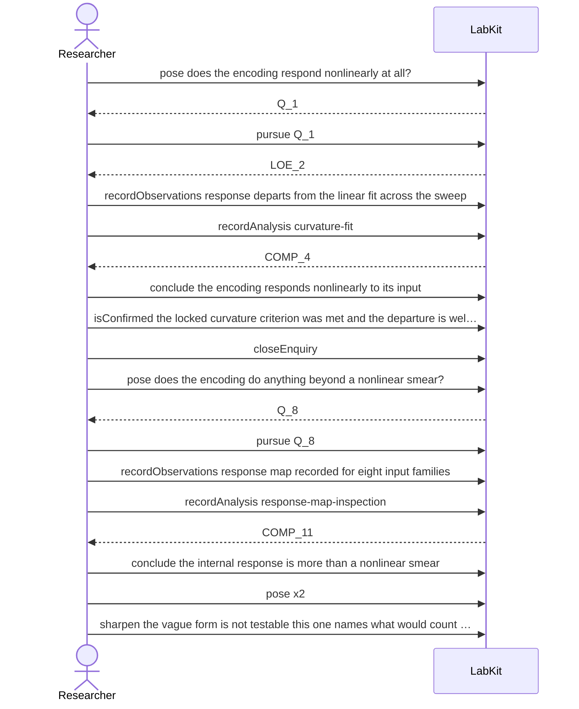

# S-1 — A hunch that is not yet an experiment

A researcher has a vague idea about what a learned topology is doing. Before anything is run, the record says what is already established, what is still open and what has never been tested, and the hunch is narrowed into a question that could be answered.

15 acts, one voice.

## The acts, in order

| | who | act | said | recorded |
| --- | --- | --- | --- | --- |
| 1 | Researcher | `pose` | does the encoding respond nonlinearly at all? | `Q_1` |
| 2 | Researcher | `pursue` | Q_1 | `LOE_2` |
| 3 | Researcher | `recordObservations` | response departs from the linear fit across the sweep | `ART_3` |
| 4 | Researcher | `recordAnalysis` | curvature-fit | `COMP_4` |
| 5 | Researcher | `conclude` | the encoding responds nonlinearly to its input | `COMP_4` |
| 6 | Researcher | `isConfirmed` | the locked curvature criterion was met and the departure is well outside the fi… | `CLM_5` |
| 7 | Researcher | `closeEnquiry` |  | `LOE_2` |
| 8 | Researcher | `pose` | does the encoding do anything beyond a nonlinear smear? | `Q_8` |
| 9 | Researcher | `pursue` | Q_8 | `LOE_9` |
| 10 | Researcher | `recordObservations` | response map recorded for eight input families | `ART_10` |
| 11 | Researcher | `recordAnalysis` | response-map-inspection | `COMP_11` |
| 12 | Researcher | `conclude` | the internal response is more than a nonlinear smear | `COMP_11` |
| 13 | Researcher | `pose` | does the learned topology help on an external task? | `Q_13` |
| 14 | Researcher | `pose` | is the learned topology doing something computationally interesting? | `Q_14` |
| 15 | Researcher | `sharpen` | the vague form is not testable; this one names what would count as an answer | `Q_15` |
