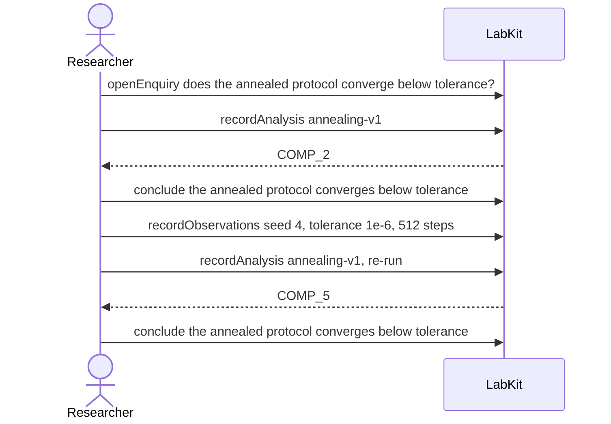

# S-10 — Rerunning is not reproducing

An old result says the protocol converges, but nobody wrote down what it started from. Running it again and recording the new result as a second analysis makes the two look like independent confirmation of each other.

6 acts, one voice.

## The acts, in order

| | who | act | said | recorded |
| --- | --- | --- | --- | --- |
| 1 | Researcher | `openEnquiry` | does the annealed protocol converge below tolerance? | `LOE_1` |
| 2 | Researcher | `recordAnalysis` | annealing-v1 | `COMP_2` |
| 3 | Researcher | `conclude` | the annealed protocol converges below tolerance | `COMP_2` |
| 4 | Researcher | `recordObservations` | seed 4, tolerance 1e-6, 512 steps | `ART_4` |
| 5 | Researcher | `recordAnalysis` | annealing-v1, re-run | `COMP_5` |
| 6 | Researcher | `conclude` | the annealed protocol converges below tolerance | `COMP_5` |
