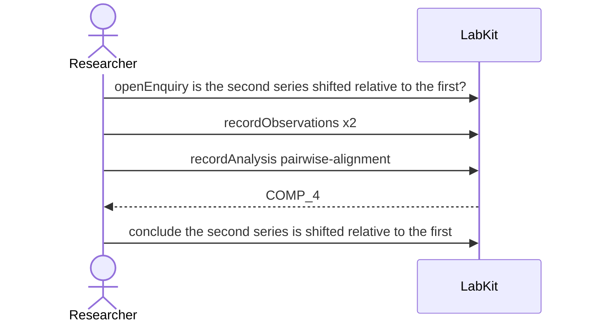

# S-10b — The same inputs, in a different order

An alignment subtracts one series from the other, so which input came first is part of what the run was. The record keeps both series either way, and nothing in it tells the two orders apart.

5 acts, one voice.

## The acts, in order

| | who | act | said | recorded |
| --- | --- | --- | --- | --- |
| 1 | Researcher | `openEnquiry` | is the second series shifted relative to the first? | `LOE_1` |
| 2 | Researcher | `recordObservations` | baseline trace | `ART_2` |
| 3 | Researcher | `recordObservations` | comparison trace | `ART_3` |
| 4 | Researcher | `recordAnalysis` | pairwise-alignment | `COMP_4` |
| 5 | Researcher | `conclude` | the second series is shifted relative to the first | `COMP_4` |
