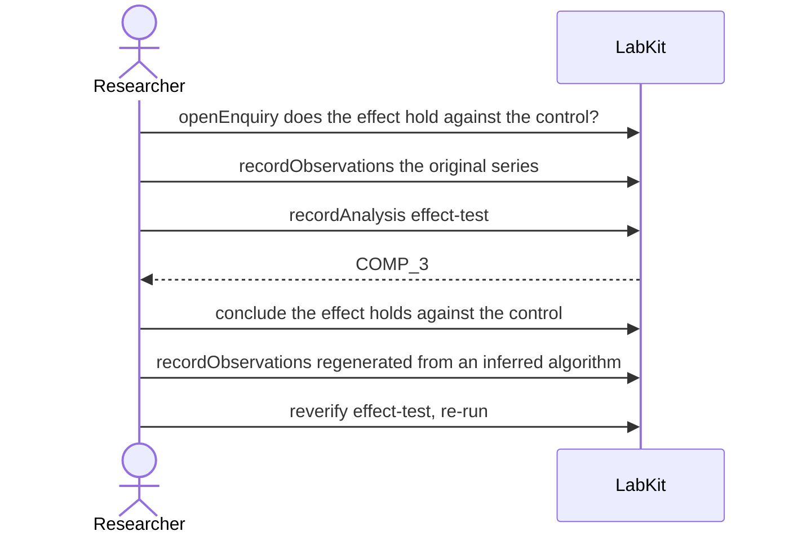

# S-10c — Which input changed?

The original control series was lost and the finding was re-checked against a regenerated one with the same name. The record reports two differences, and the reader has to be able to say which series each of them is about.

6 acts, one voice.

## The acts, in order

| | who | act | said | recorded |
| --- | --- | --- | --- | --- |
| 1 | Researcher | `openEnquiry` | does the effect hold against the control? | `LOE_1` |
| 2 | Researcher | `recordObservations` | the original series | `ART_2` |
| 3 | Researcher | `recordAnalysis` | effect-test | `COMP_3` |
| 4 | Researcher | `conclude` | the effect holds against the control | `COMP_3` |
| 5 | Researcher | `recordObservations` | regenerated from an inferred algorithm | `ART_5` |
| 6 | Researcher | `reverify` | effect-test, re-run | `COMP_6` |
