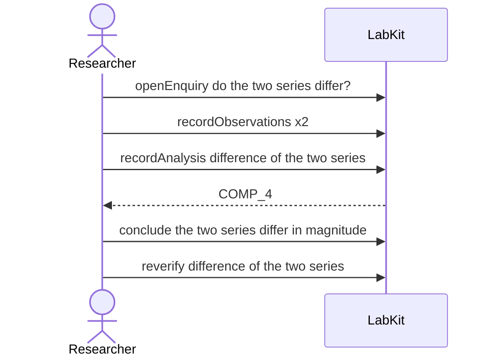

# S-10d — The order a run read its inputs in

A run takes the difference between two series, and a re-run reads the same two records the other way round. The same records are on both sides, so nothing differs, and the record still shows the order each run read them in.

6 acts, one voice.

## The acts, in order

| | who | act | said | recorded |
| --- | --- | --- | --- | --- |
| 1 | Researcher | `openEnquiry` | do the two series differ? | `LOE_1` |
| 2 | Researcher | `recordObservations` | twelve points | `ART_2` |
| 3 | Researcher | `recordObservations` | twelve points | `ART_3` |
| 4 | Researcher | `recordAnalysis` | difference of the two series | `COMP_4` |
| 5 | Researcher | `conclude` | the two series differ in magnitude | `COMP_4` |
| 6 | Researcher | `reverify` | difference of the two series | `COMP_6` |
