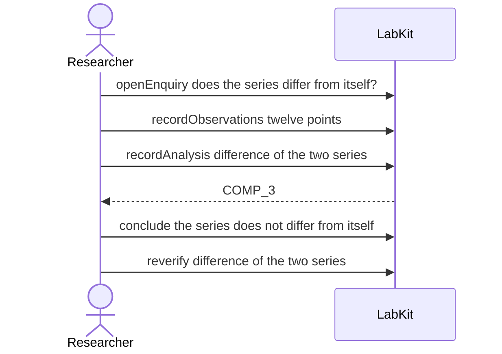

# S-10e — The same record, read twice by one run

A null test puts one series on both sides of a difference, and a re-run reads it only once. The record keeps how many times each run read the series, so the two are not reported as having read the same thing.

5 acts, one voice.

## The acts, in order

| | who | act | said | recorded |
| --- | --- | --- | --- | --- |
| 1 | Researcher | `openEnquiry` | does the series differ from itself? | `LOE_1` |
| 2 | Researcher | `recordObservations` | twelve points | `ART_2` |
| 3 | Researcher | `recordAnalysis` | difference of the two series | `COMP_3` |
| 4 | Researcher | `conclude` | the series does not differ from itself | `COMP_3` |
| 5 | Researcher | `reverify` | difference of the two series | `COMP_5` |
