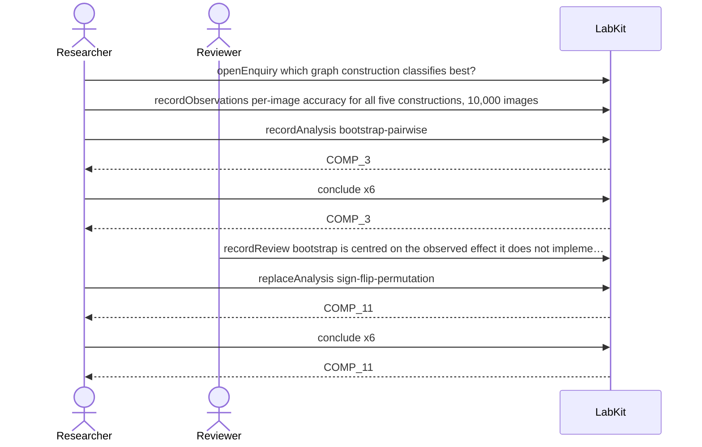

# S-11 — The analysis was wrong; the observations were fine

A reviewer finds the analysis does not implement the null it claims. The observations stand; the analysis is replaced, and only the conclusion that moved is marked as changed.

17 acts, Researcher and Reviewer.

## What moved

`labkit why COMP_11` answers:

**COMP_11** is a revision of COMP_3.

- because bootstrap is centred on the observed effect; it does not implement the intended null
- because T beats rewired: p = 0.002 (bootstrap) → p = 0.049 (sign-flip permutation)

- **changed** T beats rewired: p = 0.002 (bootstrap) → p = 0.049 (sign-flip permutation)
- **restated** unchanged: T beats lattice; T beats curr_random; lattice beats curr_random; rewired beats curr_random; T beats static

## The acts, in order

| | who | act | said | recorded |
| --- | --- | --- | --- | --- |
| 1 | Researcher | `openEnquiry` | which graph construction classifies best? | `LOE_1` |
| 2 | Researcher | `recordObservations` | per-image accuracy for all five constructions, 10,000 images | `ART_2` |
| 3 | Researcher | `recordAnalysis` | bootstrap-pairwise | `COMP_3` |
| 4 | Researcher | `conclude` | T beats lattice | `COMP_3` |
| 5 | Researcher | `conclude` | T beats rewired | `COMP_3` |
| 6 | Researcher | `conclude` | T beats curr_random | `COMP_3` |
| 7 | Researcher | `conclude` | lattice beats curr_random | `COMP_3` |
| 8 | Researcher | `conclude` | rewired beats curr_random | `COMP_3` |
| 9 | Researcher | `conclude` | T beats static | `COMP_3` |
| 10 | Reviewer | `recordReview` | bootstrap is centred on the observed effect; it does not implement the intended… | `REV_10` |
| 11 | Researcher | `replaceAnalysis` | sign-flip-permutation | `COMP_11` |
| 12 | Researcher | `conclude` | T beats lattice | `COMP_11` |
| 13 | Researcher | `conclude` | T beats rewired | `COMP_11` |
| 14 | Researcher | `conclude` | T beats curr_random | `COMP_11` |
| 15 | Researcher | `conclude` | lattice beats curr_random | `COMP_11` |
| 16 | Researcher | `conclude` | rewired beats curr_random | `COMP_11` |
| 17 | Researcher | `conclude` | T beats static | `COMP_11` |
