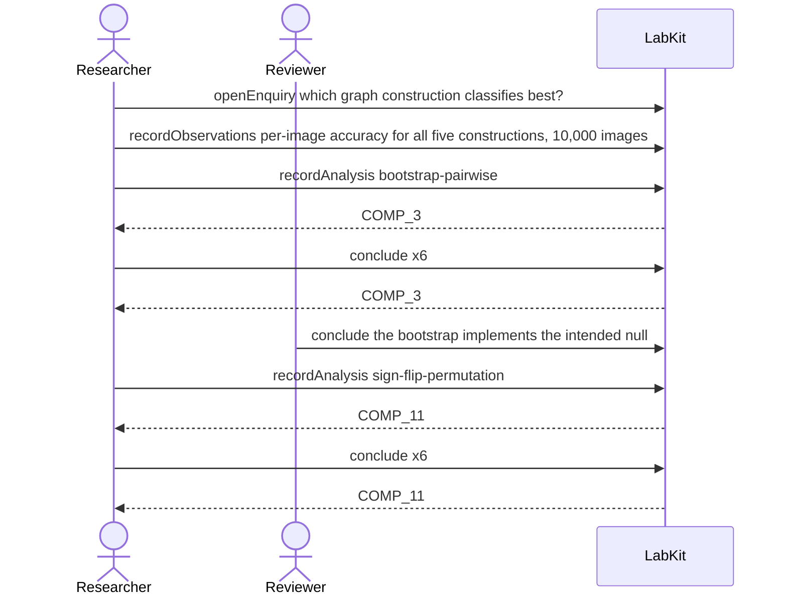

# S-11 — The analysis was wrong; the observations were fine

A reviewer finds the analysis does not implement the null it claims. The observations stand; the analysis is run again correctly, and each new conclusion names the one it replaces.

17 acts, Researcher and Reviewer.

```mermaid
sequenceDiagram
    actor Researcher
    actor Reviewer
    participant R as LabKit
    Researcher->>R: openEnquiry which graph construction classifies best?
    Researcher->>R: recordObservations per-image accuracy for all five constructions, 10,000 images
    Researcher->>R: recordAnalysis bootstrap-pairwise
    R-->>Researcher: COMP_3
    Researcher->>R: conclude x6
    R-->>Researcher: COMP_3
    Reviewer->>R: conclude the bootstrap implements the intended null
    Researcher->>R: recordAnalysis sign-flip-permutation
    R-->>Researcher: COMP_11
    Researcher->>R: conclude x6
    R-->>Researcher: COMP_11
```

## What moved

`labkit why-supported CLM_13` answers:

**T beats rewired** — supported, held as exploratory.

- **supported by** p = 0.049 (sign-flip permutation)
- **superseded** p = 0.002 (bootstrap) — superseded by "p = 0.049 (sign-flip permutation)"

## The acts, in order

| | who | act | said | recorded |
| --- | --- | --- | --- | --- |
| 1 | Researcher | `openEnquiry` | which graph construction classifies best? | `LOE_1` |
| 2 | Researcher | `recordObservations` | per-image accuracy for all five constructions, 10,000 images | `ART_2` |
| 3 | Researcher | `recordAnalysis` | bootstrap-pairwise | `COMP_3` |
| 4 | Researcher | `conclude` | T beats lattice | `COMP_3` |
| 5 | Researcher | `conclude` | T beats rewired | `COMP_3` |
| 6 | Researcher | `conclude` | T beats curr_random | `COMP_3` |
| 7 | Researcher | `conclude` | lattice beats curr_random | `COMP_3` |
| 8 | Researcher | `conclude` | rewired beats curr_random | `COMP_3` |
| 9 | Researcher | `conclude` | T beats static | `COMP_3` |
| 10 | Reviewer | `conclude` | the bootstrap implements the intended null | `COMP_3` |
| 11 | Researcher | `recordAnalysis` | sign-flip-permutation | `COMP_11` |
| 12 | Researcher | `conclude` | T beats lattice | `COMP_11` |
| 13 | Researcher | `conclude` | T beats rewired | `COMP_11` |
| 14 | Researcher | `conclude` | T beats curr_random | `COMP_11` |
| 15 | Researcher | `conclude` | lattice beats curr_random | `COMP_11` |
| 16 | Researcher | `conclude` | rewired beats curr_random | `COMP_11` |
| 17 | Researcher | `conclude` | T beats static | `COMP_11` |
