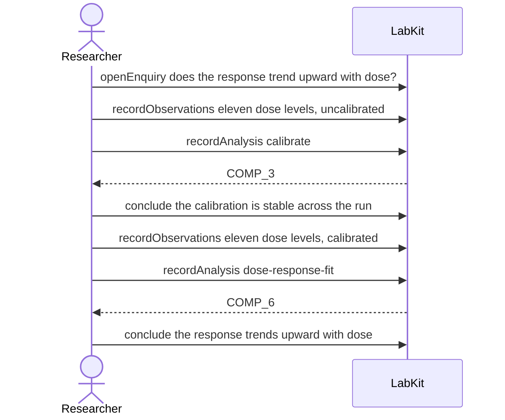

# S-11c — Nothing found is not nothing there

Raw sensor data is calibrated, and the calibrated series is re-entered by hand as fresh observations before the trend analysis reads it. Asking what depends on the raw series reaches only the first stage, and the answer says it is a lower bound rather than a complete list.

7 acts, one voice.

## The acts, in order

| | who | act | said | recorded |
| --- | --- | --- | --- | --- |
| 1 | Researcher | `openEnquiry` | does the response trend upward with dose? | `LOE_1` |
| 2 | Researcher | `recordObservations` | eleven dose levels, uncalibrated | `ART_2` |
| 3 | Researcher | `recordAnalysis` | calibrate | `COMP_3` |
| 4 | Researcher | `conclude` | the calibration is stable across the run | `COMP_3` |
| 5 | Researcher | `recordObservations` | eleven dose levels, calibrated | `ART_5` |
| 6 | Researcher | `recordAnalysis` | dose-response-fit | `COMP_6` |
| 7 | Researcher | `conclude` | the response trends upward with dose | `COMP_6` |
