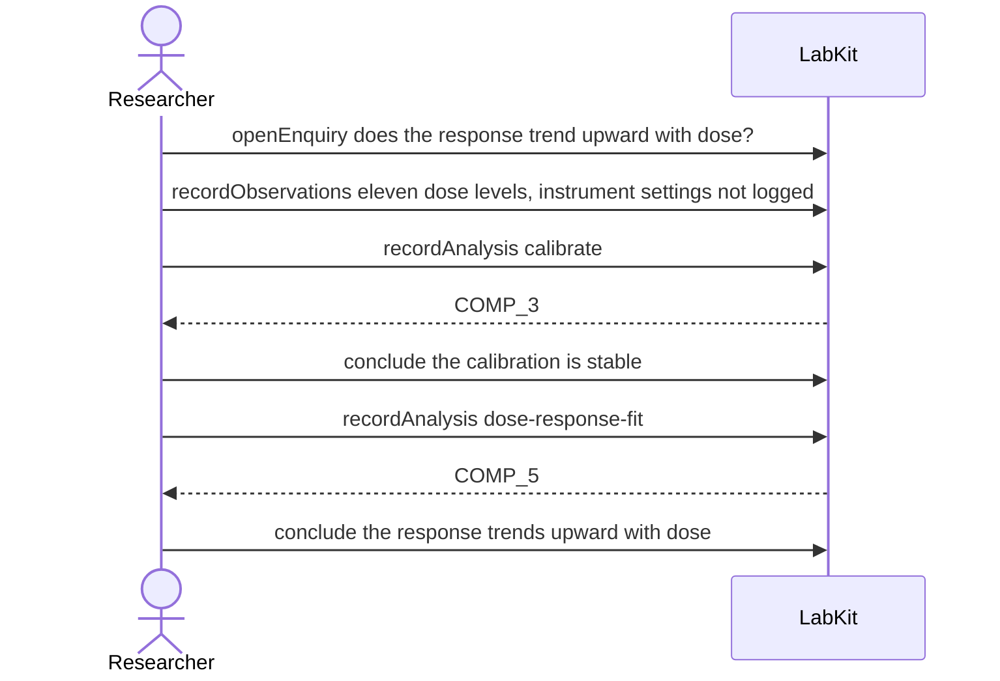

# S-11d — A stage cannot read a stage

A raw series came off an instrument whose settings were never logged, it is calibrated, and the trend analysis reads the calibration's output directly. The calibration reports itself unreproducible because what it rests on cannot be checked.

6 acts, one voice.

## The acts, in order

| | who | act | said | recorded |
| --- | --- | --- | --- | --- |
| 1 | Researcher | `openEnquiry` | does the response trend upward with dose? | `LOE_1` |
| 2 | Researcher | `recordObservations` | eleven dose levels, instrument settings not logged | `ART_2` |
| 3 | Researcher | `recordAnalysis` | calibrate | `COMP_3` |
| 4 | Researcher | `conclude` | the calibration is stable | `COMP_3` |
| 5 | Researcher | `recordAnalysis` | dose-response-fit | `COMP_5` |
| 6 | Researcher | `conclude` | the response trends upward with dose | `COMP_5` |
