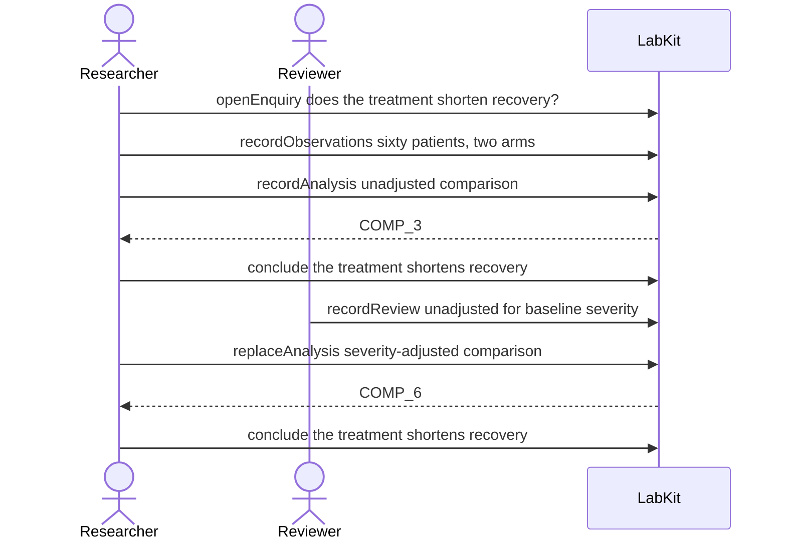

# S-11e — A replacement that consumes the output it invalidated

A replacement analysis is built on the very analysis a review found defective. Its conclusion still reads as supported, and the record names the retracted input rather than hiding it.

7 acts, Researcher and Reviewer.

## What moved

`labkit why-supported CLM_7` answers:

**the treatment shortens recovery** — supported, held as exploratory.

- **supported by** one day shorter, adjusted
- **superseded** three days shorter — unadjusted for baseline severity

## The acts, in order

| | who | act | said | recorded |
| --- | --- | --- | --- | --- |
| 1 | Researcher | `openEnquiry` | does the treatment shorten recovery? | `LOE_1` |
| 2 | Researcher | `recordObservations` | sixty patients, two arms | `ART_2` |
| 3 | Researcher | `recordAnalysis` | unadjusted comparison | `COMP_3` |
| 4 | Researcher | `conclude` | the treatment shortens recovery | `COMP_3` |
| 5 | Reviewer | `recordReview` | unadjusted for baseline severity | `REV_5` |
| 6 | Researcher | `replaceAnalysis` | severity-adjusted comparison | `COMP_6` |
| 7 | Researcher | `conclude` | the treatment shortens recovery | `COMP_6` |
