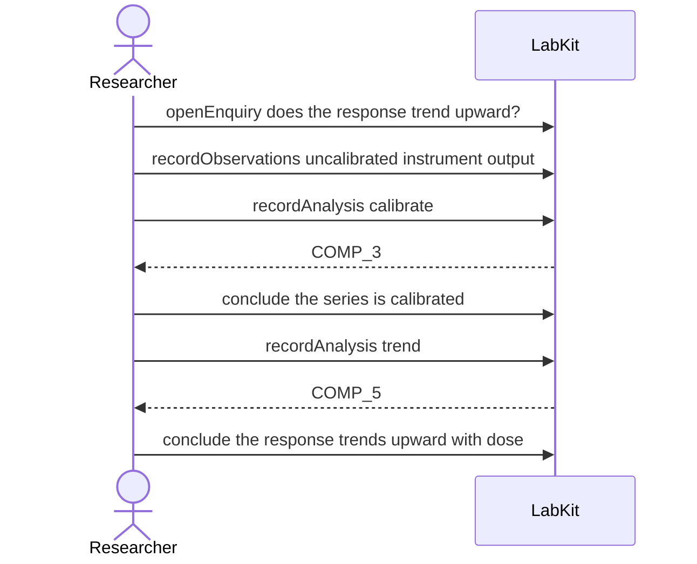

# S-11f — A computed input, asked about by the reads that touch inputs

One analysis calibrates a raw series and a second fits a trend to that calibrated output, so the second analysis rests on something computed rather than measured.

6 acts, one voice.

## The acts, in order

| | who | act | said | recorded |
| --- | --- | --- | --- | --- |
| 1 | Researcher | `openEnquiry` | does the response trend upward? | `LOE_1` |
| 2 | Researcher | `recordObservations` | uncalibrated instrument output | `ART_2` |
| 3 | Researcher | `recordAnalysis` | calibrate | `COMP_3` |
| 4 | Researcher | `conclude` | the series is calibrated | `COMP_3` |
| 5 | Researcher | `recordAnalysis` | trend | `COMP_5` |
| 6 | Researcher | `conclude` | the response trends upward with dose | `COMP_5` |
