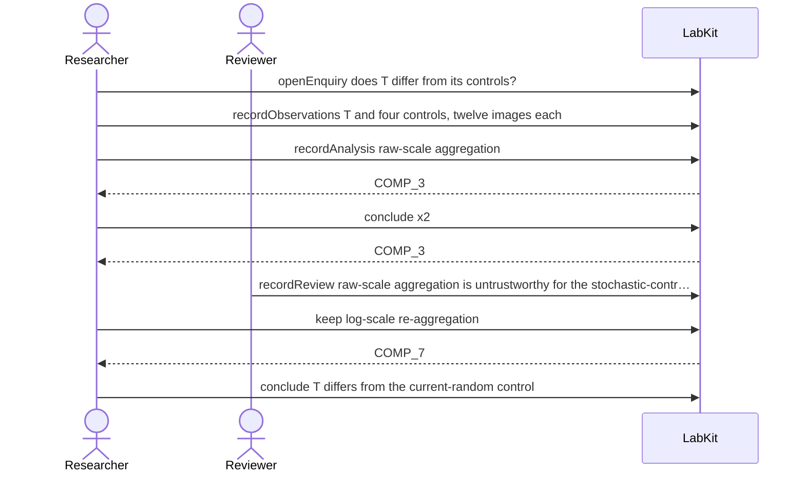

# S-11g — A replacement that addresses only some of a run's conclusions

One run drew two comparisons and the re-analysis revisits only one of them; the comparison it kept still stands on its original measurements.

8 acts, Researcher and Reviewer.

## The acts, in order

| | who | act | said | recorded |
| --- | --- | --- | --- | --- |
| 1 | Researcher | `openEnquiry` | does T differ from its controls? | `LOE_1` |
| 2 | Researcher | `recordObservations` | T and four controls, twelve images each | `ART_2` |
| 3 | Researcher | `recordAnalysis` | raw-scale aggregation | `COMP_3` |
| 4 | Researcher | `conclude` | T differs from the current-random control | `COMP_3` |
| 5 | Researcher | `conclude` | T differs from the lattice control | `COMP_3` |
| 6 | Reviewer | `recordReview` | raw-scale aggregation is untrustworthy for the stochastic-control comparisons | `REV_6` |
| 7 | Researcher | `keep` | log-scale re-aggregation | `COMP_7` |
| 8 | Researcher | `conclude` | T differs from the current-random control | `COMP_7` |
