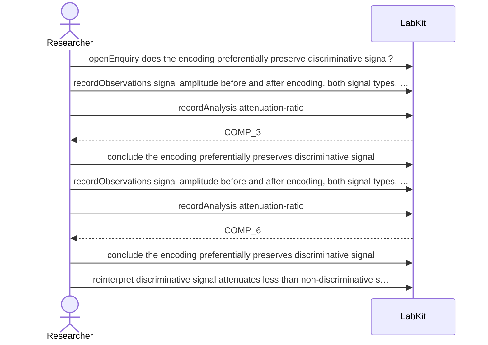

# S-12 — The numbers are right; the sentence about them is wrong

Two cohorts reach the same conclusion, and the wording of that conclusion overstates what the measurements show. The sentence is narrowed; every finding underneath it still stands.

8 acts, one voice.

## The acts, in order

| | who | act | said | recorded |
| --- | --- | --- | --- | --- |
| 1 | Researcher | `openEnquiry` | does the encoding preferentially preserve discriminative signal? | `LOE_1` |
| 2 | Researcher | `recordObservations` | signal amplitude before and after encoding, both signal types, cohort A | `ART_2` |
| 3 | Researcher | `recordAnalysis` | attenuation-ratio | `COMP_3` |
| 4 | Researcher | `conclude` | the encoding preferentially preserves discriminative signal | `COMP_3` |
| 5 | Researcher | `recordObservations` | signal amplitude before and after encoding, both signal types, cohort B | `ART_5` |
| 6 | Researcher | `recordAnalysis` | attenuation-ratio | `COMP_6` |
| 7 | Researcher | `conclude` | the encoding preferentially preserves discriminative signal | `COMP_6` |
| 8 | Researcher | `reinterpret` | discriminative signal attenuates less than non-discriminative signal | `CLM_8` |
