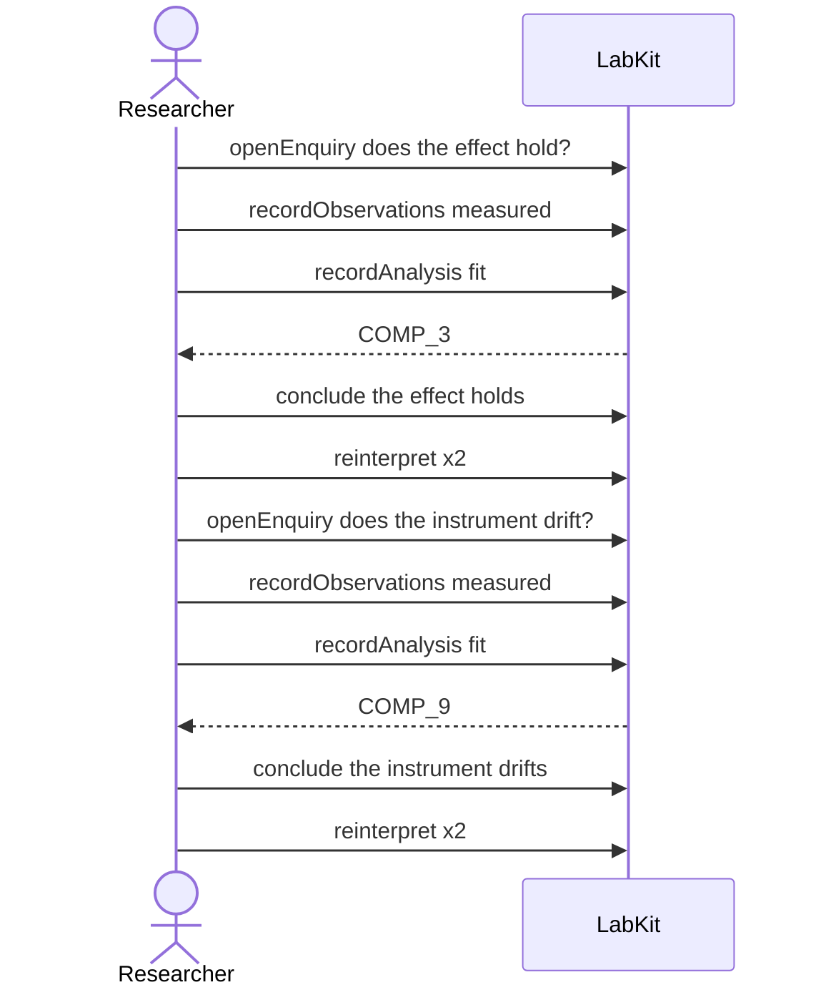

# S-12b — Two revision chains that pass through one sentence

Two unrelated lines of enquiry are each narrowed until they read as the same sentence, and the record keeps them apart as two separate claims.

12 acts, one voice.

## The acts, in order

| | who | act | said | recorded |
| --- | --- | --- | --- | --- |
| 1 | Researcher | `openEnquiry` | does the effect hold? | `LOE_1` |
| 2 | Researcher | `recordObservations` | measured | `ART_2` |
| 3 | Researcher | `recordAnalysis` | fit | `COMP_3` |
| 4 | Researcher | `conclude` | the effect holds | `COMP_3` |
| 5 | Researcher | `reinterpret` | the effect holds under condition X | `CLM_5` |
| 6 | Researcher | `reinterpret` | the effect holds under condition X in subgroup Y | `CLM_6` |
| 7 | Researcher | `openEnquiry` | does the instrument drift? | `LOE_7` |
| 8 | Researcher | `recordObservations` | measured | `ART_8` |
| 9 | Researcher | `recordAnalysis` | fit | `COMP_9` |
| 10 | Researcher | `conclude` | the instrument drifts | `COMP_9` |
| 11 | Researcher | `reinterpret` | the effect holds under condition X | `CLM_11` |
| 12 | Researcher | `reinterpret` | the instrument drifts above 40 degrees | `CLM_12` |
