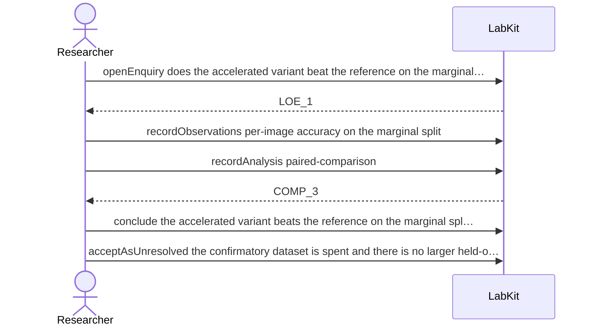

# S-14 — Deliberately leaving something unresolved

A comparison comes out marginal and there is no data left to settle it, so the question is left open on purpose, with the reason and the condition that would reopen it.

5 acts, one voice.

## The acts, in order

| | who | act | said | recorded |
| --- | --- | --- | --- | --- |
| 1 | Researcher | `openEnquiry` | does the accelerated variant beat the reference on the marginal split? | `LOE_1` |
| 2 | Researcher | `recordObservations` | per-image accuracy on the marginal split | `ART_2` |
| 3 | Researcher | `recordAnalysis` | paired-comparison | `COMP_3` |
| 4 | Researcher | `conclude` | the accelerated variant beats the reference on the marginal split | `COMP_3` |
| 5 | Researcher | `acceptAsUnresolved` | the confirmatory dataset is spent and there is no larger held-out sample | `LOE_1` |
