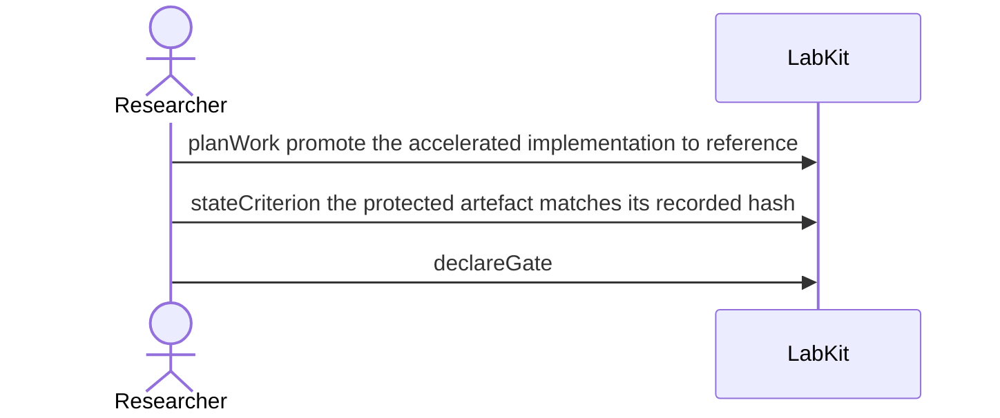

# S-17 — Does the guard actually guard?

A gate is declared over a condition that has never been checked, and the record says so rather than letting an unrun check read as a pass.

3 acts, one voice.

## The acts, in order

| | who | act | said | recorded |
| --- | --- | --- | --- | --- |
| 1 | Researcher | `planWork` | promote the accelerated implementation to reference | `TASK_1` |
| 2 | Researcher | `stateCriterion` | the protected artefact matches its recorded hash | `CRIT_2` |
| 3 | Researcher | `declareGate` |  | `GATE_3` |
