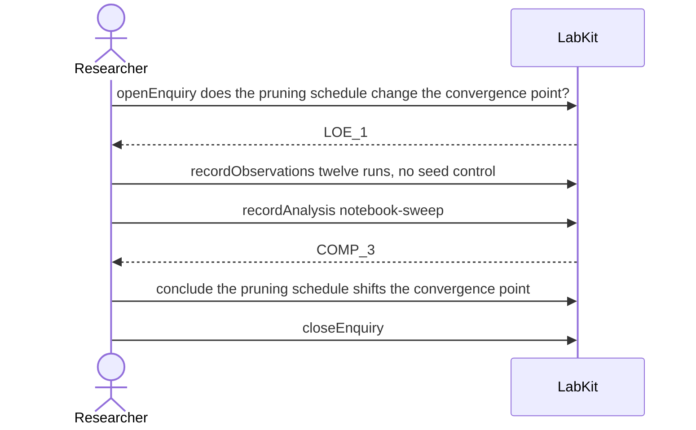

# S-18 — Scratch work that unexpectedly mattered

A question is settled on a quick notebook sweep, and the record answers it provisionally rather than treating exploratory work as if it had been careful.

5 acts, one voice.

## The acts, in order

| | who | act | said | recorded |
| --- | --- | --- | --- | --- |
| 1 | Researcher | `openEnquiry` | does the pruning schedule change the convergence point? | `LOE_1` |
| 2 | Researcher | `recordObservations` | twelve runs, no seed control | `ART_2` |
| 3 | Researcher | `recordAnalysis` | notebook-sweep | `COMP_3` |
| 4 | Researcher | `conclude` | the pruning schedule shifts the convergence point | `COMP_3` |
| 5 | Researcher | `closeEnquiry` |  | `LOE_1` |
