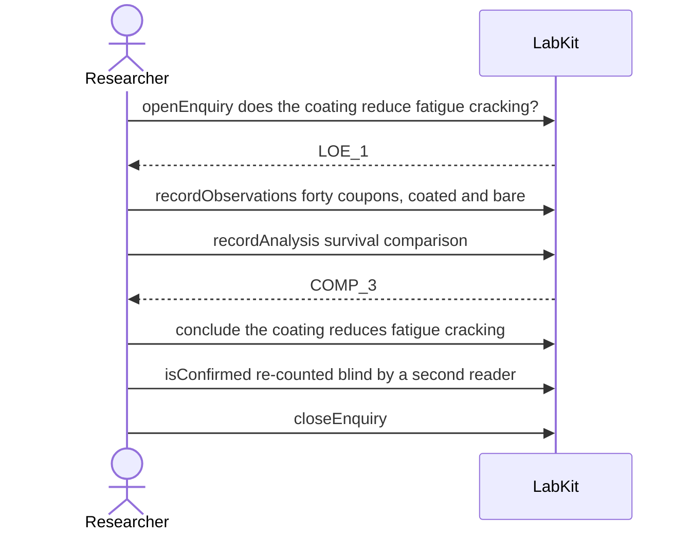

# S-18b — A negative result that somebody vouched for

A coating turns out not to work, a second reader confirms the counts, and the question closes as answered no on work somebody vouched for.

6 acts, one voice.

## The acts, in order

| | who | act | said | recorded |
| --- | --- | --- | --- | --- |
| 1 | Researcher | `openEnquiry` | does the coating reduce fatigue cracking? | `LOE_1` |
| 2 | Researcher | `recordObservations` | forty coupons, coated and bare | `ART_2` |
| 3 | Researcher | `recordAnalysis` | survival comparison | `COMP_3` |
| 4 | Researcher | `conclude` | the coating reduces fatigue cracking | `COMP_3` |
| 5 | Researcher | `isConfirmed` | re-counted blind by a second reader | `CLM_4` |
| 6 | Researcher | `closeEnquiry` |  | `LOE_1` |
