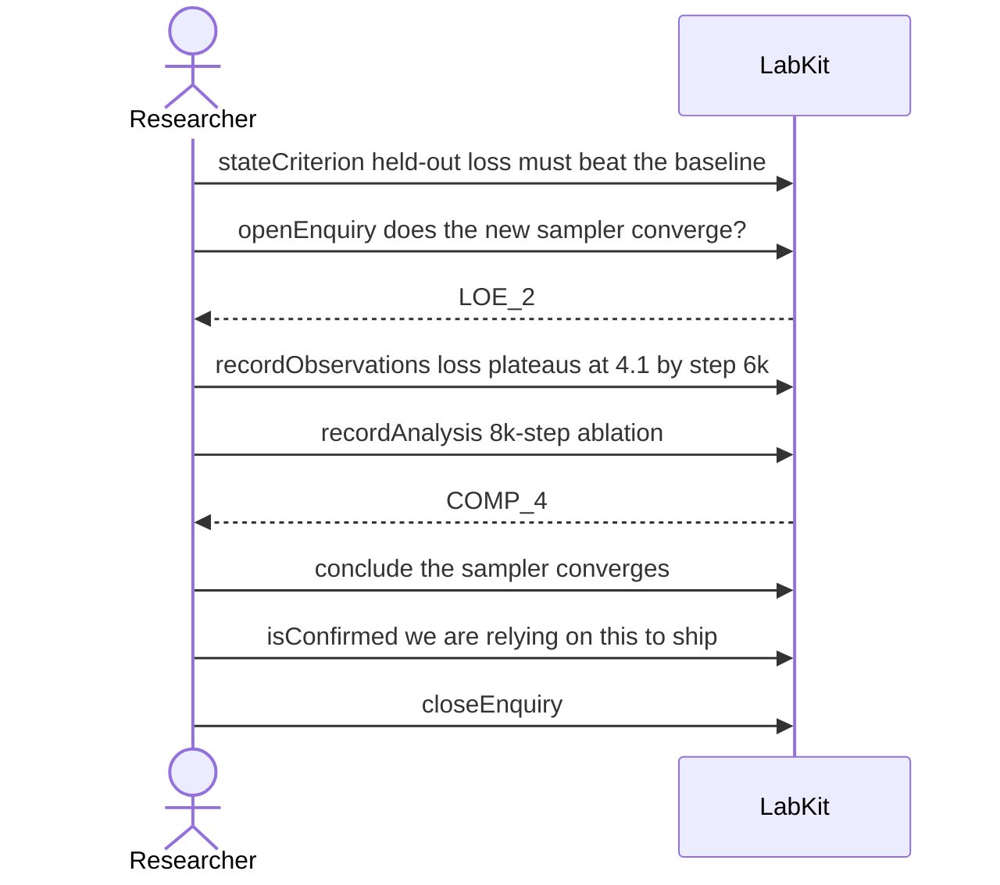

# S-19 — promoted, closed, and the agreed check never run

An answer is promoted and its question closed, but the check agreed in advance was never run, so the record still reports that check as unmet.

7 acts, one voice.

## The acts, in order

| | who | act | said | recorded |
| --- | --- | --- | --- | --- |
| 1 | Researcher | `stateCriterion` | held-out loss must beat the baseline | `CRIT_1` |
| 2 | Researcher | `openEnquiry` | does the new sampler converge? | `LOE_2` |
| 3 | Researcher | `recordObservations` | loss plateaus at 4.1 by step 6k | `ART_3` |
| 4 | Researcher | `recordAnalysis` | 8k-step ablation | `COMP_4` |
| 5 | Researcher | `conclude` | the sampler converges | `COMP_4` |
| 6 | Researcher | `isConfirmed` | we are relying on this to ship | `CLM_5` |
| 7 | Researcher | `closeEnquiry` |  | `LOE_2` |
