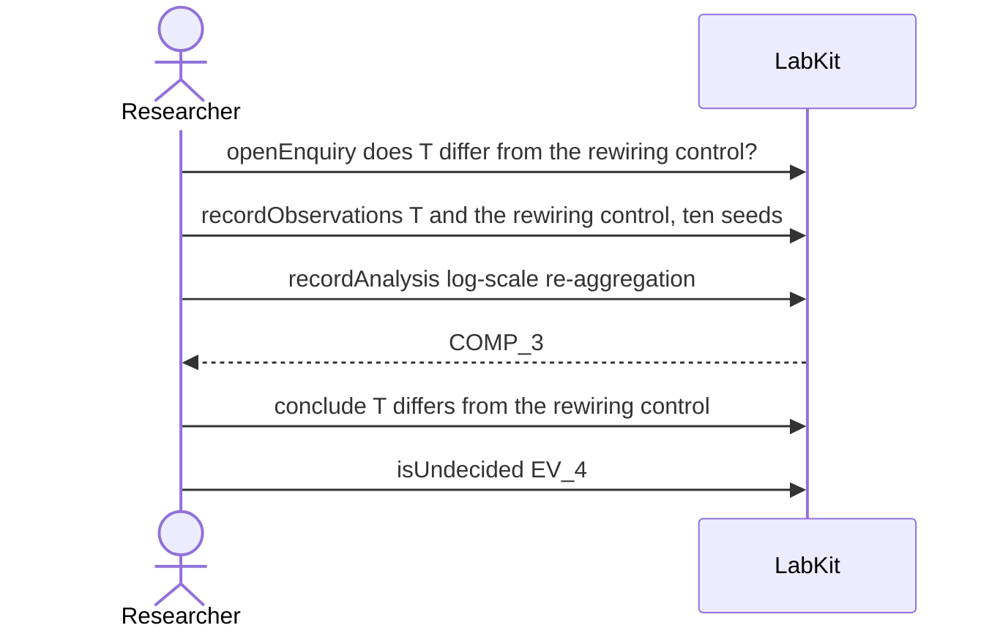

# S-20 — a finding that settles the proposition neither way

A re-analysis narrows the disagreement between three tests without resolving it, and the researcher records the claim as undecided rather than calling it either way.

5 acts, one voice.

## What moved

`labkit why CLM_4` answers:

**CLM_4** is undecided — the findings settle this neither way.

- because NOT resolved: primary (p=0.037) and sign-flip (p=0.041) still say significant, median (p=0.084) still says not -- narrowed from v1 but not closed; per pre-commitment, no further transformation attempted, reported as genuinely inconclusive at n=10/25 seeds.

## The acts, in order

| | who | act | said | recorded |
| --- | --- | --- | --- | --- |
| 1 | Researcher | `openEnquiry` | does T differ from the rewiring control? | `LOE_1` |
| 2 | Researcher | `recordObservations` | T and the rewiring control, ten seeds | `ART_2` |
| 3 | Researcher | `recordAnalysis` | log-scale re-aggregation | `COMP_3` |
| 4 | Researcher | `conclude` | T differs from the rewiring control | `COMP_3` |
| 5 | Researcher | `isUndecided` | EV_4 | `CLM_4` |
