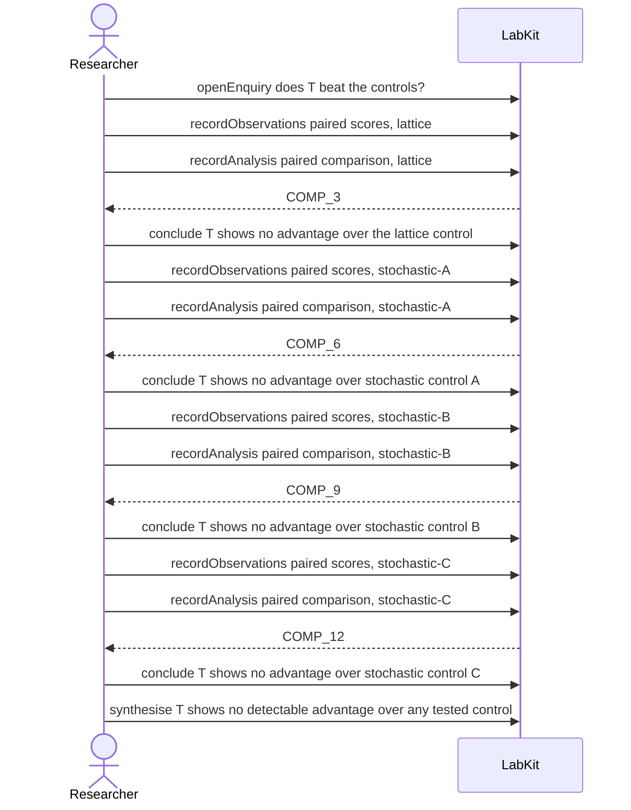

# S-21 — a finding drawn across findings

Four separate comparisons each conclude that T shows no advantage, and the headline drawn across them rests on those four findings without measuring anything itself.

14 acts, one voice.

## The acts, in order

| | who | act | said | recorded |
| --- | --- | --- | --- | --- |
| 1 | Researcher | `openEnquiry` | does T beat the controls? | `LOE_1` |
| 2 | Researcher | `recordObservations` | paired scores, lattice | `ART_2` |
| 3 | Researcher | `recordAnalysis` | paired comparison, lattice | `COMP_3` |
| 4 | Researcher | `conclude` | T shows no advantage over the lattice control | `COMP_3` |
| 5 | Researcher | `recordObservations` | paired scores, stochastic-A | `ART_5` |
| 6 | Researcher | `recordAnalysis` | paired comparison, stochastic-A | `COMP_6` |
| 7 | Researcher | `conclude` | T shows no advantage over stochastic control A | `COMP_6` |
| 8 | Researcher | `recordObservations` | paired scores, stochastic-B | `ART_8` |
| 9 | Researcher | `recordAnalysis` | paired comparison, stochastic-B | `COMP_9` |
| 10 | Researcher | `conclude` | T shows no advantage over stochastic control B | `COMP_9` |
| 11 | Researcher | `recordObservations` | paired scores, stochastic-C | `ART_11` |
| 12 | Researcher | `recordAnalysis` | paired comparison, stochastic-C | `COMP_12` |
| 13 | Researcher | `conclude` | T shows no advantage over stochastic control C | `COMP_12` |
| 14 | Researcher | `synthesise` | T shows no detectable advantage over any tested control | `CLM_14` |
