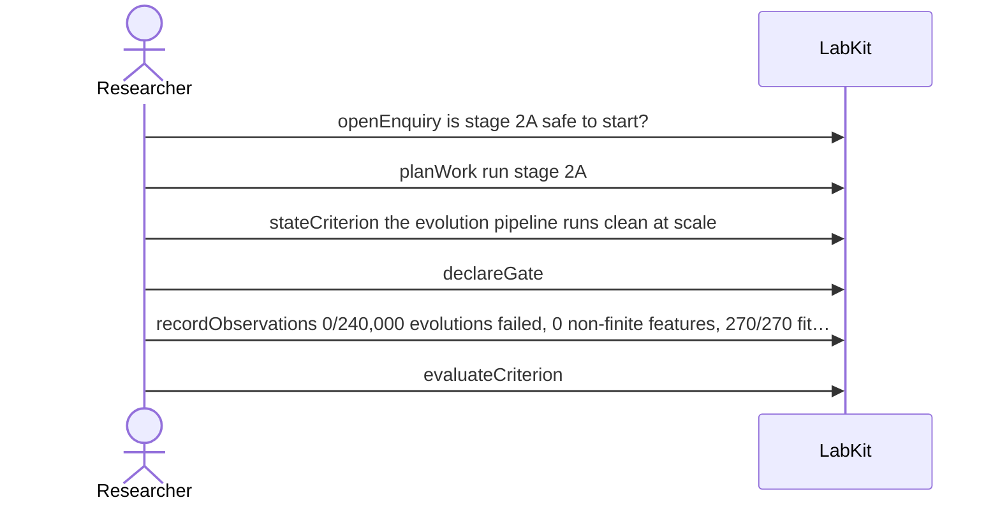

# S-22 — a check decided by measurement says so

A go/no-go check is decided by a run's measurements, and the verdict names the observations it was decided against rather than reading as somebody's assertion.

6 acts, one voice.

## The acts, in order

| | who | act | said | recorded |
| --- | --- | --- | --- | --- |
| 1 | Researcher | `openEnquiry` | is stage 2A safe to start? | `LOE_1` |
| 2 | Researcher | `planWork` | run stage 2A | `TASK_2` |
| 3 | Researcher | `stateCriterion` | the evolution pipeline runs clean at scale | `CRIT_3` |
| 4 | Researcher | `declareGate` |  | `GATE_4` |
| 5 | Researcher | `recordObservations` | 0/240,000 evolutions failed, 0 non-finite features, 270/270 fits converged | `ART_5` |
| 6 | Researcher | `evaluateCriterion` |  | `CEVAL_6` |
