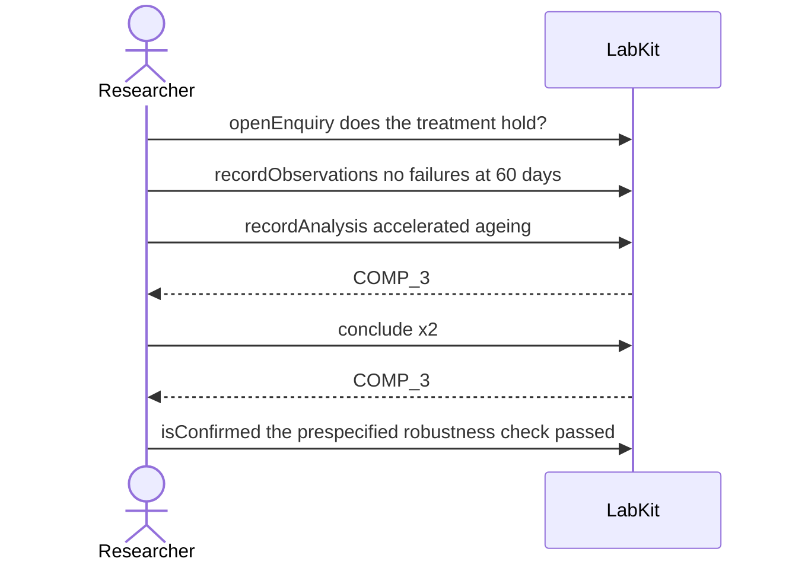

# S-23 — prespecified is not promoted

Two claims end up confirmatory by different routes: one was said in advance to count, the other was promoted afterwards, and the record keeps the two apart.

6 acts, one voice.

## The acts, in order

| | who | act | said | recorded |
| --- | --- | --- | --- | --- |
| 1 | Researcher | `openEnquiry` | does the treatment hold? | `LOE_1` |
| 2 | Researcher | `recordObservations` | no failures at 60 days | `ART_2` |
| 3 | Researcher | `recordAnalysis` | accelerated ageing | `COMP_3` |
| 4 | Researcher | `conclude` | the primer holds at 60 days | `COMP_3` |
| 5 | Researcher | `conclude` | the coating slows corrosion | `COMP_3` |
| 6 | Researcher | `isConfirmed` | the prespecified robustness check passed | `CLM_5` |
