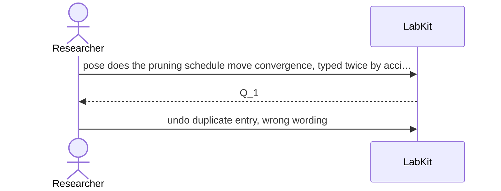

# S-24 — a mistaken act taken back

A question entered twice by accident is taken back, and the act that undoes it names every handle it retracted.

2 acts, one voice.

## The acts, in order

| | who | act | said | recorded |
| --- | --- | --- | --- | --- |
| 1 | Researcher | `pose` | does the pruning schedule move convergence, typed twice by accident | `Q_1` |
| 2 | Researcher | `undo` | duplicate entry, wrong wording | `Q_1` |
