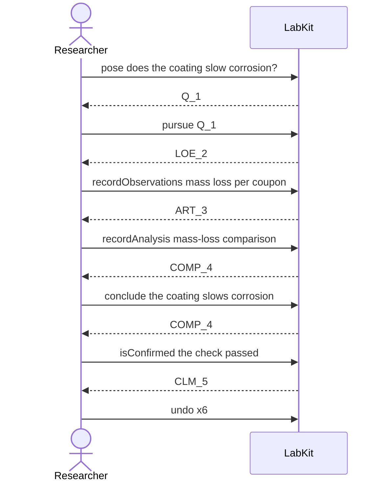

# S-24b — walking back a tree of mistakes

A whole line of work built on a mistaken question is taken back one act at a time, newest first, and the promotion goes with it.

12 acts, one voice.

## The acts, in order

| | who | act | said | recorded |
| --- | --- | --- | --- | --- |
| 1 | Researcher | `pose` | does the coating slow corrosion? | `Q_1` |
| 2 | Researcher | `pursue` | Q_1 | `LOE_2` |
| 3 | Researcher | `recordObservations` | mass loss per coupon | `ART_3` |
| 4 | Researcher | `recordAnalysis` | mass-loss comparison | `COMP_4` |
| 5 | Researcher | `conclude` | the coating slows corrosion | `COMP_4` |
| 6 | Researcher | `isConfirmed` | the check passed | `CLM_5` |
| 7 | Researcher | `undo` | the whole arc was a mistake | `CLM_5` |
| 8 | Researcher | `undo` | the whole arc was a mistake | `COMP_4` |
| 9 | Researcher | `undo` | the whole arc was a mistake | `COMP_4` |
| 10 | Researcher | `undo` | the whole arc was a mistake | `ART_3` |
| 11 | Researcher | `undo` | the whole arc was a mistake | `LOE_2` |
| 12 | Researcher | `undo` | the whole arc was a mistake | `Q_1` |
