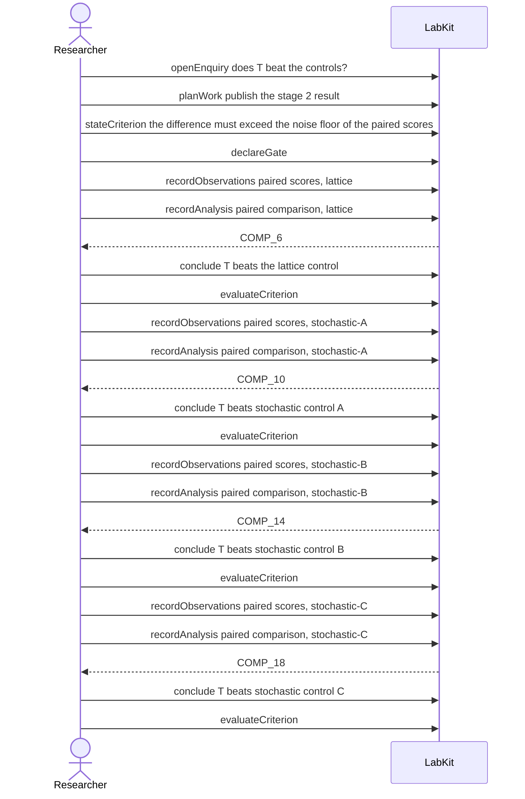

# S-25 — one rule judged four times

One decision rule is stated once and held against four comparisons, giving four verdicts that each name the comparison they judged.

20 acts, one voice.

## The acts, in order

| | who | act | said | recorded |
| --- | --- | --- | --- | --- |
| 1 | Researcher | `openEnquiry` | does T beat the controls? | `LOE_1` |
| 2 | Researcher | `planWork` | publish the stage 2 result | `TASK_2` |
| 3 | Researcher | `stateCriterion` | the difference must exceed the noise floor of the paired scores | `CRIT_3` |
| 4 | Researcher | `declareGate` |  | `GATE_4` |
| 5 | Researcher | `recordObservations` | paired scores, lattice | `ART_5` |
| 6 | Researcher | `recordAnalysis` | paired comparison, lattice | `COMP_6` |
| 7 | Researcher | `conclude` | T beats the lattice control | `COMP_6` |
| 8 | Researcher | `evaluateCriterion` |  | `CEVAL_8` |
| 9 | Researcher | `recordObservations` | paired scores, stochastic-A | `ART_9` |
| 10 | Researcher | `recordAnalysis` | paired comparison, stochastic-A | `COMP_10` |
| 11 | Researcher | `conclude` | T beats stochastic control A | `COMP_10` |
| 12 | Researcher | `evaluateCriterion` |  | `CEVAL_12` |
| 13 | Researcher | `recordObservations` | paired scores, stochastic-B | `ART_13` |
| 14 | Researcher | `recordAnalysis` | paired comparison, stochastic-B | `COMP_14` |
| 15 | Researcher | `conclude` | T beats stochastic control B | `COMP_14` |
| 16 | Researcher | `evaluateCriterion` |  | `CEVAL_16` |
| 17 | Researcher | `recordObservations` | paired scores, stochastic-C | `ART_17` |
| 18 | Researcher | `recordAnalysis` | paired comparison, stochastic-C | `COMP_18` |
| 19 | Researcher | `conclude` | T beats stochastic control C | `COMP_18` |
| 20 | Researcher | `evaluateCriterion` |  | `CEVAL_20` |
