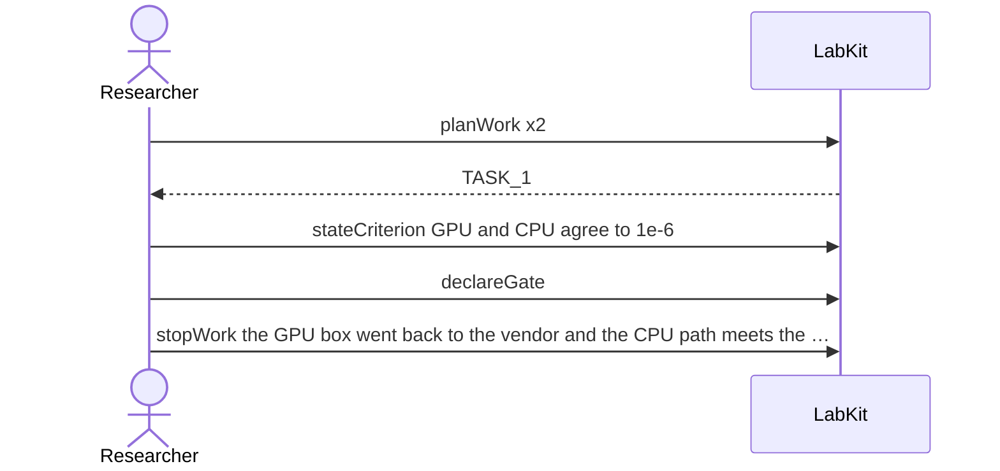

# S-26 — work nobody is doing

A planned port is stopped because the hardware went back to the vendor, and the work reads as abandoned with the reason still readable from the record.

5 acts, one voice.

## What moved

`labkit why TASK_1` answers:

**TASK_1** is abandoned.

- because the GPU box went back to the vendor and the CPU path meets the deadline

## The acts, in order

| | who | act | said | recorded |
| --- | --- | --- | --- | --- |
| 1 | Researcher | `planWork` | port the sampler to the GPU box | `TASK_1` |
| 2 | Researcher | `planWork` | profile the CPU sampler | `TASK_2` |
| 3 | Researcher | `stateCriterion` | GPU and CPU agree to 1e-6 | `CRIT_3` |
| 4 | Researcher | `declareGate` |  | `GATE_4` |
| 5 | Researcher | `stopWork` | the GPU box went back to the vendor and the CPU path meets the deadline | `TASK_1` |
