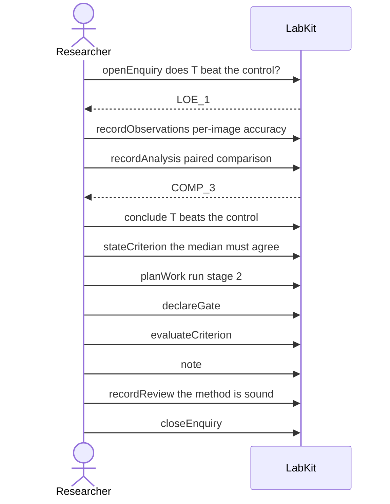

# S-27 — Why explains every kind

One ordinary arc of work — a question, observations, an analysis, a check, a gate, a note, a review and a decision — and asking why of each of them gets an answer rather than a refusal.

11 acts, one voice.

## The acts, in order

| | who | act | said | recorded |
| --- | --- | --- | --- | --- |
| 1 | Researcher | `openEnquiry` | does T beat the control? | `LOE_1` |
| 2 | Researcher | `recordObservations` | per-image accuracy | `ART_2` |
| 3 | Researcher | `recordAnalysis` | paired comparison | `COMP_3` |
| 4 | Researcher | `conclude` | T beats the control | `COMP_3` |
| 5 | Researcher | `stateCriterion` | the median must agree | `CRIT_5` |
| 6 | Researcher | `planWork` | run stage 2 | `TASK_6` |
| 7 | Researcher | `declareGate` |  | `GATE_7` |
| 8 | Researcher | `evaluateCriterion` |  | `CEVAL_8` |
| 9 | Researcher | `note` |  | `NOTE_9` |
| 10 | Researcher | `recordReview` | the method is sound | `REV_10` |
| 11 | Researcher | `closeEnquiry` |  | `LOE_1` |
