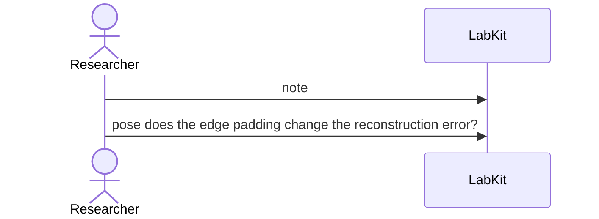

# S-28 — A hunch became a question

A vague hunch is written down, later sharpens into a precise question, and the question still says which note it came out of.

2 acts, one voice.

## The acts, in order

| | who | act | said | recorded |
| --- | --- | --- | --- | --- |
| 1 | Researcher | `note` |  | `NOTE_1` |
| 2 | Researcher | `pose` | does the edge padding change the reconstruction error? | `Q_2` |
