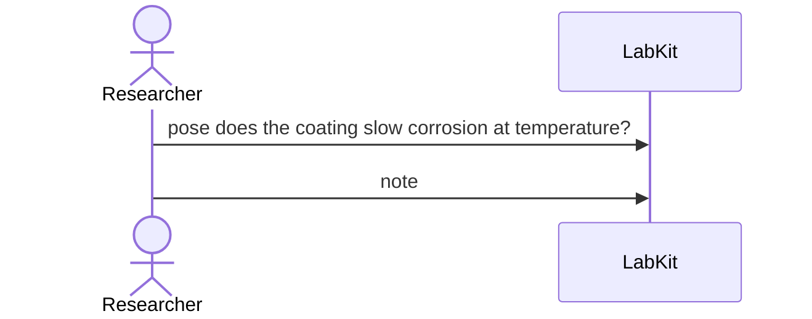

# S-29 — The note came after the question

The throwaway run that prompted a question is only written down after the question was asked, and it can still be recorded as the reason the question exists.

2 acts, one voice.

## The acts, in order

| | who | act | said | recorded |
| --- | --- | --- | --- | --- |
| 1 | Researcher | `pose` | does the coating slow corrosion at temperature? | `Q_1` |
| 2 | Researcher | `note` |  | `NOTE_2` |
