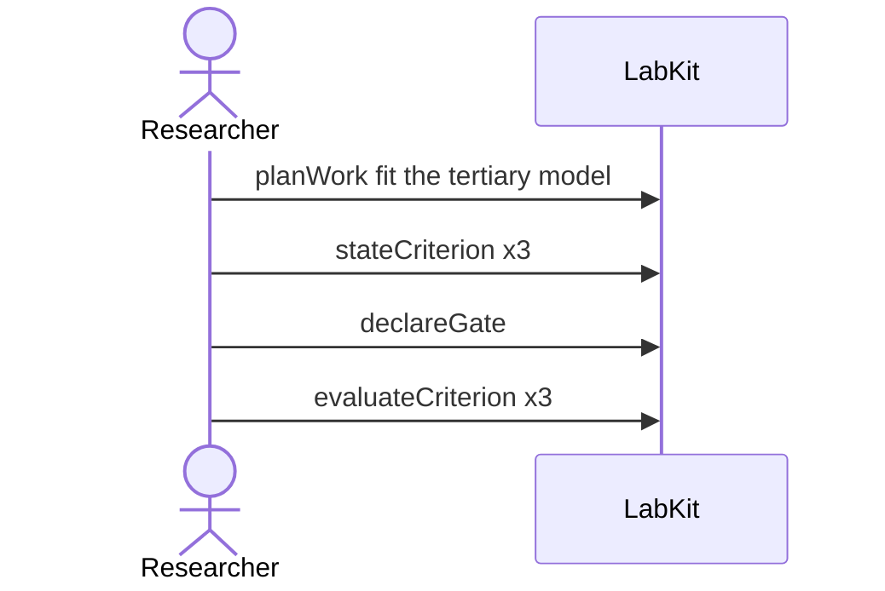

# S-3 — Significant by the primary test, untrustworthy by its own robustness checks

Three checks were agreed before the run: the primary test passes and both robustness checks disagree with it, so the work they gate stays blocked rather than reading as a result.

8 acts, one voice.

## The acts, in order

| | who | act | said | recorded |
| --- | --- | --- | --- | --- |
| 1 | Researcher | `planWork` | fit the tertiary model | `TASK_1` |
| 2 | Researcher | `stateCriterion` | Holm-corrected pairwise test is significant | `CRIT_2` |
| 3 | Researcher | `stateCriterion` | median aggregation agrees with the mean | `CRIT_3` |
| 4 | Researcher | `stateCriterion` | seed-to-seed variation is within tolerance | `CRIT_4` |
| 5 | Researcher | `declareGate` |  | `GATE_5` |
| 6 | Researcher | `evaluateCriterion` |  | `CEVAL_6` |
| 7 | Researcher | `evaluateCriterion` |  | `CEVAL_7` |
| 8 | Researcher | `evaluateCriterion` |  | `CEVAL_8` |
