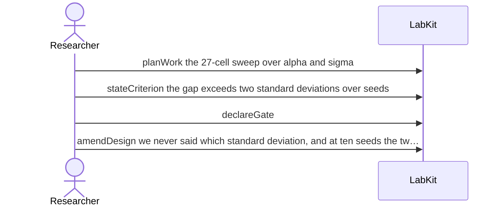

# S-30 — Fixed before the first run

A condition agreed in advance is worded too loosely, and is made precise before any number exists — so the amendment is prespecification rather than a change made in light of a result.

4 acts, one voice.

## The acts, in order

| | who | act | said | recorded |
| --- | --- | --- | --- | --- |
| 1 | Researcher | `planWork` | the 27-cell sweep over alpha and sigma | `TASK_1` |
| 2 | Researcher | `stateCriterion` | the gap exceeds two standard deviations over seeds | `CRIT_2` |
| 3 | Researcher | `declareGate` |  | `GATE_3` |
| 4 | Researcher | `amendDesign` | we never said which standard deviation, and at ten seeds the two differ by sqrt… | `DEC_4` |
