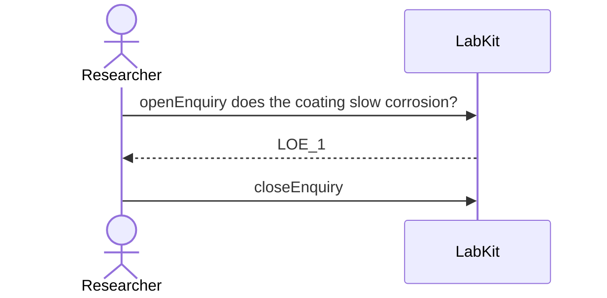

# S-31 — The read answers what was asked

An enquiry is closed with nothing settling it, and the act says which enquiry, which question and that it was abandoned rather than answered.

2 acts, one voice.

## The acts, in order

| | who | act | said | recorded |
| --- | --- | --- | --- | --- |
| 1 | Researcher | `openEnquiry` | does the coating slow corrosion? | `LOE_1` |
| 2 | Researcher | `closeEnquiry` |  | `LOE_1` |
