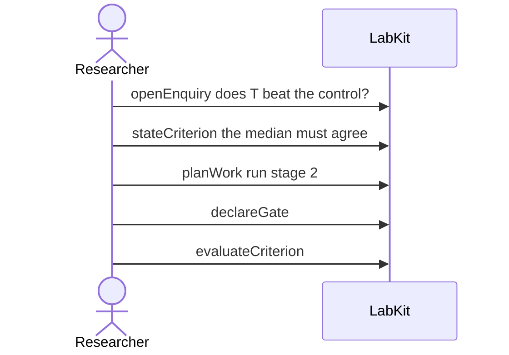

# S-363 — why <task> names the state work already computes

Asking why of a planned task says it is blocked, and names the failing check and the question the task was planned to address.

5 acts, one voice.

## What moved

`labkit why TASK_3` answers:

**TASK_3** is blocked.

- because blocked: the median must agree — failed
- because does T beat the control?
- because does T beat the control?

## The acts, in order

| | who | act | said | recorded |
| --- | --- | --- | --- | --- |
| 1 | Researcher | `openEnquiry` | does T beat the control? | `LOE_1` |
| 2 | Researcher | `stateCriterion` | the median must agree | `CRIT_2` |
| 3 | Researcher | `planWork` | run stage 2 | `TASK_3` |
| 4 | Researcher | `declareGate` |  | `GATE_4` |
| 5 | Researcher | `evaluateCriterion` |  | `CEVAL_5` |
