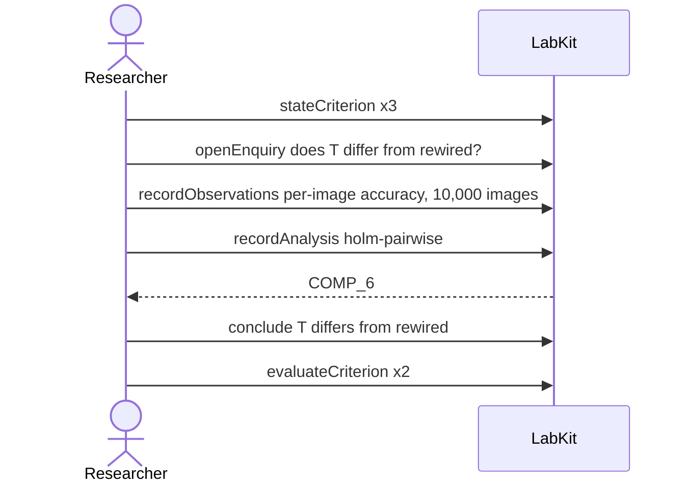

# S-3b — The same design with nothing downstream

A finding is held to three checks agreed before the run. One passes, one disagrees and one was never run, so the finding does not stand even though its numbers are untouched.

9 acts, one voice.

## What moved

`labkit why-supported CLM_7` answers:

**T differs from rewired** — standard-unmet, held as exploratory.

- **supported by** p = 0.002, Holm-corrected

## The acts, in order

| | who | act | said | recorded |
| --- | --- | --- | --- | --- |
| 1 | Researcher | `stateCriterion` | Holm-corrected pairwise test is significant | `CRIT_1` |
| 2 | Researcher | `stateCriterion` | median aggregation agrees with the mean | `CRIT_2` |
| 3 | Researcher | `stateCriterion` | seed-to-seed variation is within tolerance | `CRIT_3` |
| 4 | Researcher | `openEnquiry` | does T differ from rewired? | `LOE_4` |
| 5 | Researcher | `recordObservations` | per-image accuracy, 10,000 images | `ART_5` |
| 6 | Researcher | `recordAnalysis` | holm-pairwise | `COMP_6` |
| 7 | Researcher | `conclude` | T differs from rewired | `COMP_6` |
| 8 | Researcher | `evaluateCriterion` |  | `CEVAL_8` |
| 9 | Researcher | `evaluateCriterion` |  | `CEVAL_9` |
