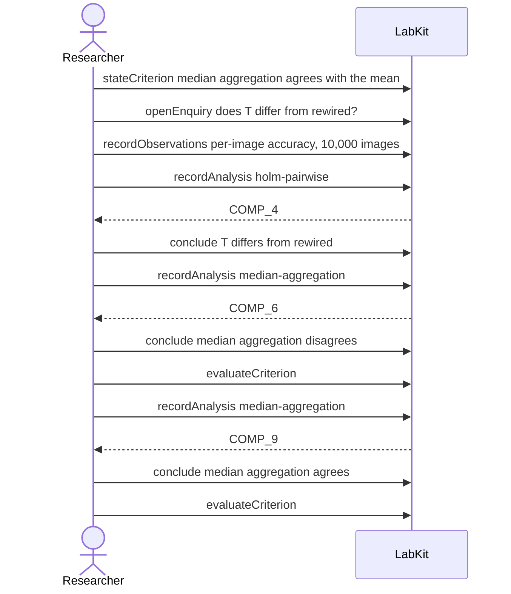

# S-3c — The check was wrong, not the result

A robustness check fails, and running the same check again until it comes back green does not clear the failure.

11 acts, one voice.

## What moved

`labkit why-supported CLM_5` answers:

**T differs from rewired** — standard-unmet, held as exploratory.

- **supported by** p = 0.002, Holm-corrected

## The acts, in order

| | who | act | said | recorded |
| --- | --- | --- | --- | --- |
| 1 | Researcher | `stateCriterion` | median aggregation agrees with the mean | `CRIT_1` |
| 2 | Researcher | `openEnquiry` | does T differ from rewired? | `LOE_2` |
| 3 | Researcher | `recordObservations` | per-image accuracy, 10,000 images | `ART_3` |
| 4 | Researcher | `recordAnalysis` | holm-pairwise | `COMP_4` |
| 5 | Researcher | `conclude` | T differs from rewired | `COMP_4` |
| 6 | Researcher | `recordAnalysis` | median-aggregation | `COMP_6` |
| 7 | Researcher | `conclude` | median aggregation disagrees | `COMP_6` |
| 8 | Researcher | `evaluateCriterion` |  | `CEVAL_8` |
| 9 | Researcher | `recordAnalysis` | median-aggregation | `COMP_9` |
| 10 | Researcher | `conclude` | median aggregation agrees | `COMP_9` |
| 11 | Researcher | `evaluateCriterion` |  | `CEVAL_11` |
