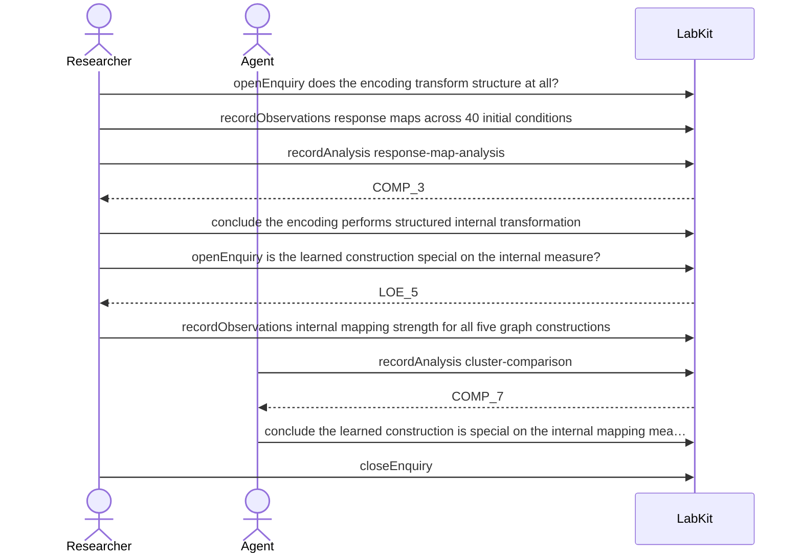

# S-4 — a negative result that closes the question

A comparison finds no separation between the five graph constructions, and the question is closed on that null result rather than left open or abandoned.

9 acts, Researcher and Agent.

## The acts, in order

| | who | act | said | recorded |
| --- | --- | --- | --- | --- |
| 1 | Researcher | `openEnquiry` | does the encoding transform structure at all? | `LOE_1` |
| 2 | Researcher | `recordObservations` | response maps across 40 initial conditions | `ART_2` |
| 3 | Researcher | `recordAnalysis` | response-map-analysis | `COMP_3` |
| 4 | Researcher | `conclude` | the encoding performs structured internal transformation | `COMP_3` |
| 5 | Researcher | `openEnquiry` | is the learned construction special on the internal measure? | `LOE_5` |
| 6 | Researcher | `recordObservations` | internal mapping strength for all five graph constructions | `ART_6` |
| 7 | Agent | `recordAnalysis` | cluster-comparison | `COMP_7` |
| 8 | Agent | `conclude` | the learned construction is special on the internal mapping measure | `COMP_7` |
| 9 | Researcher | `closeEnquiry` |  | `LOE_5` |
