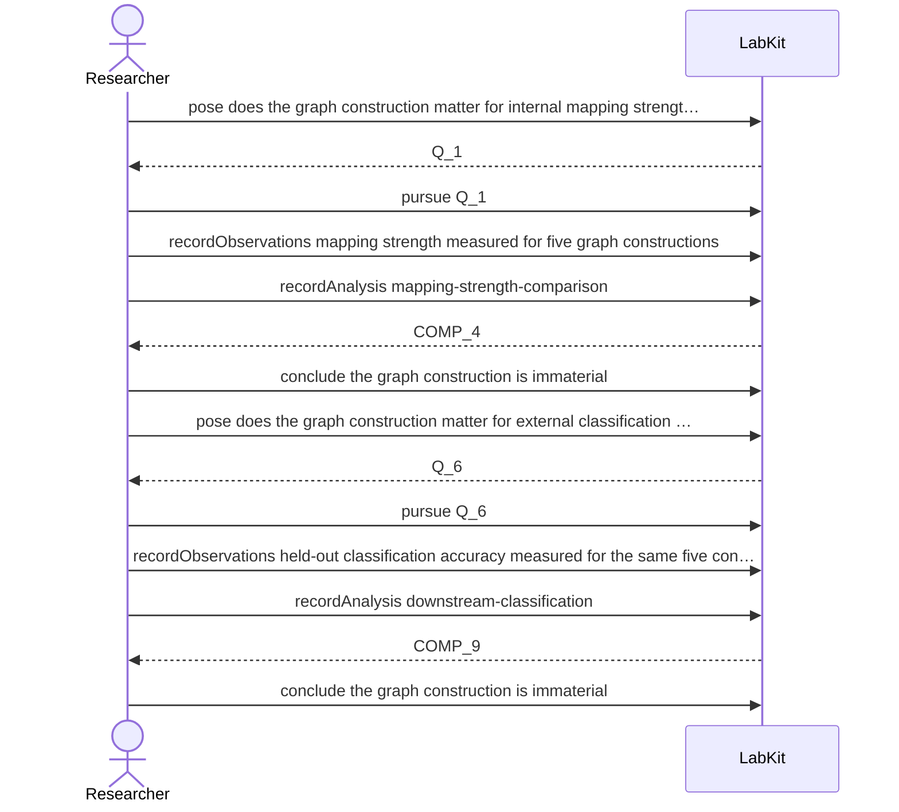

# S-5 — contradiction or dissociation?

Two stages of one programme assert the same sentence with opposite evidence. They turn out to be answering different questions, so this is a dissociation rather than a contradiction.

10 acts, one voice.

## The acts, in order

| | who | act | said | recorded |
| --- | --- | --- | --- | --- |
| 1 | Researcher | `pose` | does the graph construction matter for internal mapping strength? | `Q_1` |
| 2 | Researcher | `pursue` | Q_1 | `LOE_2` |
| 3 | Researcher | `recordObservations` | mapping strength measured for five graph constructions | `ART_3` |
| 4 | Researcher | `recordAnalysis` | mapping-strength-comparison | `COMP_4` |
| 5 | Researcher | `conclude` | the graph construction is immaterial | `COMP_4` |
| 6 | Researcher | `pose` | does the graph construction matter for external classification utility? | `Q_6` |
| 7 | Researcher | `pursue` | Q_6 | `LOE_7` |
| 8 | Researcher | `recordObservations` | held-out classification accuracy measured for the same five constructions | `ART_8` |
| 9 | Researcher | `recordAnalysis` | downstream-classification | `COMP_9` |
| 10 | Researcher | `conclude` | the graph construction is immaterial | `COMP_9` |
