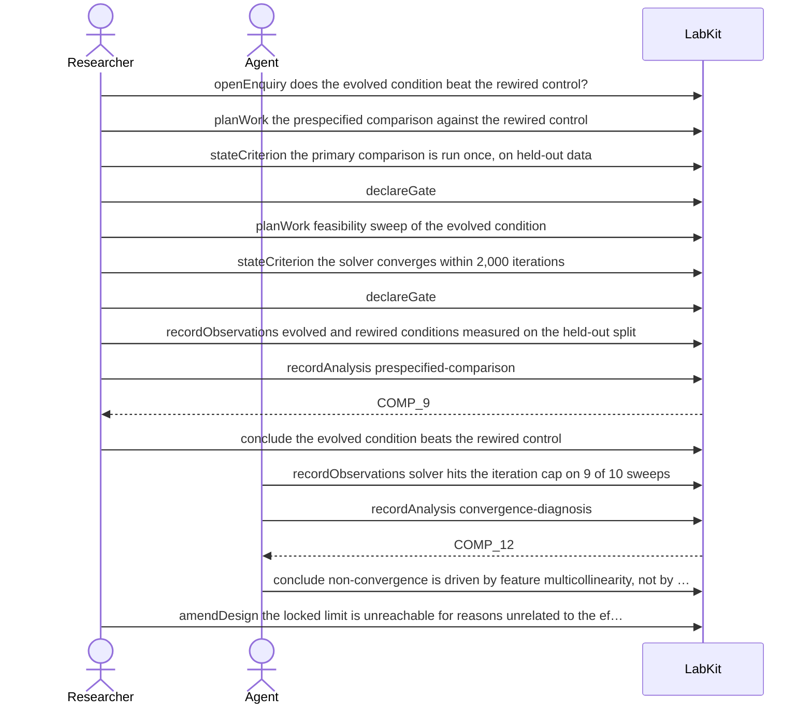

# S-7 — locked design, then feasibility finds a mechanical defect

The solver cannot reach the iteration limit the design locked, for reasons unrelated to the effect under test. The limit is raised in the open, citing the diagnosis, and the confirmatory comparison is left untouched.

14 acts, Researcher and Agent.

## The acts, in order

| | who | act | said | recorded |
| --- | --- | --- | --- | --- |
| 1 | Researcher | `openEnquiry` | does the evolved condition beat the rewired control? | `LOE_1` |
| 2 | Researcher | `planWork` | the prespecified comparison against the rewired control | `TASK_2` |
| 3 | Researcher | `stateCriterion` | the primary comparison is run once, on held-out data | `CRIT_3` |
| 4 | Researcher | `declareGate` |  | `GATE_4` |
| 5 | Researcher | `planWork` | feasibility sweep of the evolved condition | `TASK_5` |
| 6 | Researcher | `stateCriterion` | the solver converges within 2,000 iterations | `CRIT_6` |
| 7 | Researcher | `declareGate` |  | `GATE_7` |
| 8 | Researcher | `recordObservations` | evolved and rewired conditions measured on the held-out split | `ART_8` |
| 9 | Researcher | `recordAnalysis` | prespecified-comparison | `COMP_9` |
| 10 | Researcher | `conclude` | the evolved condition beats the rewired control | `COMP_9` |
| 11 | Agent | `recordObservations` | solver hits the iteration cap on 9 of 10 sweeps | `ART_11` |
| 12 | Agent | `recordAnalysis` | convergence-diagnosis | `COMP_12` |
| 13 | Agent | `conclude` | non-convergence is driven by feature multicollinearity, not by the effect under… | `COMP_12` |
| 14 | Researcher | `amendDesign` | the locked limit is unreachable for reasons unrelated to the effect under test | `DEC_14` |
