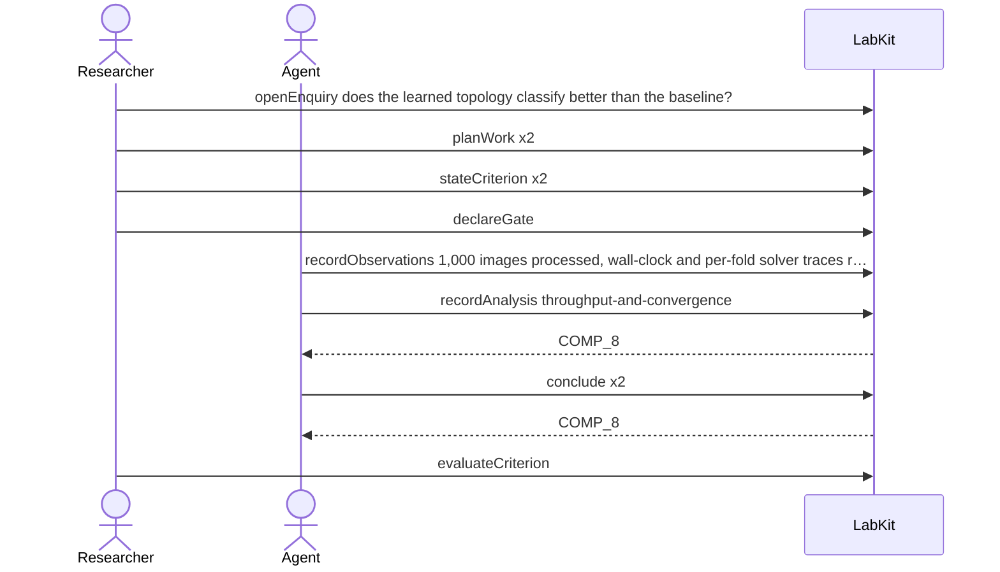

# S-8 — don't spend the whole budget discovering the pipeline is broken

A cheap feasibility slice runs first, and the expensive full run may not start until throughput and solver health are both established. One condition passes; the other has never been run, so the run stays held.

11 acts, Researcher and Agent.

## The acts, in order

| | who | act | said | recorded |
| --- | --- | --- | --- | --- |
| 1 | Researcher | `openEnquiry` | does the learned topology classify better than the baseline? | `LOE_1` |
| 2 | Researcher | `planWork` | feasibility slice: 1,000 training images | `TASK_2` |
| 3 | Researcher | `planWork` | the full classification run | `TASK_3` |
| 4 | Researcher | `stateCriterion` | the pipeline sustains 40 images per second on the feasibility slice | `CRIT_4` |
| 5 | Researcher | `stateCriterion` | the solver converges on every feasibility fold | `CRIT_5` |
| 6 | Researcher | `declareGate` |  | `GATE_6` |
| 7 | Agent | `recordObservations` | 1,000 images processed, wall-clock and per-fold solver traces recorded | `ART_7` |
| 8 | Agent | `recordAnalysis` | throughput-and-convergence | `COMP_8` |
| 9 | Agent | `conclude` | the pipeline sustains 40 images per second on the feasibility slice | `COMP_8` |
| 10 | Agent | `conclude` | a full run costs roughly 9,000 GPU-hours at the current throughput | `COMP_8` |
| 11 | Researcher | `evaluateCriterion` |  | `CEVAL_11` |
