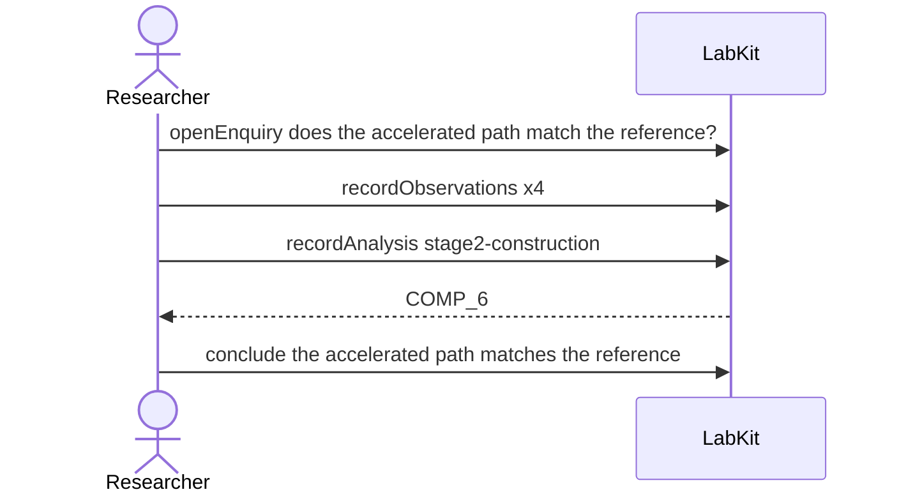

# S-9 — the artefact survived; its provenance didn't

A cached construction from an old study is rebuilt. Three of its four parts match their recorded hashes; the fourth has no hash at all, so nobody can check it, and that is not the same as its having come back different.

7 acts, one voice.

## The acts, in order

| | who | act | said | recorded |
| --- | --- | --- | --- | --- |
| 1 | Researcher | `openEnquiry` | does the accelerated path match the reference? | `LOE_1` |
| 2 | Researcher | `recordObservations` | layer weights | `ART_2` |
| 3 | Researcher | `recordObservations` | fold assignment | `ART_3` |
| 4 | Researcher | `recordObservations` | prior draws | `ART_4` |
| 5 | Researcher | `recordObservations` | randomised control series | `ART_5` |
| 6 | Researcher | `recordAnalysis` | stage2-construction | `COMP_6` |
| 7 | Researcher | `conclude` | the accelerated path matches the reference | `COMP_6` |
