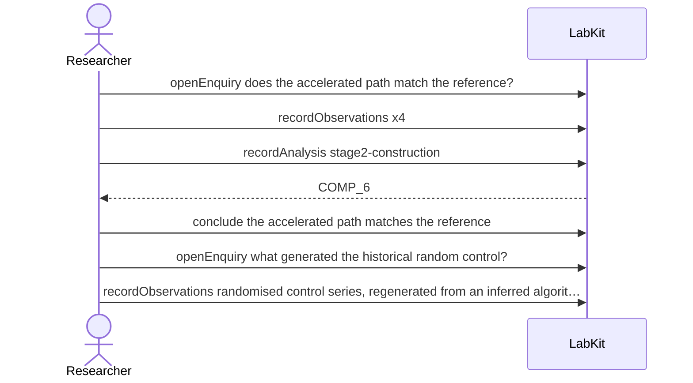

# S-9 — the artefact survived; its provenance didn't

A cached construction from an old study has one part with no recorded hash, so nobody can check it. The researcher regenerates that part, and the question of what made the original stays open.

9 acts, one voice.

```mermaid
sequenceDiagram
    actor Researcher
    participant R as LabKit
    Researcher->>R: openEnquiry does the accelerated path match the reference?
    Researcher->>R: recordObservations x4
    Researcher->>R: recordAnalysis stage2-construction
    R-->>Researcher: COMP_6
    Researcher->>R: conclude the accelerated path matches the reference
    Researcher->>R: openEnquiry what generated the historical random control?
    Researcher->>R: recordObservations randomised control series, regenerated from an inferred algorit…
```

## The acts, in order

| | who | act | said | recorded |
| --- | --- | --- | --- | --- |
| 1 | Researcher | `openEnquiry` | does the accelerated path match the reference? | `LOE_1` |
| 2 | Researcher | `recordObservations` | layer weights | `ART_2` |
| 3 | Researcher | `recordObservations` | fold assignment | `ART_3` |
| 4 | Researcher | `recordObservations` | prior draws | `ART_4` |
| 5 | Researcher | `recordObservations` | randomised control series | `ART_5` |
| 6 | Researcher | `recordAnalysis` | stage2-construction | `COMP_6` |
| 7 | Researcher | `conclude` | the accelerated path matches the reference | `COMP_6` |
| 8 | Researcher | `openEnquiry` | what generated the historical random control? | `LOE_8` |
| 9 | Researcher | `recordObservations` | randomised control series, regenerated from an inferred algorithm | `ART_9` |
