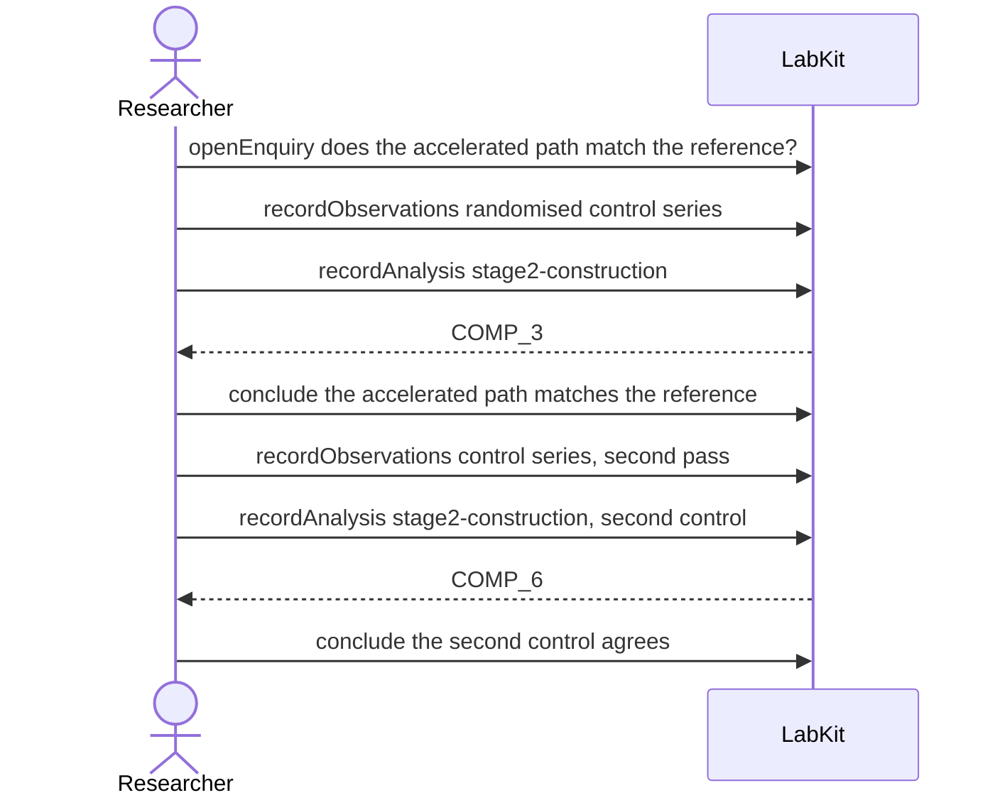

# S-9b — was this a rebuild, or new work?

A second control is recorded against an old cached construction. Whether it is a reconstruction of the original or independent fresh work is currently only wording, and the record reads the same either way.

7 acts, one voice.

## The acts, in order

| | who | act | said | recorded |
| --- | --- | --- | --- | --- |
| 1 | Researcher | `openEnquiry` | does the accelerated path match the reference? | `LOE_1` |
| 2 | Researcher | `recordObservations` | randomised control series | `ART_2` |
| 3 | Researcher | `recordAnalysis` | stage2-construction | `COMP_3` |
| 4 | Researcher | `conclude` | the accelerated path matches the reference | `COMP_3` |
| 5 | Researcher | `recordObservations` | control series, second pass | `ART_5` |
| 6 | Researcher | `recordAnalysis` | stage2-construction, second control | `COMP_6` |
| 7 | Researcher | `conclude` | the second control agrees | `COMP_6` |
