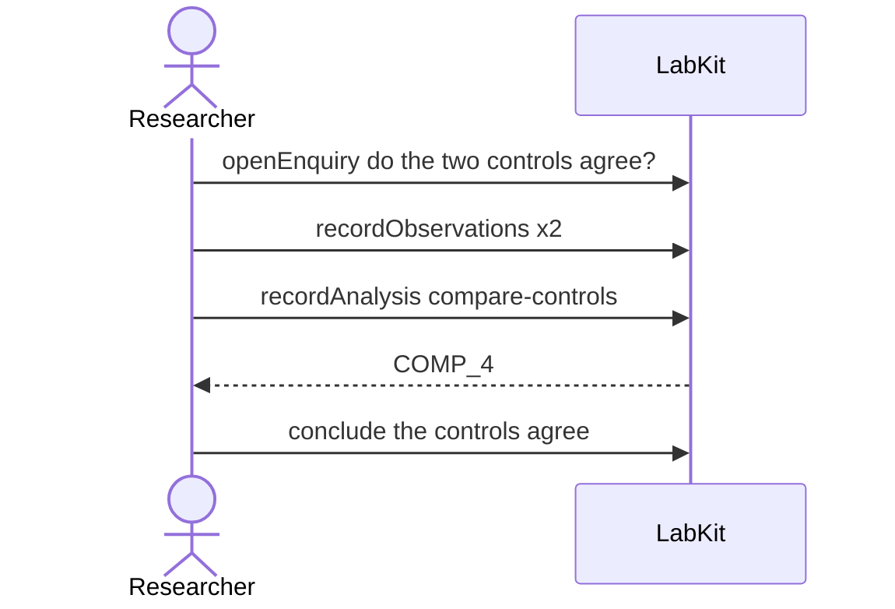

# S-9c — two parts, one name

One analysis reads two control series recorded under the same name. On a rebuild one matches and one differs, and the report keeps them apart because it identifies parts by reference rather than by name.

5 acts, one voice.

## The acts, in order

| | who | act | said | recorded |
| --- | --- | --- | --- | --- |
| 1 | Researcher | `openEnquiry` | do the two controls agree? | `LOE_1` |
| 2 | Researcher | `recordObservations` | the historical series | `ART_2` |
| 3 | Researcher | `recordObservations` | regenerated from an inferred algorithm | `ART_3` |
| 4 | Researcher | `recordAnalysis` | compare-controls | `COMP_4` |
| 5 | Researcher | `conclude` | the controls agree | `COMP_4` |
