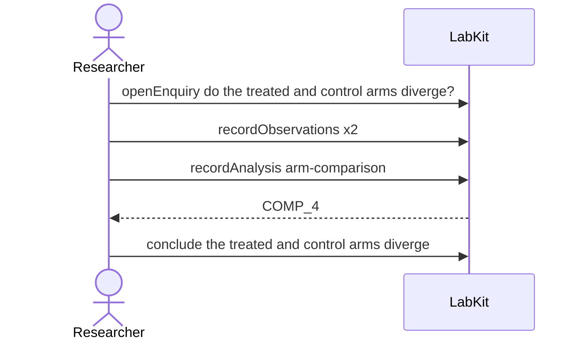

# S-9d — resting on one thing, or two?

A comparison reads the surviving fragment of a control series and the regenerated remainder. Both are recorded under the same name, and the record holds them as two inputs rather than one.

5 acts, one voice.

## The acts, in order

| | who | act | said | recorded |
| --- | --- | --- | --- | --- |
| 1 | Researcher | `openEnquiry` | do the treated and control arms diverge? | `LOE_1` |
| 2 | Researcher | `recordObservations` | the surviving fragment of the original series | `ART_2` |
| 3 | Researcher | `recordObservations` | the remainder, regenerated from an inferred algorithm | `ART_3` |
| 4 | Researcher | `recordAnalysis` | arm-comparison | `COMP_4` |
| 5 | Researcher | `conclude` | the treated and control arms diverge | `COMP_4` |
