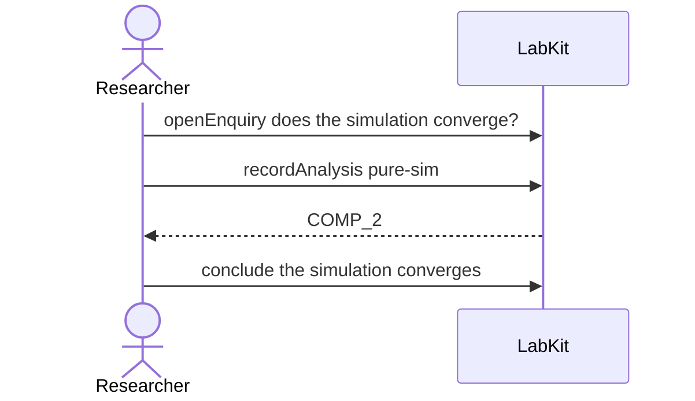

# S-9e — reproducing nothing

A pure simulation read none of the programme's own data. Asked whether it reproduces, the answer is no: nothing was rebuilt because there was nothing to rebuild.

3 acts, one voice.

## The acts, in order

| | who | act | said | recorded |
| --- | --- | --- | --- | --- |
| 1 | Researcher | `openEnquiry` | does the simulation converge? | `LOE_1` |
| 2 | Researcher | `recordAnalysis` | pure-sim | `COMP_2` |
| 3 | Researcher | `conclude` | the simulation converges | `COMP_2` |
